# System Design Interview — Chapter 10: Design a Notification System
> **Interview Prep Reference** | Alex Xu — System Design Interview

---

## Table of Contents
1. [Quick-Reference Card](#1-quick-reference-card)
2. [Step 1 — Requirements & Scope](#2-step-1--requirements--scope)
3. [Step 2 — High-Level Design](#3-step-2--high-level-design)
   - [Notification Channel Mechanics](#notification-channel-mechanics)
   - [Contact Info Gathering Flow](#contact-info-gathering-flow)
   - [DB Schema](#db-schema)
   - [Initial Design & Problems](#notification-sendingreceiving-flow--initial-design)
   - [Improved Design](#improved-high-level-design)
4. [Step 3 — Deep Dive](#4-step-3--deep-dive)
   - [Reliability](#reliability)
   - [Additional Components](#additional-components--considerations)
   - [Updated Design](#updated-design-final)
5. [Step 4 — Wrap Up](#5-step-4--wrap-up)
6. [Potential Interviewer Questions](#6-potential-interviewer-questions)
   - [A. Requirements & Scoping](#a-requirements--scoping)
   - [B. Architecture & Components](#b-architecture--components)
   - [C. Reliability & Data Integrity](#c-reliability--data-integrity)
   - [D. Scalability & Performance](#d-scalability--performance)
   - [E. User Experience & Settings](#e-user-experience--settings)
   - [F. Security](#f-security)
   - [G. Trade-offs](#g-trade-offs--design-decisions)
   - [H. Analytics & Tracking](#h-analytics--event-tracking)
   - [Rapid-Fire Q&A](#rapid-fire-qa)
7. [One-Page Cheat Sheet](#7-one-page-cheat-sheet)
8. [Reference Materials](#8-reference-materials)

---

## 1. Quick-Reference Card

| | |
|---|---|
| **Scale** | 10M mobile push · 1M SMS · 5M email per day |
| **Channels** | iOS push (APNs) · Android push (FCM) · SMS (Twilio/Nexmo) · Email (Sendgrid/Mailchimp) |
| **Latency** | Soft real-time — slight delay acceptable under high load |
| **Devices** | iOS · Android · laptop/desktop |
| **Triggers** | Client applications OR server-side scheduled jobs |
| **Opt-out** | Yes — users who opt out stop receiving all notifications |

---

## 2. Step 1 — Requirements & Scope

> Building a scalable system that sends millions of notifications a day is not easy. The question is open-ended by design — **your job is to ask clarifying questions before drawing anything.**

### Clarifying Q&A

| Candidate asks | Interviewer answers |
|---|---|
| What notification types does the system support? | Push notification, SMS message, and Email |
| Is it a real-time system? | Soft real-time — slight delay acceptable under high load |
| What are the supported devices? | iOS, Android, and laptop/desktop |
| What triggers notifications? | Client applications; can also be scheduled server-side |
| Will users be able to opt out? | Yes — opted-out users stop receiving notifications |
| How many notifications per day? | 10M mobile push, 1M SMS, 5M emails |

> **Interview Tip:** Always clarify scale, SLA (real-time vs soft real-time), and channels first. These drive every major design decision.

---

## 3. Step 2 — High-Level Design

### Notification Channel Mechanics

#### iOS Push Notification (Figure 10-2)

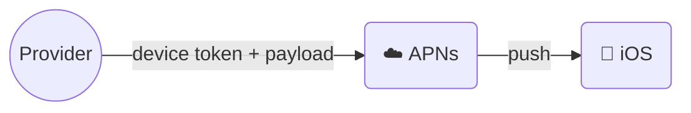

**Components needed:**
- **Provider** — builds and sends notification request to APNs
- **Device token** — unique identifier for sending push notifications
- **Payload** — JSON dictionary:

```json
{
  "aps": {
    "alert": {
      "title": "Game Request",
      "body": "Bob wants to play chess",
      "action-loc-key": "PLAY"
    },
    "badge": 5
  }
}
```

- **APNs** — Apple's remote service that propagates push notifications to iOS devices
- **iOS Device** — the end client receiving push notifications

---

#### Android Push Notification (Figure 10-3)

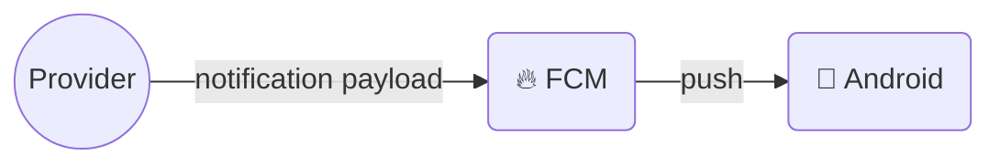

> Android uses **Firebase Cloud Messaging (FCM)** instead of APNs. FCM is unavailable in China — alternatives: **JPush**, **PushY**, **Xiaomi Push**.

---

#### SMS (Figure 10-4)

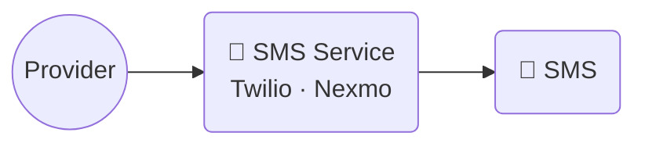

> Third-party SMS services are commercial. Easy to swap out — design for extensibility.

---

#### Email (Figure 10-5)

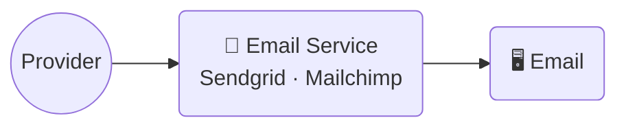

> Commercial services offer better delivery rates and data analytics than self-hosted.

---

#### All Third-Party Services Combined (Figure 10-6)

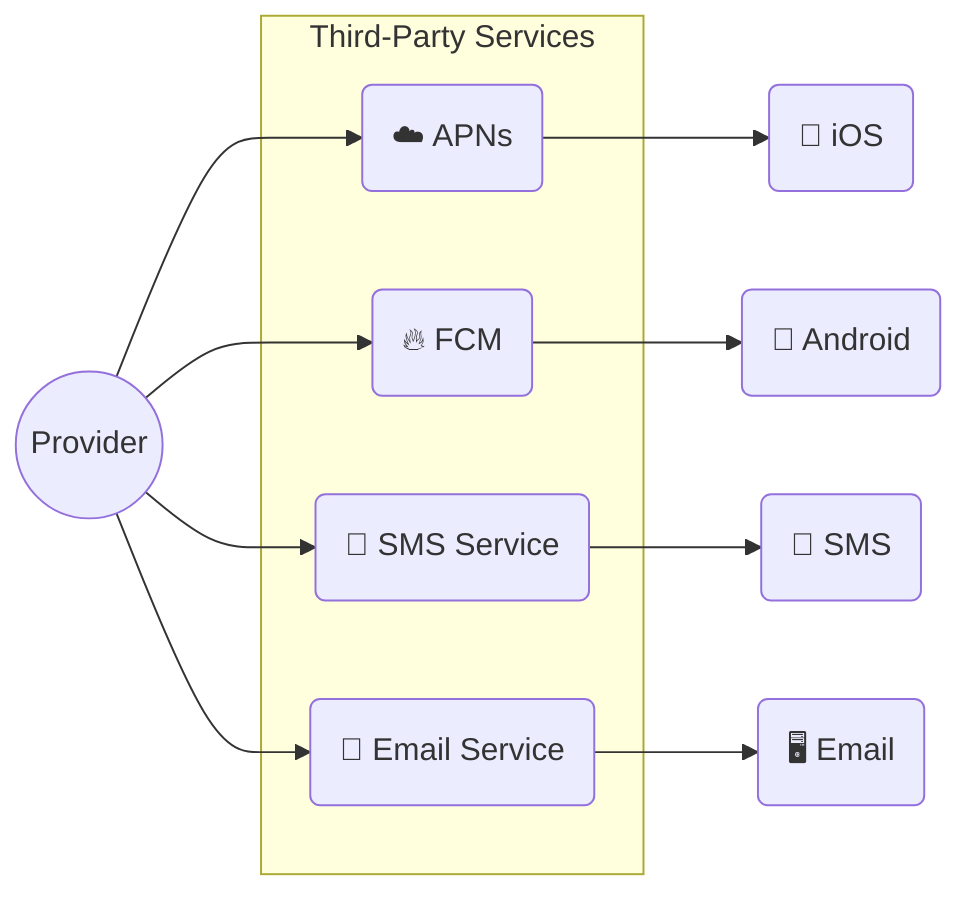

---

### Contact Info Gathering Flow

> To send notifications, we need device tokens, phone numbers, or email addresses. On first app install or sign-up, API servers collect user contact info and store it in DB.

#### Figure 10-7

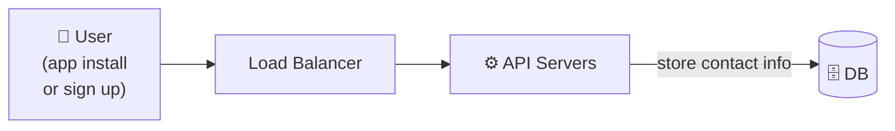

---

### DB Schema

#### Figure 10-8

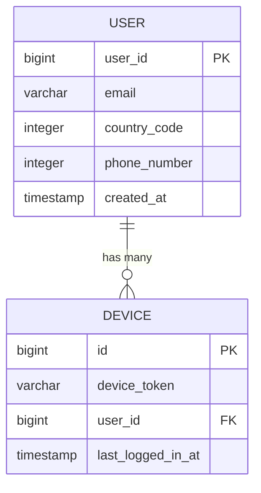

> A user can have **multiple devices** — a push notification is sent to **all** of the user's devices.

---

### Notification Sending/Receiving Flow — Initial Design

#### Figure 10-9

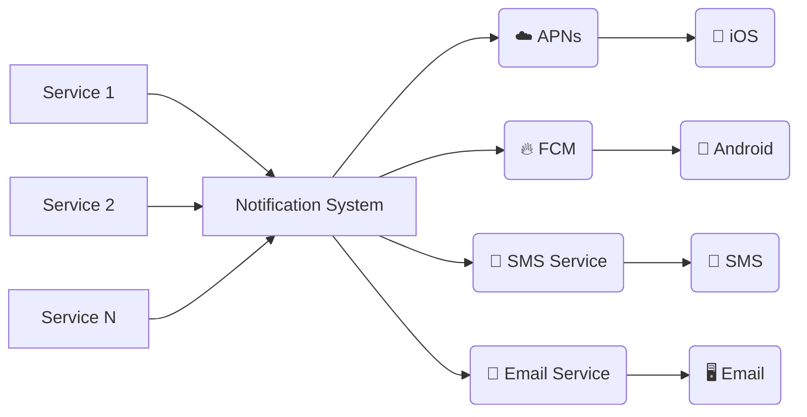

#### Problems with Initial Design

| Problem | Description |
|---|---|
| **SPOF** | A single notification server = single point of failure |
| **Hard to scale** | Notification system handles everything — can't scale DB, cache, and processing independently |
| **Performance bottleneck** | Constructing HTML pages + waiting for third-party responses = resource intensive; peak hours cause system overload |

---

### Improved High-Level Design

**Three changes to fix the initial design:**

1. Move the DB and cache **out** of the notification server
2. Add more notification servers + **automatic horizontal scaling**
3. Introduce **message queues** to decouple system components

#### Figure 10-10

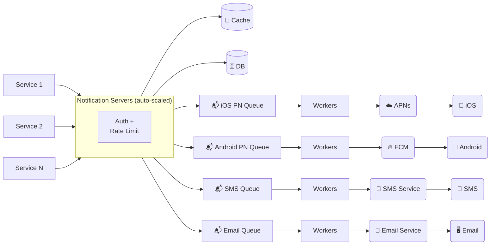

#### How every component works together

1. A service calls the APIs provided by notification servers to send a notification
2. Notification servers fetch metadata (user info, device token, settings) from cache or DB
3. Notification event is sent to the **corresponding message queue** for processing
   - e.g., an iOS push event → iOS PN queue
4. Workers pull notification events from message queues
5. Workers send notifications to third-party services (APNs / FCM / Twilio / Sendgrid)
6. Third-party services deliver notifications to user devices

#### Notification Server — API example

```
POST https://api.example.com/v/sms/send

{
  "to": [{ "user_id": 123456 }],
  "from": { "email": "from_address@example.com" },
  "subject": "Hello, World!",
  "content": [{ "type": "text/plain", "value": "Hello, World!" }]
}
```

**Notification server responsibilities:**
- Provide APIs for services to send notifications (internal-only or verified clients — prevents spam)
- Carry out basic validations (email format, phone number, etc.)
- Query DB/cache to fetch data needed to render the notification
- Put notification data to message queues for parallel processing

---

## 4. Step 3 — Deep Dive

**Topics to cover:**
- Reliability
- Notification templates
- Notification settings (opt-in/opt-out)
- Rate limiting
- Retry mechanism
- Security in push notifications
- Monitor queued notifications
- Event tracking

---

### Reliability

#### How to prevent data loss?

> Notifications can be delayed or re-ordered, but **must never be lost**. The notification system persists notification data in a DB and implements a retry mechanism.

#### Figure 10-11 — Notification Log & Retry

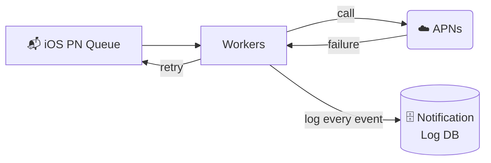

#### Will recipients receive a notification exactly once?

**Short answer: No.**

Although notification is delivered exactly once most of the time, the distributed nature could result in **duplicate notifications**. To reduce duplicates, introduce a **dedupe mechanism**:

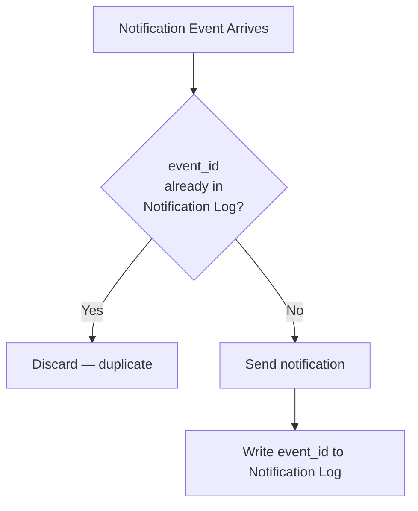

> **Interview Tip:** Acknowledge you can't achieve true exactly-once in distributed systems. Dedupe is best-effort mitigation.

---

### Additional Components & Considerations

#### Notification Template

A large notification system sends millions of notifications per day — many follow the same format. Templates avoid building every notification from scratch.

```
BODY:
You dreamed of it. We dared it. [ITEM NAME] is back — only until [DATE].

CTA:
Order Now. Or, Save My [ITEM NAME]
```

**Benefits:** consistent format · reduced margin error · saves time

---

#### Notification Settings

Users receive too many notifications daily and can easily feel overwhelmed. Store fine-grained control in `notification_settings`:

```
notification_settings table:
  user_id   bigint
  channel   varchar   -- 'push' | 'email' | 'sms'
  opt_in    boolean   -- opt-in to receive notifications
```

> Before any notification is sent, **check opt_in = true** for that user + channel combination.

---

#### Rate Limiting

Cap the number of notifications a user can receive per time window. If we send too often, receivers could turn off notifications completely.

---

#### Retry Mechanism

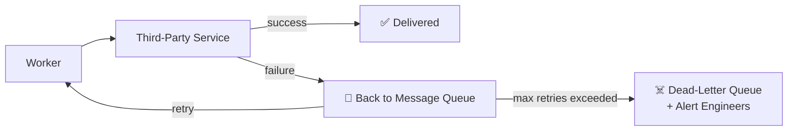

---

#### Security in Push Notifications

For iOS/Android apps, **appKey** and **appSecret** are used to secure push notification APIs. Only authenticated or verified clients are allowed to send push notifications using our APIs.

---

#### Monitor Queued Notifications

**Key metric:** total number of queued (pending) notifications.

```
Queued messages (chart: last minute)
250 ┤      ╭╮
200 ┤    ╭─╯╰╮
150 ┤   ╭╯   ╰─
100 ┤  ╭╯
 50 ┤ ╭╯
  0 ┴─╯
    09:02:10  09:02:20  09:02:30  09:02:40  09:02:50
```

If the number is large → notification events are not processed fast enough → **add more workers**.

---

#### Events Tracking

Notification metrics (open rate, click rate, engagement) are important for understanding customer behavior.

#### Figure 10-13 — Event State Machine

```mermaid
stateDiagram-v2
    [*] --> start
    start --> pending
    pending --> sent
    sent --> deliver
    deliver --> click
    deliver --> error
    deliver --> unsubscribe
    click --> [*]
    error --> [*]
    unsubscribe --> [*]
```

---

### Updated Design (Final)

#### Figure 10-14

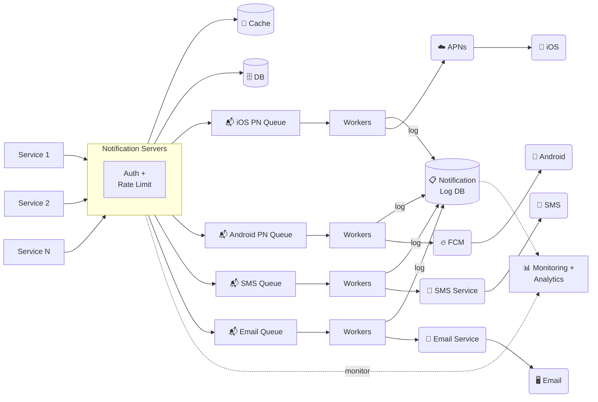

**New components vs improved design:**

| Addition | Purpose |
|---|---|
| Auth + Rate Limiting on notification servers | Prevent abuse, protect third-party quotas |
| Retry mechanism (back to queue) | Handle transient third-party failures |
| Notification Log DB | Persistence for retry + dedupe; never lose a notification |
| Notification templates | Consistent format, reduce creation error |
| Monitoring system | Queue depth, delivery rates, latency |
| Event tracking | Open/click/error events → analytics |

---

## 5. Step 4 — Wrap Up

**Summary points to state at the end of your interview:**

| Topic | What to say |
|---|---|
| **Reliability** | Retry mechanism minimises failure rate; Notification Log DB prevents data loss |
| **Security** | AppKey/appSecret ensures only verified clients can send notifications |
| **Tracking & Monitoring** | Implemented at every stage to capture important stats |
| **User Settings** | System checks opt-in before sending; users control their preferences |
| **Rate Limiting** | Frequency capping prevents notification fatigue and keeps users engaged |

---

## 6. Potential Interviewer Questions

> Each question lists: the key points **you must hit** and the **likely follow-up**.

---

### A. Requirements & Scoping

---

**Q: How would you start designing a notification system?**

**Key points to cover:**
- Ask clarifying questions first: notification types, scale (how many/day), real-time vs soft real-time, device types, opt-out support, trigger source
- State numbers explicitly: 10M push, 1M SMS, 5M email/day
- Announce you'll start high-level before going deep

**Likely follow-up:** *What if the interviewer says "just design it" — how do you proceed?*
> Pick the most common defaults (push + email + SMS, 10M/day scale, soft real-time) and state your assumptions clearly before proceeding.

---

**Q: What does "soft real-time" mean and why does it matter?**

**Key points to cover:**
- Slight delay is acceptable under high load — we trade strict latency for availability and throughput
- Justifies using **message queues** (async) instead of synchronous calls to third-party services
- Enables horizontal scaling and fault tolerance

**Likely follow-up:** *How would the design change if strict real-time (< 1 second) was required?*
> Drop message queues, use direct async calls with tight timeouts, pre-warm connections to APNs/FCM, use lower-latency infrastructure (e.g., gRPC).

---

### B. Architecture & Components

---

**Q: Why do you need separate message queues for each notification type?**

**Key points to cover:**
- **Isolation** — an APNs outage should not delay SMS or email
- Each channel has different SLAs, throughput, and third-party dependencies
- Separate queues let workers per channel scale independently
- One queue failure doesn't cascade

**Likely follow-up:** *What queue technology would you use?*
> Kafka for high-throughput durability with replay; SQS for simplicity + managed infra; RabbitMQ for flexible routing. For this scale (~116 push/sec avg), any of the three works.

---

**Q: What happens if a third-party service (e.g., APNs) is down?**

**Key points to cover:**
- Workers detect failure (non-2xx or timeout)
- Event goes back to the message queue
- Retry with **exponential backoff** up to N attempts
- After max retries → **dead-letter queue** + alert on-call engineers
- Other channels (SMS, email) are unaffected due to queue isolation

**Likely follow-up:** *How do you avoid retrying indefinitely?*
> Max retry count on the worker + dead-letter queue with TTL. Inspect DLQ periodically and replay manually or with circuit-breaker auto-resume.

---

**Q: How do you scale the notification servers?**

**Key points to cover:**
- Notification servers are **stateless** — they read from cache/DB, enqueue, and return
- Horizontal auto-scaling behind a load balancer
- Scale triggers: CPU utilisation or request rate
- DB and cache are separate services → scale independently

**Likely follow-up:** *What if the DB becomes the bottleneck?*
> Read replicas for reads; shard by user_id; cache user/device/settings aggressively (Redis, TTL-based).

---

**Q: Walk me through how a single email notification gets delivered end-to-end.**

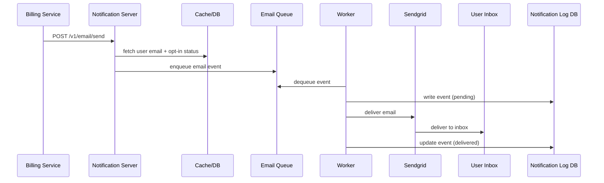

**Likely follow-up:** *What if the user has opted out? Where exactly do you check?*
> In the notification server, **before** enqueueing. If opt_in = false for email channel → drop silently and log. Don't waste queue/worker resources.

---

### C. Reliability & Data Integrity

---

**Q: How do you ensure notifications are never lost?**

**Key points to cover:**
1. Persist every notification event to Notification Log DB **before** processing
2. Workers acknowledge queue messages only **after** successful delivery
3. On failure → event re-queues for retry
4. Monitor queue depth — growing queue = workers can't keep up → auto-scale
5. Dead-letter queue for events exceeding max retries

**Likely follow-up:** *What is the difference between at-least-once and exactly-once delivery?*
> At-least-once: message delivered ≥ 1 time (possible duplicates). Exactly-once: delivered precisely once (requires distributed coordination — very expensive). We choose at-least-once + dedupe.

---

**Q: Can you guarantee exactly-once notification delivery?**

**Key points to cover:**
- **No** — distributed systems cannot guarantee exactly-once delivery
- Best practice: **at-least-once** delivery with idempotent dedupe
- Each notification has an `event_id`; worker checks Notification Log on arrival
- If `event_id` already processed → discard. If new → send and log.

**Likely follow-up:** *How would you make a notification handler idempotent?*
> Use `INSERT ... WHERE NOT EXISTS` (DB) or `SET NX` (Redis) on the event_id. Both are atomic — only one concurrent worker can "win" and actually process.

---

**Q: What is the dedupe mechanism and where does it sit?**

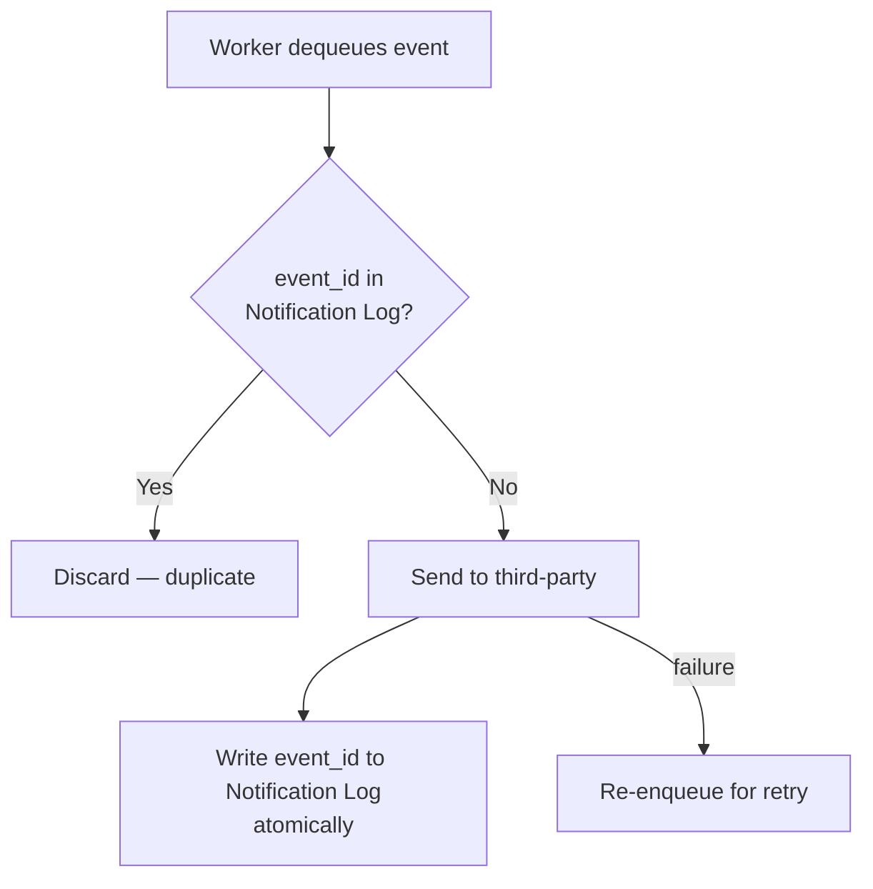

**Likely follow-up:** *What if two workers process the same event simultaneously?*
> Atomic write using DB transaction or Redis `SET NX EX`. First writer wins; second sees the key already exists and discards. Use optimistic locking or distributed lock for the critical section.

---

### D. Scalability & Performance

---

**Q: How do you handle 10 million push notifications per day?**

**Back-of-envelope:**
```
10M push / 86,400 sec ≈ 116 push/sec average
Peak (5-10x spike)    ≈ 600 – 1,000 push/sec
```

**Key points to cover:**
- Multiple notification servers behind load balancer
- Message queue absorbs bursts
- Workers auto-scale on queue depth (e.g., CloudWatch → ASG)
- APNs supports batch sends — group by device type
- Cache device tokens to avoid per-notification DB hits

**Likely follow-up:** *How would this change at 10x scale (100M/day)?*
> Shard message queues by user geography. Use Kafka for higher throughput + replay. Pre-warm third-party connections. Add priority lanes (critical vs marketing).

---

**Q: How do you monitor the health of the notification pipeline?**

**Key metrics:**

| Metric | Alert condition |
|---|---|
| Queue depth per channel | Growing → add workers |
| Delivery success rate | Drop → third-party issue |
| End-to-end latency | Spike → bottleneck investigation |
| Retry rate | High → persistent third-party failures |
| DLQ message count | Non-zero → manual intervention needed |

**Likely follow-up:** *How do you set the alerting threshold for queue depth?*
> Baseline normal queue depth during off-peak, then alert at 2–3x that value. Use rate-of-change alerts too (queue growing faster than workers drain it).

---

**Q: What caching strategy would you use?**

**Key points to cover:**
- Cache **user info** (email, phone), **device tokens**, **notification settings**, **templates** — all read-heavy, change rarely
- **Cache-aside** pattern: worker checks cache first, DB on miss
- TTL-based invalidation + write-through on updates
- Redis or Memcached

**Likely follow-up:** *What if the cache is stale when a user updates their device token?*
> Write-through cache on device token update: update DB + invalidate/update cache atomically. APNs/FCM also return an error on invalid token — worker marks device inactive in DB and removes from cache.

---

### E. User Experience & Settings

---

**Q: How do you implement user opt-out?**

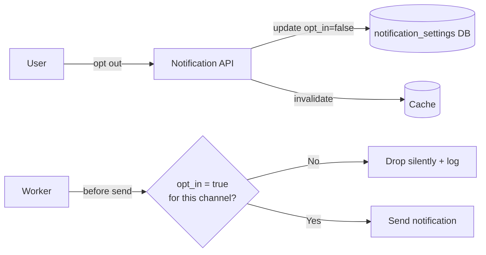

**Likely follow-up:** *What if a user opts out mid-delivery — notification already in queue?*
> Worker checks opt_in status at **dequeue time** (not at enqueue time). Pulling the latest setting at dequeue ensures opt-outs are respected even for queued events. Small race window at exactly the moment of delivery is acceptable.

---

**Q: How do you prevent notification fatigue / spamming users?**

**Key points to cover:**
- Rate limiting layer on notification server
- Track notifications sent per user per channel per time window (e.g., max 10 push/day)
- Store counters in Redis (`INCR` + `TTL`)
- Reject or queue-delay requests that exceed the limit
- Notification templates help avoid near-duplicate messages

**Likely follow-up:** *How do you rate-limit across multiple notification server instances?*
> Centralised counter in Redis — all instances share the same counter. `INCR` is atomic; use `SET NX` + Lua scripts for multi-key rate limiting logic.

---

**Q: A user complains they received the same notification 3 times. How do you debug it?**

**Debugging flow:**
1. Check Notification Log DB — were 3 separate `event_id`s created, or was one `event_id` processed 3 times?
2. If **3 distinct event_ids**: upstream service called the API 3 times → add **idempotency key** at API layer
3. If **one event_id processed 3 times**: dedupe logic failed → check worker race condition or Redis `SET NX` atomicity
4. Check retry logic — did a false failure trigger retries on an already-delivered notification?

**Likely follow-up:** *How would you add an idempotency key to the notification API?*
> Callers include a client-generated `idempotency_key` in the request. Notification server stores it with a TTL. Duplicate requests with the same key return the cached response without processing again.

---

### F. Security

---

**Q: How do you secure the notification API?**

**Key points to cover:**
1. **appKey + appSecret** — only verified internal services / trusted clients can call the API
2. HTTPS for all traffic (in transit encryption)
3. Rate limiting per caller to prevent abuse
4. Notification API is **internal-only** (not exposed to public internet)
5. Audit log of all notification requests

**Likely follow-up:** *How do you rotate appKey/appSecret without downtime?*
> Dual-key validity window: issue new key, accept both old + new for a grace period, phase out old key. Store key metadata (issued_at, expires_at) in DB.

---

**Q: How do you protect sensitive data in notifications (e.g., OTPs in SMS)?**

**Key points to cover:**
1. Never log notification content in plain text — mask/hash sensitive fields in logs
2. Short TTL for OTP notifications (invalidate after N minutes)
3. Encrypt notification payload at rest in Notification Log DB
4. TLS in transit to all third-party services
5. GDPR: allow users to delete contact info — cascade delete from `user` + `device` tables

**Likely follow-up:** *What GDPR/CCPA requirements affect this design?*
> Right to erasure: delete user from `user`, `device`, `notification_settings` tables. Data minimisation: store only what's needed for delivery. Explicit opt-in records with timestamps. Data residency: route EU user data through EU-region services only.

---

### G. Trade-offs & Design Decisions

---

**Q: Push vs pull model — which did you choose and why?**

**Key points:**
- **Push** (chosen): notification server pushes to devices via APNs/FCM. Low latency, standard for mobile
- **Pull**: clients poll the server — inefficient at scale, adds latency, drains battery
- Internal pipeline: push-to-queue (broker) pattern decouples producers from consumers

**Likely follow-up:** *Are there cases where pull is better?*
> Yes — inbox-style notifications (e.g., email count badge) where the client only needs to know there's *something* new, not the actual content. Pull is also simpler to implement for web apps using SSE or polling.

---

**Q: Why use a message queue instead of synchronous third-party calls?**

| | Synchronous | Message Queue (chosen) |
|---|---|---|
| Coupling | Tight — server waits for APNs | Loose — server enqueues and returns |
| Burst handling | Request drops if APNs slow | Queue absorbs spikes |
| Retry | Client must re-call | Failed message stays in queue |
| Channel isolation | One failure blocks all | Per-channel queues isolate failures |
| Latency | Lower (no queue hop) | Slightly higher (soft real-time acceptable) |

**Likely follow-up:** *What's the maximum acceptable queue lag for this system?*
> Depends on notification type. Marketing emails: minutes acceptable. OTP/transactional: < 5 seconds. Define SLA per channel and set queue depth alerts accordingly.

---

**Q: How would you handle FCM being unavailable in China?**

**Key points:**
- Detect user region via `country_code` in user table
- If Chinese Android device → route through **JPush / PushY / Xiaomi Push**
- Abstract push provider behind an interface — swapping is transparent to the rest of the system
- Feature-flag the provider per region in config

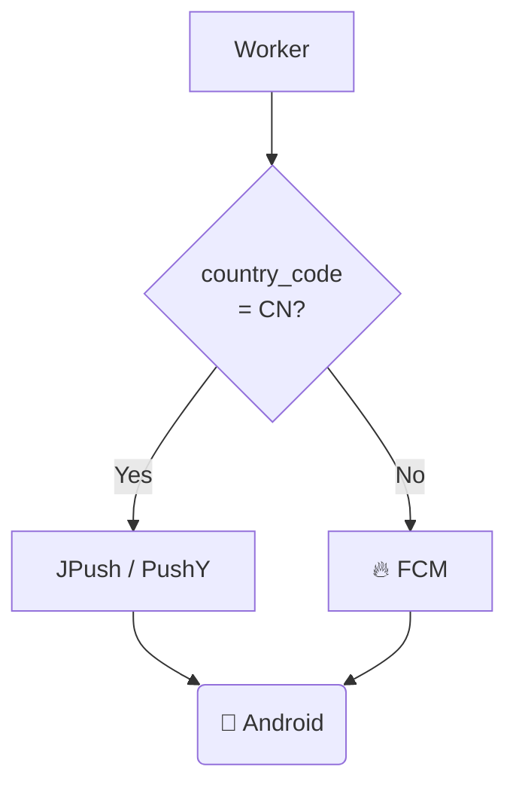

**Likely follow-up:** *How do you detect the user's region reliably?*
> country_code stored at registration (from phone number prefix or IP geo-lookup). For existing users, update on next login. Trust device's locale as a secondary signal.

---

**Q: SQL vs NoSQL for the notification log — which would you pick?**

| Table | DB choice | Reason |
|---|---|---|
| Notification Log | **NoSQL** (Cassandra) | High write throughput, time-series access pattern (query by user_id + time), horizontal scale |
| user / device / settings | **SQL** (MySQL/Postgres) | Relational structure, lower volume, transactional consistency for opt-in/opt-out |

**Likely follow-up:** *How do you handle schema changes in a NoSQL notification log?*
> Schema-on-read: store a `schema_version` field in each row. Consumers handle multiple versions. Migrations are additive only (never remove fields, mark deprecated).

---

### H. Analytics & Event Tracking

---

**Q: How do you track whether a user opened a push notification?**

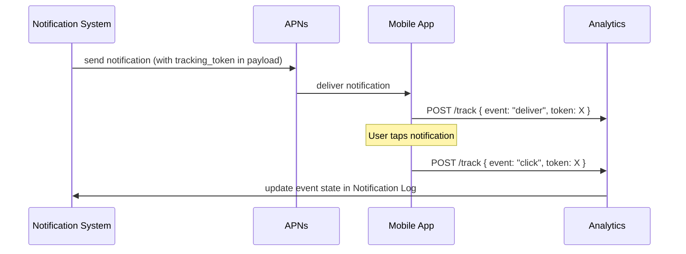

**Likely follow-up:** *What if the user taps the notification but the app is offline?*
> Buffer the tracking event locally and flush when connectivity resumes. Use background app refresh or on-next-open to send the queued event.

---

**Q: What metrics would you report to the product team?**

| Metric | Formula | Insight |
|---|---|---|
| Delivery rate | delivered / attempted | Pipeline health per channel |
| Open rate | opened / delivered | Notification relevance |
| Click rate | clicked / delivered | CTA effectiveness |
| Opt-out rate | opt-outs / period | Notification fatigue signal |
| Latency P99 | enqueue → deliver | Pipeline bottleneck detection |
| Retry rate | retries / sends | Third-party reliability |
| Error breakdown | by type | Invalid token vs timeout vs rate-limit |

**Likely follow-up:** *How do you correlate a notification with a downstream conversion (e.g., a purchase)?*
> Embed a `campaign_id` or `notification_id` in the deep-link URL. When user completes purchase, the app/backend records the attribution source. Join notification events with purchase events on `campaign_id` in the analytics warehouse.

---

## Rapid-Fire Q&A

> 30-second answers expected. Practise until these are automatic.

| Question | Answer |
|---|---|
| What's in the device table? | `id`, `device_token`, `user_id` (FK), `last_logged_in_at` — one row per device; one user → many devices |
| How does APNs know which phone to send to? | The **device token** uniquely identifies the app+device combo. Sent to APNs in the push payload. |
| What is FCM? | Firebase Cloud Messaging — Google's push service for Android (replaces GCM). Unavailable in China. |
| What's a notification template? | Preformatted message with parameter placeholders (item name, date, CTA). Avoids rebuilding from scratch. |
| Why rate-limit notifications? | Too many → users disable all notifications → you lose the channel entirely. |
| What's a dead-letter queue? | Queue where messages land after exceeding max retry attempts. Used for inspection, alerting, manual replay. |
| How do you handle an invalid device token? | APNs/FCM returns an error. Worker marks device inactive in DB + removes from cache. Stops sending to it. |
| Event states in tracking? | `start → pending → sent → deliver → click / error / unsubscribe` |
| How do you secure the notification API? | appKey + appSecret auth + rate limiting per caller + internal-only exposure |
| Difference between `deliver` and `click` events? | `deliver` = notification reached the OS (APNs/FCM ack). `click` = user tapped it (in-app tracking callback). |
| What's the notification settings table schema? | `user_id`, `channel` (push/email/sms), `opt_in` (boolean) |
| Where exactly do you check opt-out? | In the worker at **dequeue time** — ensures late opt-outs are respected even for queued events |
| Why extract the DB from the notification server? | Prevents SPOF; enables independent scaling of compute vs storage |
| What does "at-least-once delivery" mean? | Message delivered ≥ 1 time — possible duplicates, mitigated by dedupe on `event_id` |

---

## 7. One-Page Cheat Sheet

> Print and review 10 minutes before the interview.

| Topic | Key Point |
|---|---|
| Scale | 10M push / 1M SMS / 5M email per day |
| Push iOS | Provider → APNs → iOS (device token + JSON payload) |
| Push Android | Provider → FCM → Android (FCM unavailable in China → JPush/PushY) |
| SMS | Provider → Twilio / Nexmo → Phone |
| Email | Provider → Sendgrid / Mailchimp → Inbox |
| Contact info flow | App install/signup → LB → API servers → DB |
| DB tables | `user` (email, phone) + `device` (device_token, user_id FK) |
| Initial design problem | SPOF + hard to scale + perf bottleneck |
| Fix #1 | Move DB + cache out of notification server |
| Fix #2 | Horizontal scaling of notification servers |
| Fix #3 | Message queues **per channel** (iOS PN / Android PN / SMS / Email) |
| Workers | Pull from queues → send to third-party services |
| Reliability | Notification Log DB + retry on failure + dedupe by `event_id` |
| Exactly once? | No — best-effort dedupe; distributed systems can't guarantee it |
| Templates | Preformatted notifications with parameters; reduces error, saves time |
| Settings table | `user_id` + `channel` + `opt_in`; check before **every** send |
| Rate limiting | Cap notifications per user per window to prevent fatigue |
| Retry | Failed sends → back to queue → N retries → DLQ + alert engineers |
| Security | appKey + appSecret on notification API; verified clients only |
| Queue monitoring | Alert + auto-scale workers when queue depth grows |
| Event tracking | `start → pending → sent → deliver → click / error / unsubscribe` |

---

## 8. Reference Materials

- **[1] Twilio SMS** — https://www.twilio.com/sms
- **[2] Nexmo SMS** — https://www.nexmo.com/products/sms
- **[3] Sendgrid** — https://sendgrid.com/
- **[4] Mailchimp** — https://mailchimp.com/
- **[5] You Cannot Have Exactly-Once Delivery** — https://bravenewgeek.com/you-cannot-have-exactly-once-delivery/
- **[6] Security in Push Notifications** — https://cloud.ibm.com/docs/services/mobilepush?topic=mobile-pushnotification-security-in-push-notifications
- **[7] RabbitMQ tutorial** — https://bit.ly/2sotla6

---

*Source: System Design Interview by Alex Xu — Chapter 10 (pages 152–167)*
