# Top K Leaderboard System — High Level Design

---

## Full Architecture Diagram

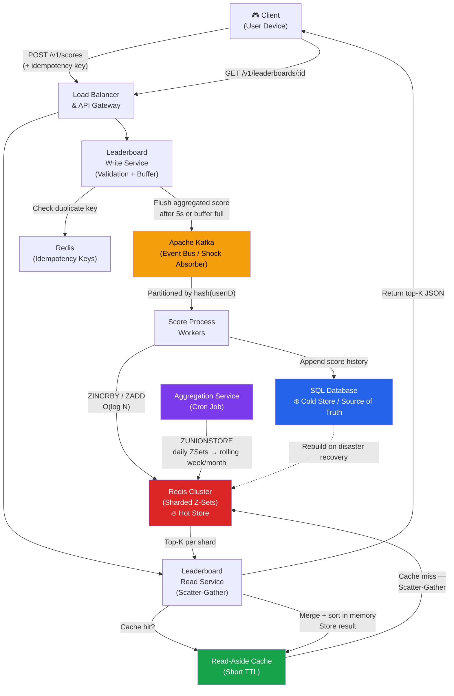

---

## 1. Requirements

### Functional Requirements

| # | Requirement | Description |
|---|-------------|-------------|
| 1 | **Update Score** | Users can submit score updates after a game/level |
| 2 | **Get Top K** | View top 10 or top 100 globally ranked users |
| 3 | **Get User Rank** | Any user can see their own rank + neighbors, even if outside top K |

### Non-Functional Requirements

| Requirement | Target |
|-------------|--------|
| **Scalability** | 10M DAU, 50K writes/sec peak, 500K reads/sec |
| **Write Visibility** | Score visible in leaderboard within **1–2 seconds** |
| **Read Latency** | Top-K fetch **< 20ms P99** |
| **Availability** | **99.9%** uptime on read path (stale reads acceptable) |
| **Storage** | ~1–2 GB in Redis (100 bytes/user × 10M users) |

---

## 2. Data Model

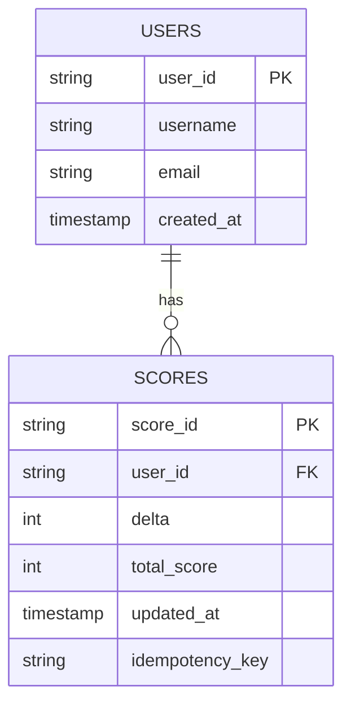

> **Redis** is used as the live ranking index — not source of truth.  
> **SQL** is the durable source of truth and disaster-recovery store.

---

## 3. API Design (REST)

### Endpoints

```
POST   /v1/scores
GET    /v1/leaderboards/:leaderboardId?k=100
GET    /v1/leaderboards/:leaderboardId/users/:userId?range=5
```

### Request / Response Flows

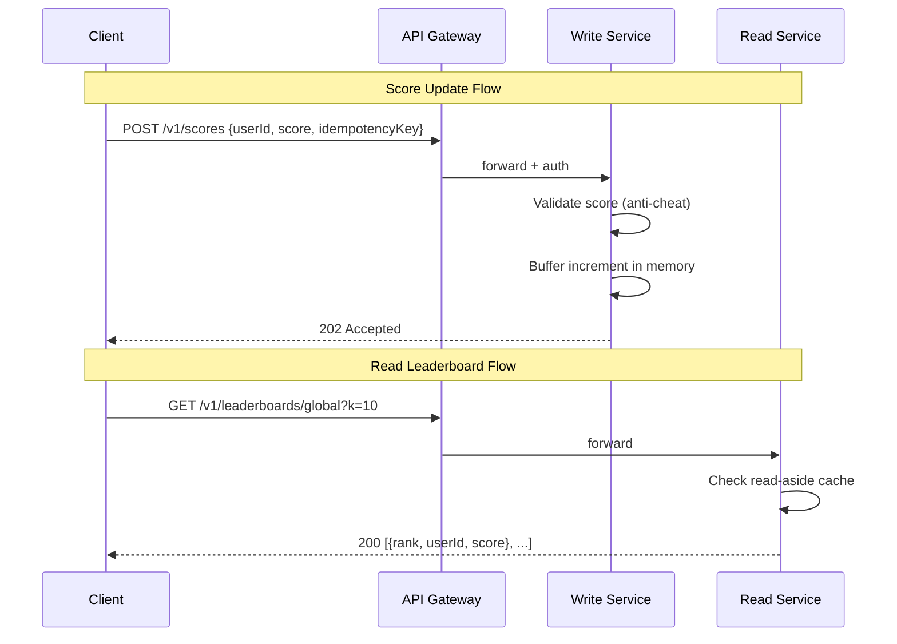

---

## 4. Redis Sorted Sets (Z-Sets) — Deep Dive

Redis Z-Sets use **two internal structures** operating in tandem:

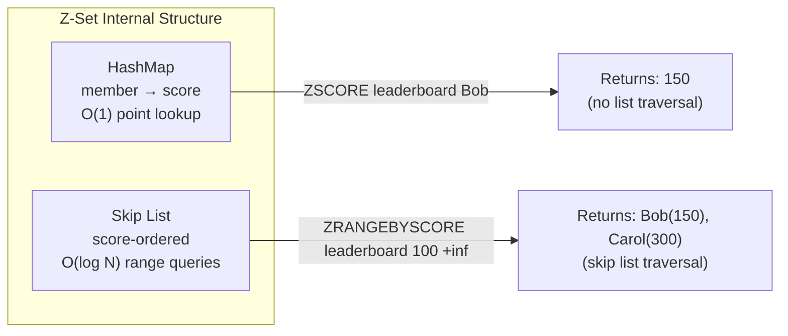

### Skip List Traversal — `ZRANGEBYSCORE > 100`

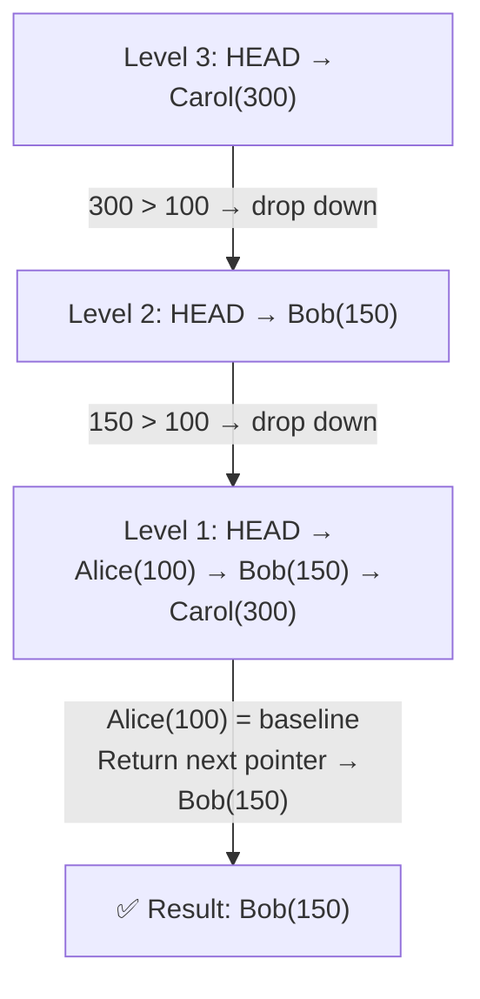

### Operation Complexity

| Operation | Complexity | Redis Command |
|-----------|-----------|---------------|
| Insert / Update score | O(log N) | `ZINCRBY` |
| Get user score | O(1) | `ZSCORE` |
| Get top K | O(log N + K) | `ZREVRANGE` |
| Get user rank | O(log N) | `ZREVRANK` |
| Get neighbors (range) | O(log N + M) | `ZREVRANGEBYSCORE` |

---

## 5. Write Path — Real-Time Counting at Scale

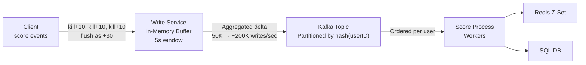

### Idempotency — Handling Server Crashes

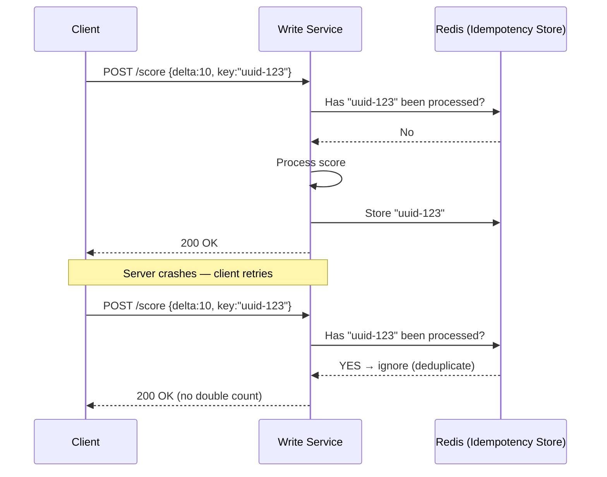

---

## 6. Scaling the Leaderboard — Sharding Strategies

### Strategy A: Fixed Range Partitioning

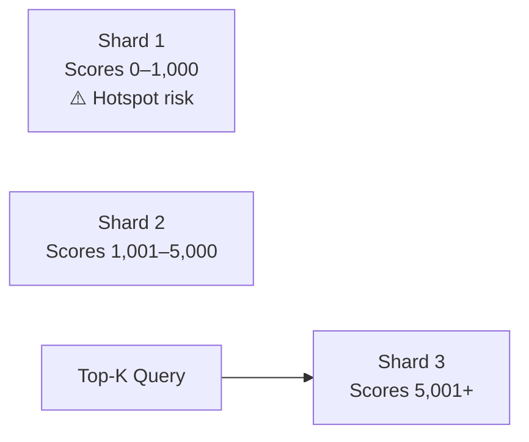

- ✅ Easy top-K: just query the highest shard  
- ❌ Hotspot: beginners flood Shard 1

### Strategy B: Hash Partitioning — Scatter-Gather ✅ Recommended

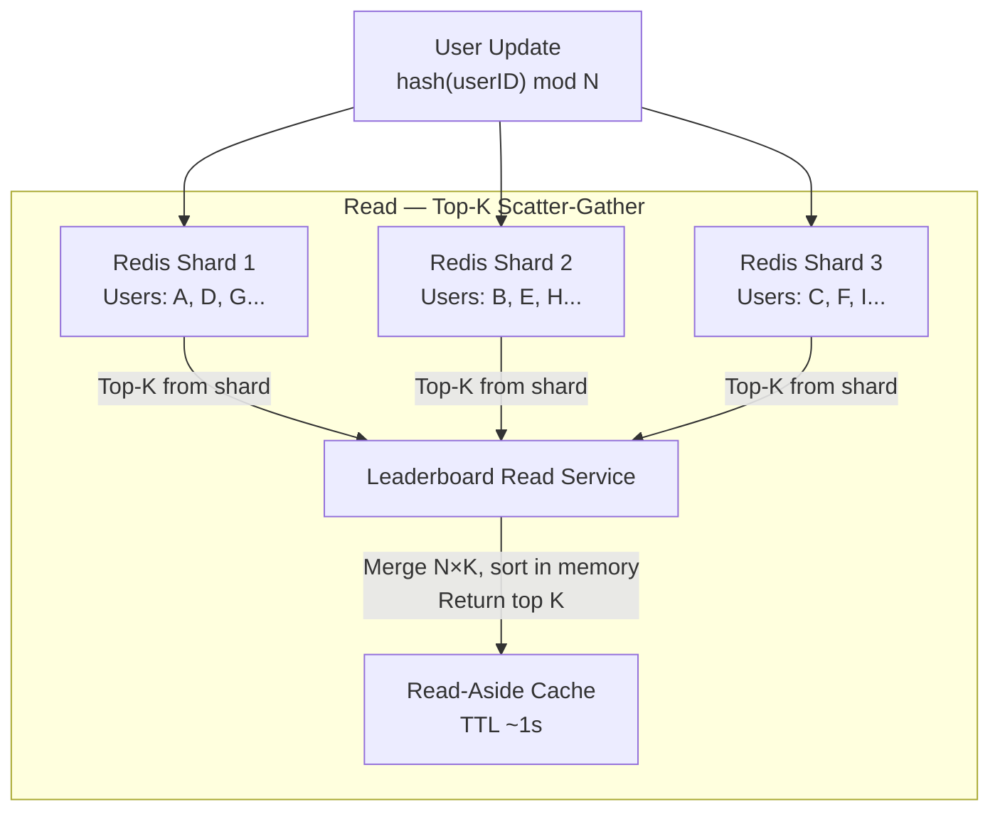

- ✅ Perfectly balanced write load  
- ⚠️ Read is more expensive (N×K merge), acceptable since K ≤ 100

---

## 7. Historical Data & Time Windows

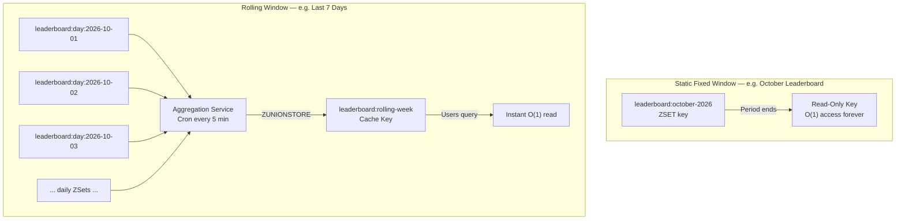

| Window Type | Mechanism | Read Complexity |
|-------------|-----------|----------------|
| Fixed (monthly) | Dedicated Z-Set key per period | O(1) after period ends |
| Rolling (7 days) | Daily Z-Sets + `ZUNIONSTORE` via cron | O(1) from merged cache key |

---

## 8. Complete Data Flow

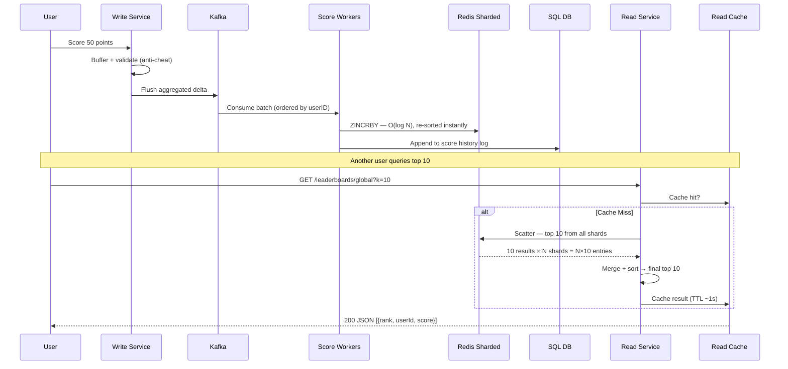

---

## 9. Component Summary

| Component | Technology | Role |
|-----------|-----------|------|
| Load Balancer / API GW | AWS ALB / Kong | Traffic distribution, auth, rate limiting |
| Write Service | Stateless backend | Validation, anti-cheat, in-memory aggregation buffer |
| Event Bus | Apache Kafka | Shock absorber, decouples ingestion from processing |
| Score Workers | Consumer group | Batch-consume Kafka → update Redis + SQL |
| Hot Store | Redis Z-Sets (sharded) | Real-time sorted rankings, O(log N) ops |
| Cold Store | PostgreSQL / MySQL | Source of truth, score history, disaster recovery |
| Read Service | Stateless backend | Scatter-gather across Redis shards, merge results |
| Read-Aside Cache | Redis / Memcached | Short-TTL cache of computed top-K results |
| Aggregation Service | Cron job | Builds rolling-window Z-Sets via ZUNIONSTORE |
| Idempotency Store | Redis | Deduplicates retried score submissions |

---

*Generated from system design walkthrough — Top K Leaderboard*
