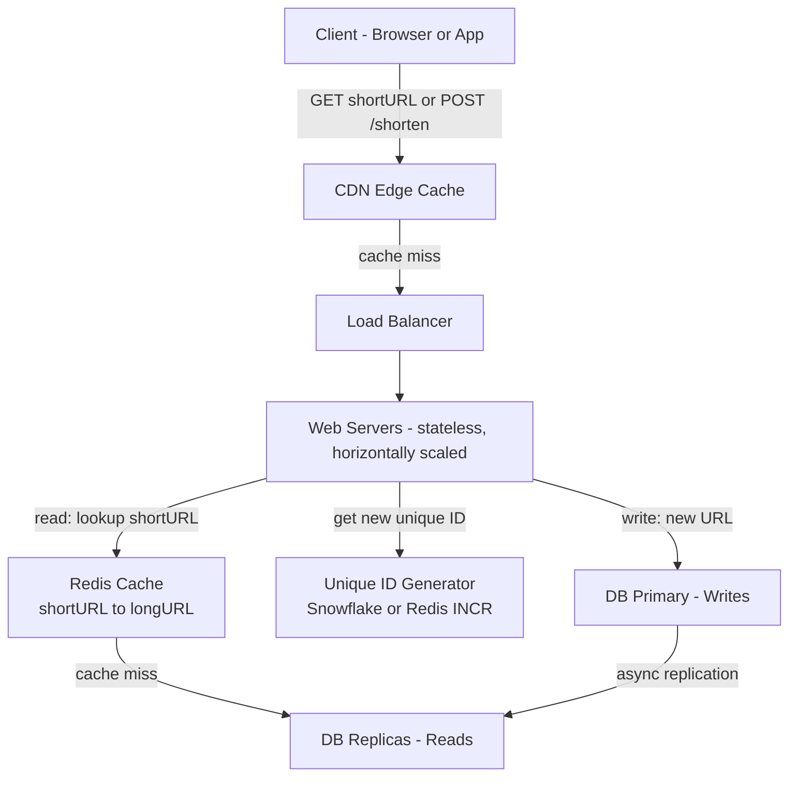
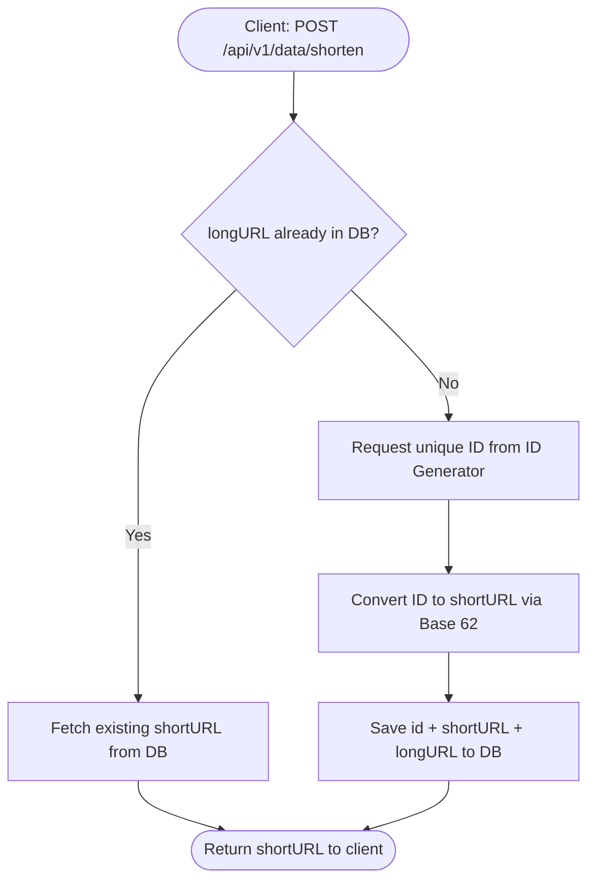
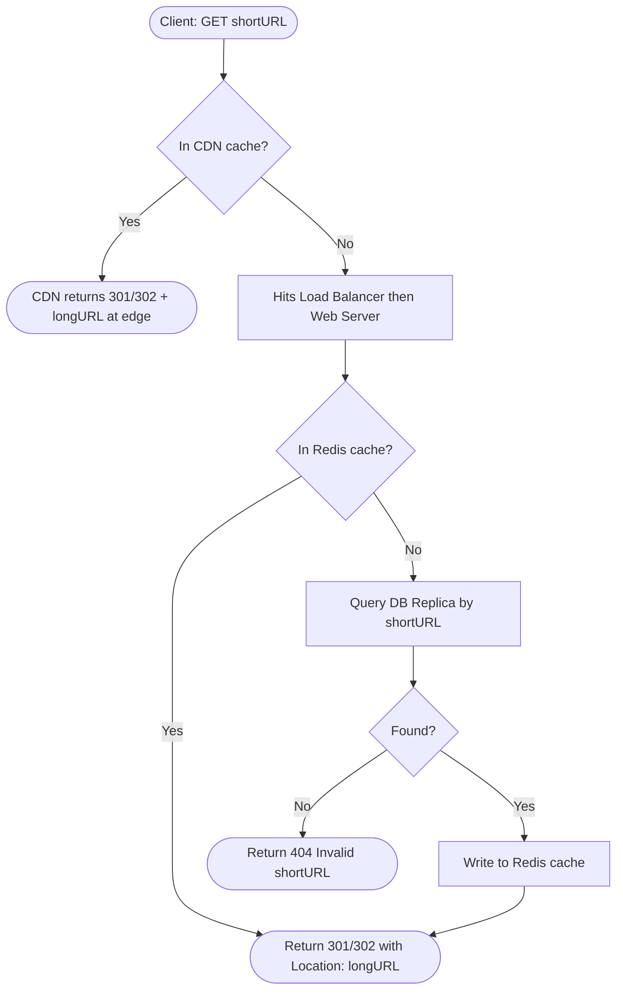
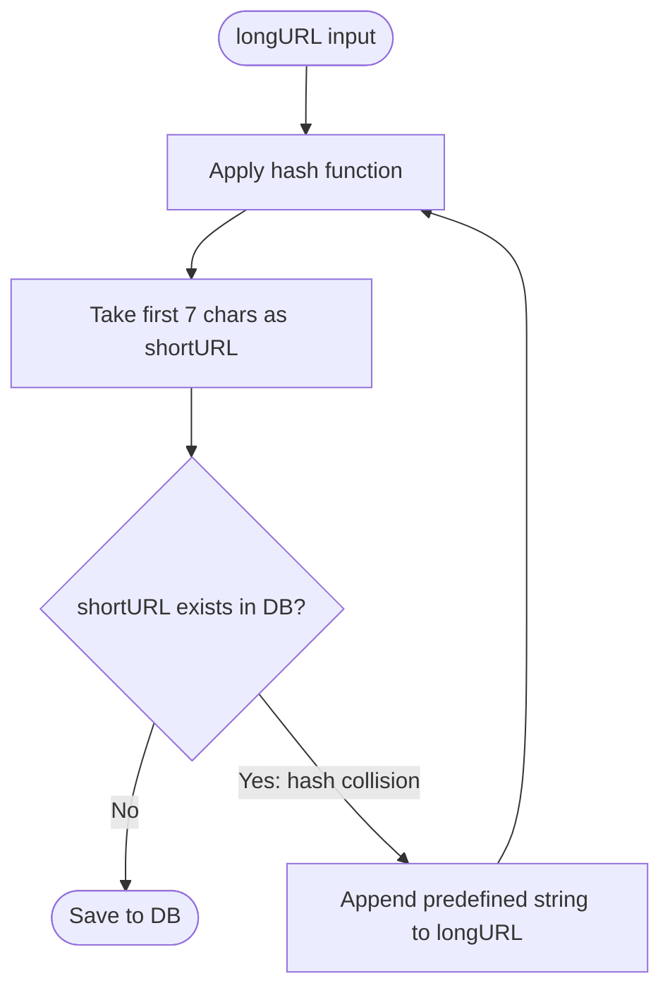

# System Design: URL Shortener (e.g. TinyURL)
> Source: *System Design Interview* — Chapter 8

---

## Step 1 — Clarify Scope

### Clarification Q&A (simulate in interview)

| Question | Answer |
|---|---|
| Example of how it works? | `https://www.systeminterview.com/q=chatsystem&c=loggedin&v=v3&l=long` → `https://tinyurl.com/y7keocwj` |
| Traffic volume? | 100 million URLs/day |
| Length of short URL? | As short as possible |
| Allowed characters? | `[0-9, a-z, A-Z]` (62 characters) |
| Can URLs be deleted/updated? | No — assume immutable |

### Core Use Cases
1. **URL shortening** — given a long URL → return a short URL
2. **URL redirecting** — given a short URL → redirect to the original long URL
3. **High availability, scalability, fault tolerance**

---

## Step 2 — Back-of-the-Envelope Estimation

- **Write**: 100 million URLs/day → 100M / 24 / 3600 ≈ **1,160 writes/sec**
- **Read**: 10:1 read-to-write ratio → **11,600 reads/sec**
- **Storage**: 10 years × 365 billion records × 100 bytes avg URL length = **365 TB**

---

## Step 3 — High-Level Design

### API Endpoints (REST)

**URL Shortening:**
```
POST /api/v1/data/shorten
  Request body: { longUrl: longURLString }
  Response: shortURL
```

**URL Redirecting:**
```
GET /api/v1/{shortUrl}
  Response: longURL (HTTP redirect)
```

---

### High-Level Architecture Diagram



**Write path (shorten):** Client → LB → Web Server → ID Generator → DB Primary → return shortURL

**Read path (redirect):** Client → CDN (edge hit?) → LB → Web Server → Redis (hit?) → DB Replica → 301/302

---

### URL Shortening Flow Diagram



---

### URL Redirecting Flow Diagram



---

### URL Redirecting: 301 vs 302

| | 301 (Permanent) | 302 (Temporary) |
|---|---|---|
| Browser caches? | Yes — subsequent requests go **directly to long URL** (bypasses tinyurl server) | No — all requests go **through tinyurl server** |
| Server load | Lower (cached after first hit) | Higher (every request hits tinyurl) |
| Analytics tracking | Hard (requests bypass server after first) | Easy (every click tracked server-side) |
| **When to use** | Reduce server load | Track click analytics |

**Redirect flow:**
```
Client → GET short URL → TinyURL Server
TinyURL Server → 301/302 (Location: long URL)
Client → GET long URL → Origin Server
```

---

### URL Shortening: Hash Function

Short URL format: `www.tinyurl.com/{hashValue}`

**Requirements:**
- Each `longURL` maps to exactly one `hashValue`
- Each `hashValue` maps back to the `longURL`

---

## Step 4 — Deep Dive

### Data Model

Store `<shortURL, longURL>` in a relational database:

```
+------------------------+
|        url Table       |
+------------------------+
| PK  id (auto increment)|
|     shortURL           |
|     longURL            |
+------------------------+
```

---

### Why Relational DB Here — and When to Use DynamoDB Instead

This is a very common follow-up. The book uses a relational DB as a **teaching simplification**. In a real production system at scale, the answer is more nuanced.

#### Why the book chooses Relational DB

| Reason | Explanation |
|---|---|
| **Auto-increment PK** | Base 62 approach depends on a sequentially incrementing integer ID. RDBMS natively supports `AUTO_INCREMENT` / `SERIAL` — no extra service needed |
| **Deduplication check** | "Is longURL already in DB?" is a simple `SELECT WHERE longURL = ?` with an index — clean in SQL |
| **ACID on concurrent writes** | Prevents two requests for the same longURL both generating new IDs and creating duplicate shortURLs |
| **Uniqueness constraints** | `UNIQUE` on `shortURL` column gives free collision protection at the DB layer |
| **Teaching simplicity** | Fewer moving parts when explaining the design |

#### Why DynamoDB is the better production choice at scale

| Reason | Explanation |
|---|---|
| **Throughput** | DDB handles millions of reads/sec with single-digit ms latency — RDBMS hits connection pool limits well before that |
| **No joins needed** | Data model is pure key-value: `shortURL → longURL`. All relational features are wasted overhead |
| **Horizontal scaling** | DDB partitions automatically. RDBMS requires manual sharding — operationally complex |
| **HA built-in** | DDB replicates across 3 AZs automatically. RDBMS HA = Multi-AZ setup + read replicas + failover scripts |
| **No schema migrations** | Adding `expiry_timestamp`, `custom_alias`, `click_count` requires no `ALTER TABLE` downtime |

#### DynamoDB Schema Design

```
Table: url_mappings
  Partition Key (PK): shortURL    ← O(1) GetItem lookup on every redirect (the hot path)
  Attributes:
    longURL        (String)
    createdAt      (Number, epoch ms)
    expiryAt       (Number, epoch ms — set as TTL attribute for auto-expiry)
    userId         (String, optional)

GSI-1:
  PK: longURL                     ← enables dedup: "has this longURL been shortened before?"
```

> **Why `shortURL` as partition key?** 100% of redirect traffic does a point-lookup by shortURL. DDB GetItem is O(1) — exactly what you want for the hot read path.

> **Why a GSI on `longURL`?** Enables the dedup check without a full table scan. At 365 billion records this is non-negotiable.

#### The ID Generation Problem with DynamoDB

This is the core tradeoff that makes RDBMS attractive for the Base 62 approach:

- **RDBMS:** auto-increment PK is free and built-in.
- **DynamoDB:** no native auto-increment. You need an external ID generator.

**Options for ID generation with DDB:**

| Option | How it works | Tradeoff |
|---|---|---|
| **Snowflake ID** | 64-bit: timestamp + machine ID + sequence. No central coordinator | Best for distributed. Slight clock skew risk |
| **Redis INCR** | `INCR counter` — atomic and fast | Adds Redis dependency; SPOF unless clustered |
| **DDB counter item** | `UpdateItem` with `ADD 1` on a counter attribute — atomic | Hot partition at high write volume |
| **Random 7-char string** | Generate random base-62 string, check DDB for collision | Simple but collision check adds latency |

**Recommended: Snowflake-style ID** — globally unique, no coordination, works across distributed web servers.

#### Summary: What to say in the interview

| Stage | What to say |
|---|---|
| First answer | "I'll use a relational DB — it gives me a free auto-increment PK for Base 62, UNIQUE constraints, and ACID on concurrent shortens" |
| Interviewer: "at scale?" | "At 10K+ writes/sec I'd migrate to DynamoDB — the access pattern is pure key-value, DDB scales horizontally without manual sharding, and I'd add a Snowflake-based ID generator to replace auto-increment" |
| Interviewer: "why not DDB from the start?" | "DDB has no native auto-increment. Base 62 needs a monotonically increasing ID, so I'd need an external ID service anyway. Starting with RDBMS defers that complexity while the system is small" |

**The one-line interview answer:**
> *"Start with RDBMS for simplicity and auto-increment. At scale, switch to DynamoDB with Snowflake IDs — the data model is pure key-value with no joins, and DDB's managed horizontal scaling removes the sharding burden."*

---

### Hash Value Length

Characters: `[0-9, a-z, A-Z]` = 10 + 26 + 26 = **62 possible characters**

| n (length) | Max URLs supported |
|---|---|
| 1 | 62 |
| 2 | 3,844 |
| 3 | 238,328 |
| 4 | 14,776,336 |
| 5 | 916,132,832 |
| 6 | 56,800,235,584 |
| **7** | **3,521,614,606,208 (~3.5 trillion)** ✅ |

**n = 7** is sufficient — 3.5 trillion >> 365 billion needed.

---

### Hash Approach 1: Hash + Collision Resolution

Use well-known hash functions (CRC32, MD5, SHA-1):

| Hash Function | Hash Value (Hex) |
|---|---|
| CRC32 | `5cb54054` |
| MD5 | `5a62509a84df9ee03fe1230b9df8b84e` |
| SHA-1 | `0eeae7916c06853901d9ccbefbfcaf4de57ed85b` |

Problem: Even CRC32 (shortest) is 8 chars — too long. **Take first 7 characters.**

**Collision handling flow:**


Drawback: DB query on every request to check collision → use **Bloom filter** to speed this up (probabilistic, space-efficient membership check).

---

### Hash Approach 2: Base 62 Conversion (Preferred)

Convert a unique numeric ID (auto-increment PK) to a base-62 string.

**Example:** Convert `11157` to base 62:
```
11157 / 62 = 179 remainder 59  → 'X'  (0-9 = 0-9, 10-35 = a-z, 36-61 = A-Z)
  179 / 62 =   2 remainder 55  → 'T'
    2 / 62 =   0 remainder  2  → '2'

Result: "2TX"  →  https://tinyurl.com/2TX
```

**Comparison of two approaches:**

| Property | Hash + Collision Resolution | Base 62 Conversion |
|---|---|---|
| Short URL length | Fixed (always 7 chars) | Variable (grows with ID magnitude) |
| Unique ID generator needed? | No | Yes |
| Collision possible? | Yes — must resolve | No (ID is always unique) |
| Predict next URL? | No | Yes — security concern |

---

### URL Shortening Flow (Base 62) — Figure 8-7

1. Input: longURL
2. Check if longURL is already in DB
3. If yes — return existing shortURL (dedup)
4. If no — generate new unique ID (primary key)
5. Convert ID → shortURL via Base 62
6. Save `{id, shortURL, longURL}` to DB, return shortURL

**Concrete example:**
- Input: `https://en.wikipedia.org/wiki/Systems_design`
- Unique ID: `2009215674938`
- Base 62 conversion: → `"zn9edcu"`
- Short URL: `https://tinyurl.com/zn9edcu`

> The **distributed unique ID generator** is a critical sub-component. See Chapter 7 (Design a Unique ID Generator in Distributed Systems).

---

### URL Redirecting Flow — Figure 8-8

1. User clicks: `https://tinyurl.com/zn9edcu`
2. Load balancer routes to web servers
3. If shortURL is in **Redis cache** → return longURL immediately
4. If not in cache → query **DB replica** → write result to cache
5. Return longURL to user via 301/302

Cache is critical — **reads are 10x writes**, so cache hit rate will be high after warm-up.

---

## Step 5 — Wrap Up (Additional Talking Points)

| Topic | Key Points |
|---|---|
| **Rate Limiting** | Filter malicious users sending huge volumes of shortening requests. Filter by IP or API key. See: "Design a Rate Limiter" |
| **Web Server Scaling** | Web tier is **stateless** → easy horizontal scaling (add/remove servers behind LB) |
| **Database Scaling** | Read replicas for 10:1 read load. Shard on `shortURL` hash if write volume grows |
| **Analytics** | Use 302 redirect for accurate click tracking. Async event pipeline (Kafka → analytics DB) for aggregation |
| **Availability & Consistency** | Covered in Chapter 1 — CAP theorem, replication lag, eventual consistency |

---

## Quick Cheat Sheet

```
Scale:      100M writes/day → ~1,160 writes/sec, ~11,600 reads/sec
Storage:    365 TB over 10 years
URL length: 7 chars (62^7 = 3.5 trillion)
Hash:       Base 62 preferred (no collision) | Hash+Collision as fallback
Redirect:   302 (analytics) vs 301 (performance)
Cache:      shortURL → longURL (high read:write ratio makes this very effective)
DB:         RDBMS for simplicity; DynamoDB at scale (key-value, auto-partitioned)
Schema:     id (PK auto-increment) | shortURL | longURL
```

---

## Potential Interview Questions & Model Answers

### Clarification / Requirement Questions (Interviewer → You)

| Question | Your Answer |
|---|---|
| What is the expected scale? | 100 million URLs shortened per day |
| How long should the short URL be? | As short as possible — 7 characters is optimal |
| Can users customize their short URL? | Clarify — if yes, store custom alias; check uniqueness before saving |
| Should URLs expire? | Clarify — default no TTL; if yes, add `expiry_timestamp` column / DDB TTL attribute |
| Should we support analytics (click tracking)? | Clarify — affects 301 vs 302 redirect choice |
| Highly available or strongly consistent? | Availability > consistency — stale cached URL for a few ms is acceptable |

---

### Deep Dive Questions (Interviewer probing your design)

#### On Hash Function

**Q: Why not just use MD5 / SHA-1 directly?**
> Output is 128-bit / 160-bit hex — far longer than 7 chars. Even truncating to 7 chars causes collisions. You'd need to recursively append a predefined string and re-hash — expensive DB check on every write.

**Q: How does Base 62 avoid collisions?**
> The input is a globally unique auto-incremented integer ID. Two different IDs always produce two different base-62 strings. No DB collision check needed.

**Q: What if two users shorten the same long URL?**
> Check if `longURL` already exists in DB before inserting. If found, return the existing `shortURL` (dedup). This saves space and avoids redundant entries.

**Q: How do you generate unique IDs in a distributed environment?**
> Options: (1) **Snowflake** — 64-bit ID with timestamp + datacenter + machine + sequence, no coordination needed; (2) **Redis INCR** — atomic counter, adds a dependency; (3) **UUID** — no coordination but 128-bit is too long for direct base-62 use.

---

#### On Redirecting

**Q: When would you choose 301 over 302?**
> 301 = permanent → browser caches, subsequent requests skip your server. Good for reducing load, bad for analytics.
> 302 = temporary → every click goes through your server. Good for click tracking, A/B testing. Higher load but manageable with caching.

**Q: How does caching help URL redirecting?**
> Redirecting is 10x more frequent than shortening. Cache stores `shortURL → longURL`. On a hit you skip the DB entirely. LRU eviction keeps popular URLs warm.

---

#### On Database Choice

**Q: Why use a relational DB? Wouldn't DynamoDB be better?**
> RDBMS gives a free auto-increment PK (needed for Base 62), UNIQUE constraints, and ACID on concurrent writes — simpler starting point.
> At scale (10K+ writes/sec), DynamoDB is better: pure key-value access pattern, auto-partitioned, no sharding ops. Just need to add a Snowflake ID generator to replace auto-increment.

**Q: How would you design the DynamoDB schema?**
> Partition key: `shortURL` (every redirect is a point-lookup by shortURL).
> Add a GSI on `longURL` to enable dedup check without a full scan.
> Set `expiryAt` as the TTL attribute for automatic expiry.

---

#### On Scalability

**Q: The system gets 10x traffic. What breaks first and how do you fix it?**
> 1. **Web servers** — stateless, add more behind LB.
> 2. **Cache** — scale out Redis cluster; shard by shortURL hash.
> 3. **DB reads** — add read replicas; route all GET requests there.
> 4. **DB writes** — shard the DB or switch to DynamoDB.

**Q: How would you shard the database?**
> Range-based sharding on ID is simple but creates hotspots (recent IDs cluster on one shard).
> Hash-based sharding on shortURL distributes load evenly. Use consistent hashing to minimise resharding cost when adding nodes.

**Q: What if the unique ID generator goes down?**
> It's a SPOF. Fix: run multiple ID generator instances. Snowflake-style IDs embed `machine_id` — no coordination between generators. Alternatively use Redis Sentinel for HA on a Redis INCR counter.

---

#### On Data Model Edge Cases

**Q: How would you support URL expiry (TTL)?**
> Add `expiry_timestamp` column. On redirect, check `NOW() > expiry_timestamp` → return 404. Run a background job to delete expired rows and free up shortURLs. In DynamoDB, set `expiryAt` as the native TTL attribute — DDB deletes it automatically.

**Q: How would you support custom aliases (e.g. tinyurl.com/my-brand)?**
> Add a `custom_alias` column. Before inserting, check uniqueness. If taken, return an error. Store it the same as any shortURL — only the generation differs (user-provided vs system-generated).

**Q: What if someone tries to shorten a malicious URL?**
> Integrate with Google Safe Browsing API — check the longURL before shortening. If flagged, reject. Also implement rate limiting per IP to prevent abuse at the API layer.

---

#### On System Design Breadth

**Q: How would you add analytics — click count, geo, timing?**
> Synchronous: increment counter in DB on every redirect — creates high write contention, blocks the critical path.
> Asynchronous (correct): on redirect, publish a click event to Kafka/SQS. A consumer service aggregates and writes to an analytics store (ClickHouse, Redshift). Zero impact on redirect latency.

**Q: How would you handle a viral URL (thundering herd)?**
> - CDN: serve the redirect at the edge — no origin hit after first request.
> - Cache warm-up: pre-populate cache for known popular URLs.
> - Cache stampede protection: mutex/lock so only one request populates cache on miss; others wait.

**Q: What if someone keeps generating shortURLs to exhaust the ID space?**
> Rate limiting: cap requests per API key / IP per minute.
> Require authentication for shortening (logged-in users only).
> Recycle expired short URLs back into the available pool.

---

### "What would you do differently?" Questions

**Q: Where would you put a CDN?**
> In front of the web servers for redirect traffic. CDN caches `GET /{shortUrl}` responses (the 301/302 + Location header). For 301 redirects, CDN serves the redirect entirely from edge after the first request — zero origin load.

**Q: How would you make this multi-region?**
> - Deploy web servers + cache in each region (US, EU, APAC).
> - GeoDNS routes users to the nearest region.
> - DB: active-active or active-passive replication across regions.
> - Writes go to nearest region; async replication syncs globally.
> - Caveat: replication lag means a URL shortened in US may take a few hundred ms to appear in EU — acceptable for this use case.

**Q: SQL vs NoSQL — final answer?**
> Start with RDBMS for simplicity (auto-increment, ACID, UNIQUE constraints).
> At scale, migrate to DynamoDB: pure key-value access, auto-partitioned, no manual sharding.
> Add Snowflake ID generator to replace auto-increment.
> The pivot point is roughly 10K writes/sec or when DB horizontal scaling becomes operationally painful.
