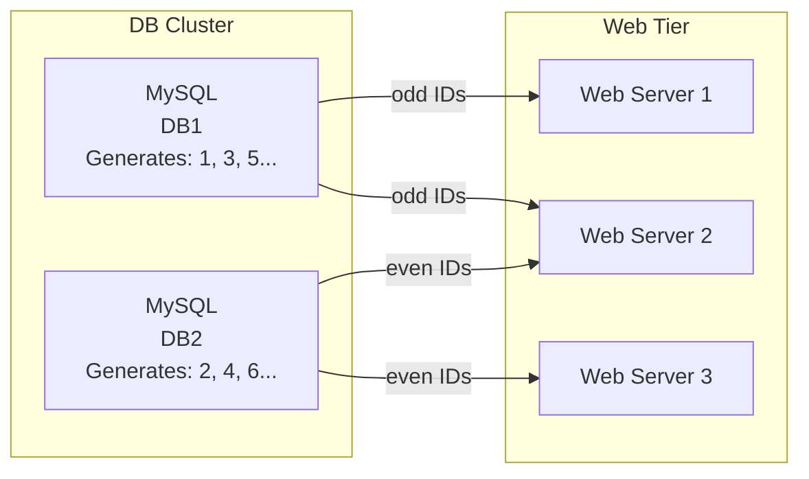
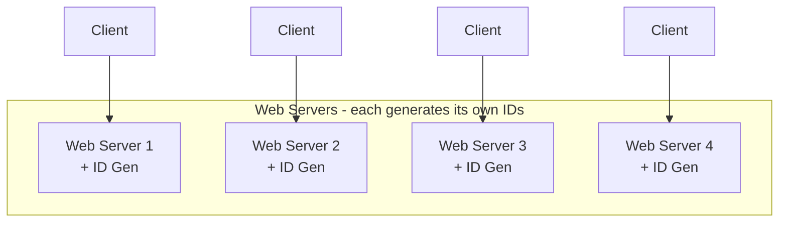
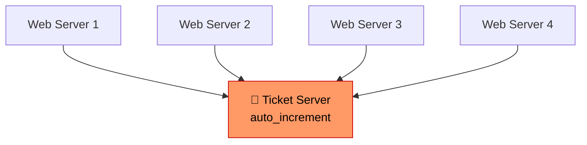
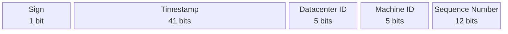
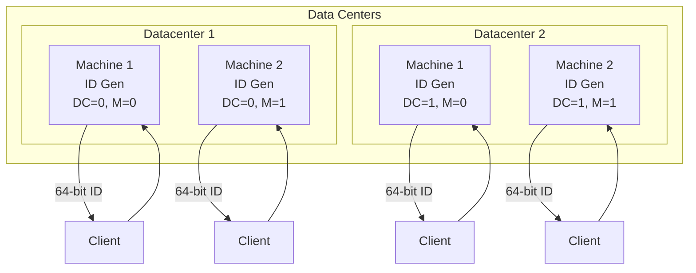
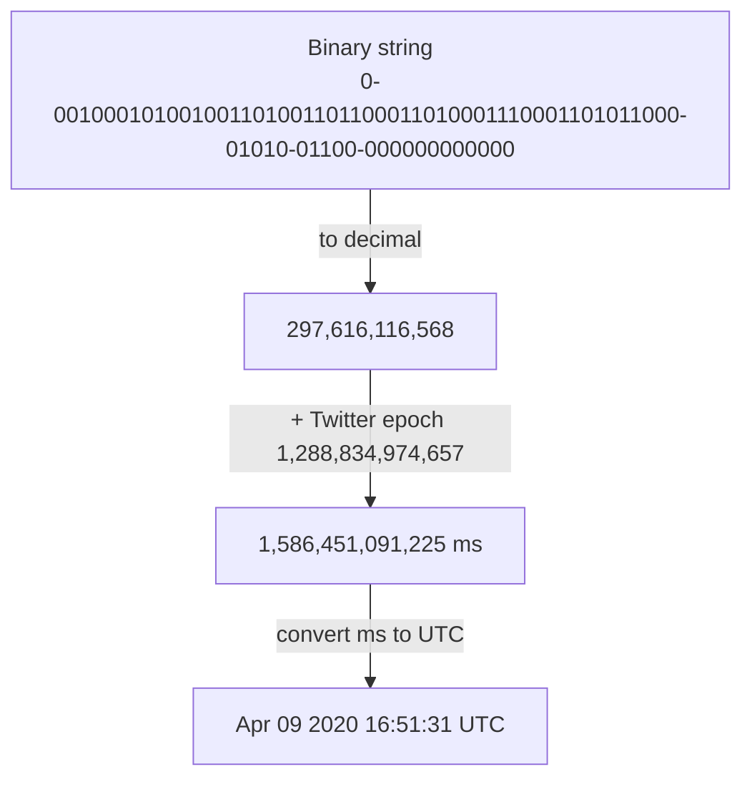
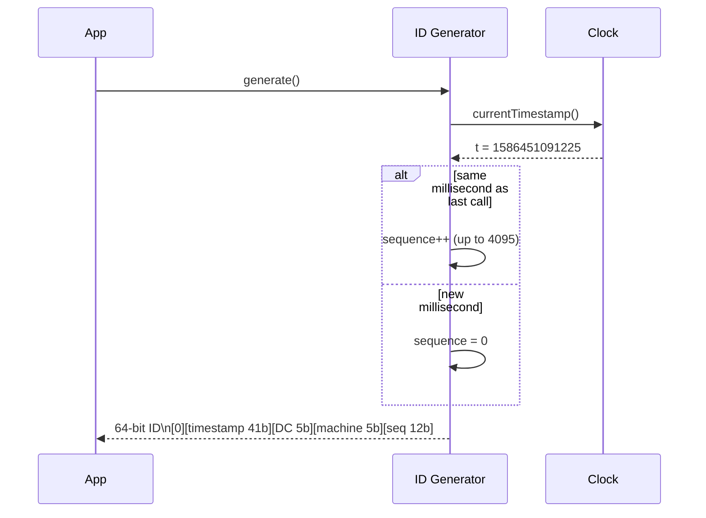
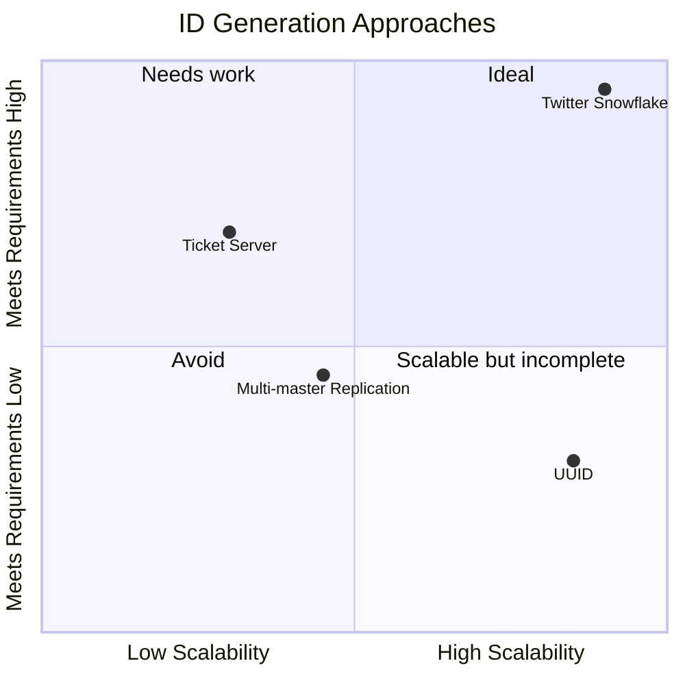

# System Design Interview: Unique ID Generator in Distributed Systems

> Source: *System Design Interview* — Chapter 7 (pp. 112–119)

---

## The Problem

Design a **unique ID generator** for distributed systems.

**Why not just use `auto_increment` in a database?**
- A single DB server is not large enough to handle scale
- Generating unique IDs across multiple databases with minimal delay is hard
- `auto_increment` doesn't work across distributed nodes

---

## Step 1 — Clarify Requirements

Always ask these questions before proposing a design:

| Question | Answer |
|---|---|
| Are IDs numerical only? | Yes |
| What is the ID length? | 64-bit |
| What is the scale? | 10,000 IDs/second |
| Do IDs need to be sortable? | Yes — ordered by date/time |

### Final Requirements Checklist
- [ ] IDs must be **unique**
- [ ] IDs are **numerical values only**
- [ ] IDs fit in **64 bits**
- [ ] IDs are **ordered by date** (time-sortable)
- [ ] System generates **> 10,000 unique IDs per second**

---

## Step 2 — High-Level Design: Four Approaches

### Option 1: Multi-Master Replication

**How it works:** Uses DB `auto_increment` but increments by *k* (number of DB servers) instead of 1.



**Pros:**
- Scales with number of database servers

**Cons:**
- ❌ Hard to scale with **multiple data centers**
- ❌ IDs do **not go up with time** across multiple servers
- ❌ Does not scale well when a server is **added or removed**

---

### Option 2: UUID (Universally Unique Identifier)

**How it works:** 128-bit number generated independently on each server. No coordination needed.

Example: `09c93e62-50b4-468d-bf8a-c07e1040bfb2`

> "After generating 1 billion UUIDs every second for ~100 years, the probability of a single duplicate reaches 50%"



**Pros:**
- No coordination between servers — no sync issues
- Easy to scale — each server is self-contained

**Cons:**
- ❌ IDs are **128 bits**, requirement is 64 bits
- ❌ IDs **do not go up with time** (not sortable)
- ❌ IDs could be **non-numeric** (hex strings)

---

### Option 3: Ticket Server

**How it works:** Flickr's approach. A centralized server with a single `auto_increment` handles ID generation for all web servers.



**Pros:**
- ✅ Numeric IDs
- ✅ Easy to implement
- ✅ Works for small to medium-scale applications

**Cons:**
- ❌ **Single point of failure** — if Ticket Server goes down, all systems fail
- Multiple ticket servers solve SPOF but introduce **data synchronization** challenges

---

### Option 4: Twitter Snowflake Approach ⭐ (Recommended)

**How it works:** Divide a 64-bit ID into meaningful sections. Each section is generated locally — no coordination needed.



**Bit breakdown:**

| Section | Bits | Capacity | Purpose |
|---|---|---|---|
| Sign bit | 1 | Always `0` | Reserved for future use |
| Timestamp | 41 | ~69 years of ms | Milliseconds since custom epoch |
| Datacenter ID | 5 | 2^5 = **32** datacenters | Set at startup, fixed |
| Machine ID | 5 | 2^5 = **32** machines/DC | Set at startup, fixed |
| Sequence number | 12 | 2^12 = **4,096**/ms/machine | Reset to 0 every millisecond |

**Total throughput:** 32 DCs × 32 machines × 4096 IDs/ms = **~4.19 billion IDs/ms** (theoretical max)

---

## Step 3 — Design Deep Dive (Snowflake)

### Architecture: ID Generator Service



### Timestamp: Binary → UTC Conversion



### Sequence Number Logic



### Timestamp Lifespan Math

```
Max value of 41 bits:
  2^41 - 1 = 2,199,023,255,551 milliseconds

Convert to years:
  2,199,023,255,551 ms
  ÷ 1000     = 2,199,023,255 seconds
  ÷ 3600     = 611,395,369 hours
  ÷ 24       = 25,474,807 days
  ÷ 365      ≈ 69 years

→ System works for ~69 years from the chosen epoch.
  Using today's date as epoch pushes overflow to ~2095.
```

---

## Step 4 — Wrap Up

### Why Snowflake wins



### Additional Talking Points (if time remains)

| Topic | Key Point |
|---|---|
| **Clock synchronization** | Assumes all servers share the same clock — not true in multi-core/multi-server setups. **NTP (Network Time Protocol)** is the standard fix. |
| **Section length tuning** | Fewer sequence bits + more timestamp bits = better for low concurrency, long-running apps. Trade off based on use case. |
| **High availability** | ID generator is mission-critical — design with redundancy, no SPOF. |

---

## Quick Comparison Table

| Approach | Numeric | 64-bit | Time-sorted | Highly Scalable | No SPOF |
|---|:---:|:---:|:---:|:---:|:---:|
| Multi-master replication | ✅ | ✅ | ❌ | ⚠️ | ✅ |
| UUID | ❌ | ❌ | ❌ | ✅ | ✅ |
| Ticket Server | ✅ | ✅ | ✅ | ⚠️ | ❌ |
| **Twitter Snowflake** | ✅ | ✅ | ✅ | ✅ | ✅ |

---

## Interview Q&A

### Conceptual / Design Questions

**Q1: Why can't we just use `auto_increment` in MySQL for a distributed system?**
> `auto_increment` works on a single database node. In a distributed system, multiple nodes generate IDs concurrently — there's no shared counter, so you'll get duplicates. Even with multi-master replication, IDs won't be globally time-ordered and scaling to multiple data centers becomes operationally painful.

---

**Q2: Why is time-sortability important for IDs?**
> Many systems use IDs to paginate or range-scan records (e.g., "give me all orders after ID X"). If IDs encode time, you can do range queries without a separate `created_at` index. It also makes debugging easier — you can decode an ID and know roughly when it was created.

---

**Q3: Why is the sign bit always 0?**
> To ensure IDs are always positive. Some languages treat the most significant bit as a sign flag for signed integers. Fixing it to 0 means the 64-bit ID behaves as a positive long in Java/Go/etc., preventing negative ID bugs.

---

**Q4: What happens when the sequence number overflows (hits 4095) within the same millisecond?**
> The ID generator must **wait until the next millisecond** before issuing a new ID. In practice, hitting 4096 IDs/ms on a single machine is rare. If it becomes a bottleneck, you add more machines (5-bit machine ID allows 32 per DC).

---

**Q5: What is the maximum number of unique IDs this system can generate per second?**
> Per machine: 4,096 IDs/ms × 1,000 ms = **~4.09 million IDs/second per machine**.  
> Across the full system: 32 DCs × 32 machines × 4.09M = **~4.19 billion IDs/second** (theoretical max).

---

**Q6: What happens after ~69 years when the timestamp overflows?**
> Two options:
> 1. **Migrate** — define a new epoch and reissue IDs using a new scheme
> 2. **Extend** — repurpose the sign bit (giving 1 extra bit → ~138 years), or reduce datacenter/machine bits if the system has fewer nodes
> 
> In practice, using a custom epoch close to today (not Unix epoch 1970) shifts the overflow to ~2089–2095, giving plenty of runway.

---

**Q7: How do you handle clock drift or clock going backwards?**
> This is a real problem — NTP can cause a server's clock to go backwards, generating duplicate timestamps.  
> Solutions:
> - **Reject or wait**: If the current time < last timestamp, refuse to generate IDs until the clock catches up
> - **Use sequence number as buffer**: The sequence can absorb small backward drifts within the same millisecond
> - **Logical clocks**: Use a hybrid logical clock (HLC) that combines physical and logical time

---

**Q8: How does Twitter Snowflake differ from UUID?**
> | | Snowflake | UUID |
> |---|---|---|
> | Size | 64 bits | 128 bits |
> | Type | Numeric (long) | Hex string |
> | Time-sortable | ✅ Yes | ❌ No |
> | Coordination | None needed | None needed |
> | Central dependency | None | None |
>
> Snowflake satisfies all constraints UUID fails on: 64-bit, numeric, and sortable.

---

### Deep Dive / Follow-Up Questions

**Q9: Can two machines generate the same ID simultaneously?**
> No — by design. The combination of datacenter ID + machine ID is unique per machine, set at startup. Two machines will always have different (datacenterID, machineID) pairs, so even identical timestamps and sequence numbers produce different IDs.

---

**Q10: How do you assign datacenter IDs and machine IDs? What if a machine is replaced?**
> Options:
> - **ZooKeeper / etcd**: Each machine registers on startup and is assigned an ID atomically. On replacement, the old ID is released and reassigned
> - **Config file**: Simpler; manually assign and manage IDs per machine
> 
> The key constraint: no two running machines can share the same (DC ID, machine ID) pair.

---

**Q11: What if we need more than 32 machines per datacenter?**
> Rebalance the bit allocation. For example:
> - Reduce datacenter bits from 5 → 3 (8 DCs) and increase machine bits from 5 → 7 (128 machines/DC)
> - Or reduce sequence bits and increase machine bits — accepting lower per-machine throughput
> 
> The 64-bit budget is fixed; it's always a tradeoff between DCs, machines, and sequence capacity.

---

**Q12: Is Snowflake the only solution? What would you use in practice today?**
> Not the only one. Real-world alternatives:
> - **Instagram's ID scheme**: Similar to Snowflake, but uses PostgreSQL sequences for the sequence number portion
> - **Sonyflake**: Snowflake variant optimized for AWS environments (10-bit machine ID derived from IP)
> - **ULID**: Universally Unique Lexicographically Sortable Identifier — 128-bit, but base32 encoded and time-sorted
> - **MongoDB ObjectID**: 12 bytes — timestamp + machine + process + counter
> 
> For most systems, Snowflake or a variant is the right answer.

---

**Q13: How would you make the ID generator highly available?**
> - Run **multiple instances** per datacenter — no shared state between generators, so no coordination needed
> - Use **health checks + load balancing** in front of the ID generation service
> - Each instance is stateless from a coordination perspective (state is just the local clock + sequence counter)
> - Monitor for **clock drift** with alerts

---

**Q14: Can this design support multi-region (e.g., US + EU + APAC)?**
> Yes. Each region gets its own datacenter ID range (e.g., DC 0–10 = US, DC 11–20 = EU, DC 21–31 = APAC). IDs are globally unique because the datacenter bits distinguish regions. Clients can even decode which region generated an ID from the ID itself.

---

## One-Liner Answer for Interviews

> *"I'd use a Twitter Snowflake-inspired approach — a 64-bit ID split into: 1 sign bit (always 0), a 41-bit millisecond timestamp, a 5-bit datacenter ID, a 5-bit machine ID, and a 12-bit sequence number. This gives time-sorted, numeric, unique IDs with no coordination overhead, supports 4,096 IDs per machine per millisecond, and scales to 32 datacenters × 32 machines. The main tradeoff to watch is clock drift — handled by waiting or using hybrid logical clocks."*

