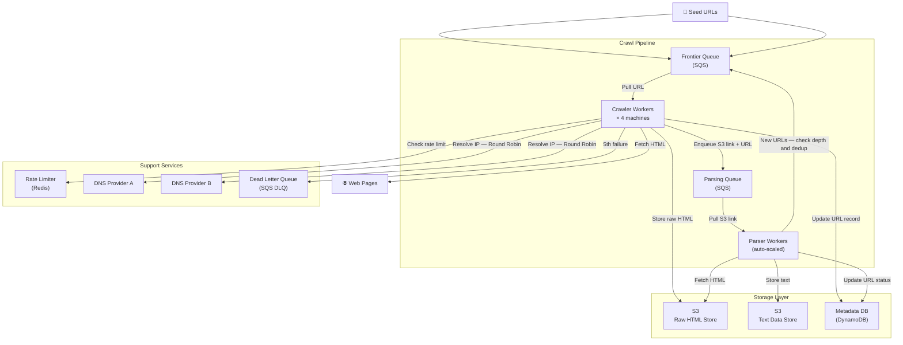
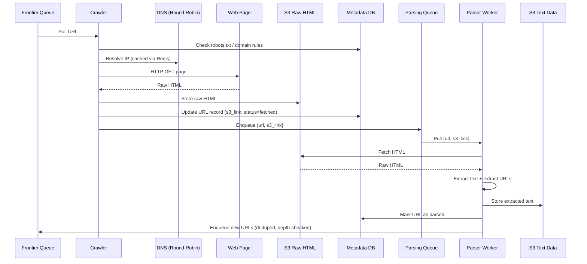
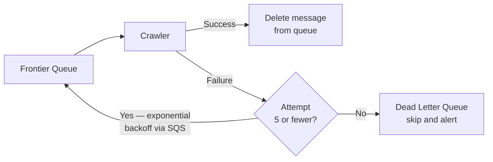
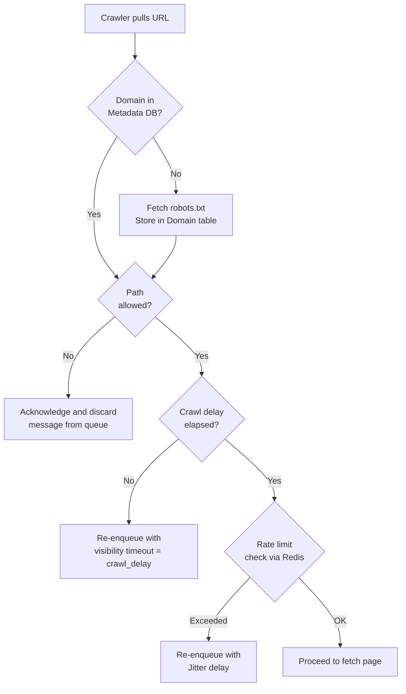

# Web Crawler — High Level Design

> **Goal:** Extract text data from the web to train a large language model (LLM).  
> **Constraint:** Crawl 10 billion pages in under 5 days.

---

## System Architecture Diagram



---

## Data Flow



---

## Retry and Fault Tolerance Flow



---

## Politeness — robots.txt Adherence



---

## Requirements

### Functional

| # | Requirement |
|---|-------------|
| 1 | Crawl the full web starting from a set of seed URLs |
| 2 | Extract text data from each web page |
| 3 | Store extracted text for LLM training consumption |

### Non-Functional

| # | Requirement | Detail |
|---|-------------|--------|
| 1 | **Fault Tolerant** | Resume crawling without losing progress on failures |
| 2 | **Polite** | Adhere to `robots.txt`; respect crawl delays; max 1 req/sec per domain |
| 3 | **Scalable** | Handle 10 billion pages across distributed workers |
| 4 | **Efficient** | Complete full crawl in under 5 days |

### Scale Parameters

| Parameter | Value |
|-----------|-------|
| Total web pages | 10 billion |
| Average page size | 2 MB |
| Crawl deadline | 5 days |
| Budget constraint | Unlimited (within reason) |

---

## System Interface

```
Input:  Set<SeedURL>  — bootstrapped into Frontier Queue
Output: S3 bucket of extracted text files, keyed by URL hash
```

---

## Core Entities

### URL Metadata (DynamoDB)

| Field | Type | Notes |
|-------|------|-------|
| `url` | String (PK) | Primary key |
| `s3_html_link` | String | Pointer to raw HTML in S3 |
| `content_hash` | String (GSI) | MD5/SHA of HTML for dedup |
| `status` | Enum | `pending / fetched / parsed / failed` |
| `last_crawled_at` | Timestamp | Used for recrawl scheduling |
| `depth` | Integer | Crawl depth from seed URL |

### Domain Metadata (DynamoDB)

| Field | Type | Notes |
|-------|------|-------|
| `domain` | String (PK) | e.g. `example.com` |
| `robots_user_agent` | String | From `robots.txt` |
| `disallow_paths` | List<String> | Paths blocked by `robots.txt` |
| `crawl_delay_secs` | Integer | From `robots.txt` (default: 1) |
| `last_crawled_at` | Timestamp | Enforce crawl delay |

---

## Component Breakdown

### 1. Frontier Queue (SQS)

- Bootstrapped with seed URLs
- Messages stay **invisible** (visibility timeout) until confirmed processed
- On success: crawler explicitly deletes the message
- On failure: SQS retries with **exponential backoff** (30s → 2m → 5m → 15m)
- After 5 failures: message routed to **Dead Letter Queue**

> **Why SQS over Kafka?**  
> SQS provides built-in configurable exponential backoff and DLQ routing out of the box. Kafka requires manual implementation of retry topics and offset management.

---

### 2. Crawler Workers (× 4 EC2 Network-Optimized Instances)

**Responsibilities:**
1. Pull URL from Frontier Queue
2. Check `robots.txt` and domain rules (Metadata DB / Redis cache)
3. Check rate limiter (Redis sliding window, max 1 req/sec per domain)
4. Resolve DNS (round-robin across providers; cached in Redis)
5. Fetch raw HTML from web
6. Store HTML in S3
7. Update URL metadata record
8. Enqueue `{url, s3_link}` to Parsing Queue

**Scale estimate:**

```
Top AWS network-optimized instance:    400 Gbps
Usable bandwidth (real-world ~30%):    ~120 Gbps
Pages per second per machine:          120 Gbps / 8 bits / 2 MB = ~7,500 pages/sec

With 4 machines:                       ~30,000 pages/sec
10B pages / 30,000/sec                 = ~333,000 sec = ~3.9 days ✅ (buffer for retries/errors)
```

---

### 3. Parsing Queue (SQS)

- Receives `{url, s3_link}` messages from Crawler
- Auto-scales downstream Parser Workers based on queue depth
- Decouples fetch (slow, IO-bound) from parse (CPU-bound, retryable without re-fetch)

> **Key benefit of two-stage pipeline:** If the ML team later requests OCR text or image alt-text,
> replay all stored HTML through an updated parser — no re-crawling required.

---

### 4. Parser Workers (Auto-scaled EC2 / Lambda)

**Responsibilities:**
1. Pull `{url, s3_link}` from Parsing Queue
2. Fetch raw HTML from S3
3. Parse DOM — extract clean text
4. Extract all URLs from page
5. Store text in S3 Text Data bucket
6. For each extracted URL:
   - **Depth check** — skip if `depth > MAX_DEPTH` (default: 20) → prevents crawler traps
   - **Dedup check** — skip if `content_hash` already exists (GSI lookup or Redis set)
   - Enqueue to Frontier Queue if new
7. Update URL record: `status = parsed`

---

### 5. Redis (Rate Limiter + DNS Cache)

| Use Case | Mechanism |
|----------|-----------|
| Domain rate limiting | Sliding window counter per domain (max 1 req/sec) |
| DNS caching | Domain → IP map with TTL |
| Content hash set (optional) | Set of seen hashes — O(1) dedup check |

**Content hash storage estimate:**

```
10B pages × 20 bytes/hash = 200 GB
Max single Redis instance:  ~256 GB  → fits in one node ✅
```

---

### 6. DNS (Round Robin Across Providers)

- Distribute DNS resolution load across multiple third-party providers
- Reduces risk of hitting rate limits from any single provider
- Redis caches resolved IPs to minimize external DNS calls

---

## Deduplication Strategy

### 1. URL Dedup — don't crawl the same URL twice

- `url` is the **primary key** in DynamoDB — existence check is O(log n)
- Parser workers check existence before enqueuing new URLs
- New URLs inserted with `status = pending` immediately on discovery

### 2. Content Dedup — don't parse duplicate content

- Crawler hashes raw HTML (MD5 or SHA-256) after fetching
- Hash stored in URL record with a **Global Secondary Index (GSI)**
- Before enqueuing to Parsing Queue: does this hash exist?
  - **GSI lookup** — O(log n), no extra infra needed
  - **Redis Set** — O(1), ~200 GB memory, optional for higher throughput

> **On Bloom Filters:** Space-efficient but produce false positives — they can report content as
> already seen when it hasn't been, causing silent data loss. Unless Redis memory is severely
> constrained, a GSI or Redis set is the better choice.

---

## Crawler Trap Prevention

```
MAX_DEPTH = 20

On each new URL discovered by Parser Worker:
  new_depth = parent_url.depth + 1
  if new_depth > MAX_DEPTH → discard, do not enqueue
  else                     → enqueue with depth = new_depth
```

Prevents infinite loops on sites that generate endless internal links with minimal content.

---

## Additional Deep Dives

| Topic | Approach |
|-------|----------|
| **Dynamic JS content** | Headless browser (Puppeteer/Playwright) in Crawler — slower, more expensive |
| **System health monitoring** | Datadog/New Relic per-stage metrics; alert on queue depth spikes |
| **Large page handling** | Check `Content-Length` header before download; skip pages over size threshold |
| **Continuous recrawling** | Smart URL Scheduler queries DB periodically; prioritises stale URLs via `last_crawled_at` |
| **robots.txt TTL** | Store fetch timestamp; re-fetch after configurable TTL (e.g. 24 h) |
| **Smart URL scheduler** | Priority queue that avoids flooding same domain; prevents mass rate-limit collisions |

---

## Component Summary

| Component | Technology | Purpose |
|-----------|-----------|---------|
| Frontier Queue | Amazon SQS | URL distribution, retries, DLQ routing |
| Parsing Queue | Amazon SQS | Decoupled stage-2 work queue |
| Crawler Workers | 4× EC2 (network-optimized) | Fetch raw HTML from web |
| Parser Workers | EC2 / Lambda (auto-scaled) | Extract text, enqueue new URLs |
| Raw HTML Store | Amazon S3 | Durable intermediate storage |
| Text Data Store | Amazon S3 | Final LLM training data output |
| Metadata DB | Amazon DynamoDB | URL state, content hashes, domain rules |
| Rate Limiter + Cache | Redis | Per-domain throttling, DNS cache |
| DNS | Multiple providers (round-robin) | Avoid single-provider rate limits |
| Dead Letter Queue | Amazon SQS DLQ | Failed URLs after 5 attempts |
