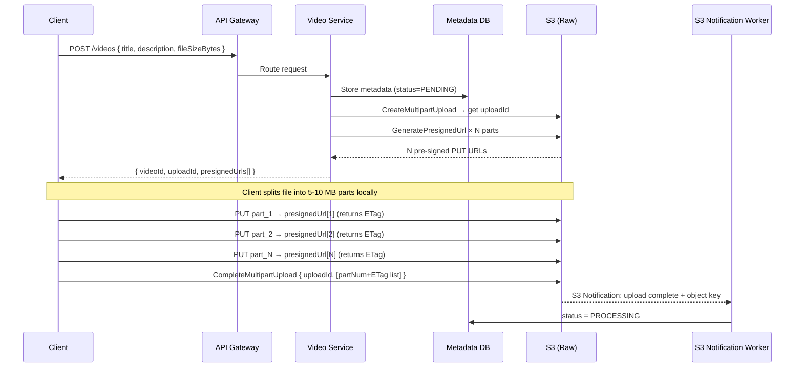
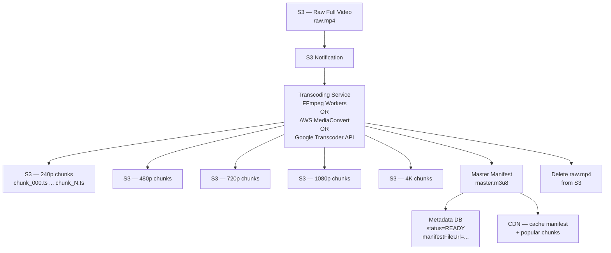
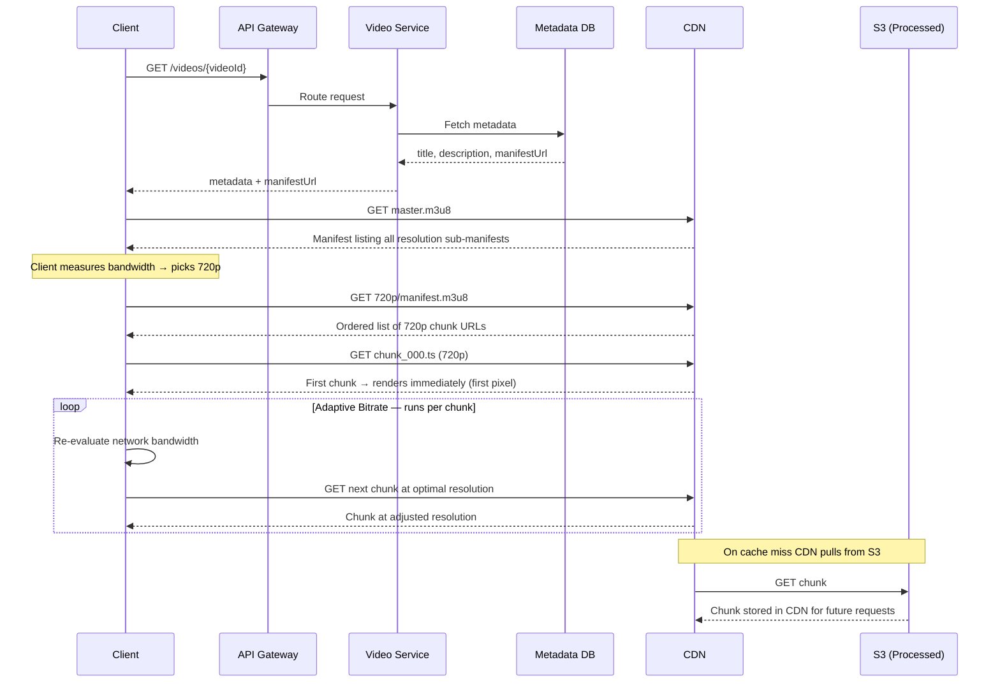
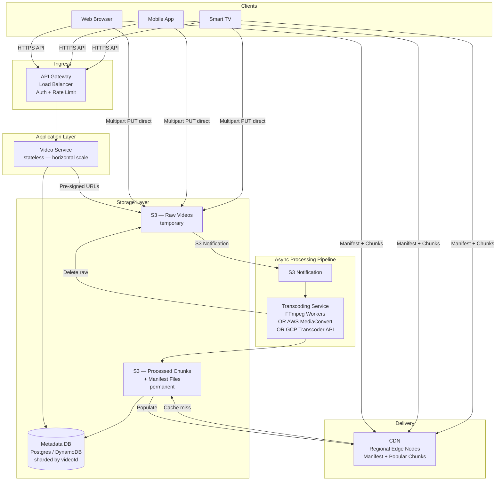
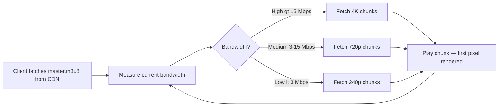

# High Level Design: YouTube

> Framework: Requirements → Core Entities → API → High Level Design → Deep Dives → Interview Q&A

---

## 1. Requirements

### Functional Requirements

| # | Requirement |
|---|-------------|
| 1 | Users should be able to **upload videos** |
| 2 | Users should be able to **watch / stream videos** |

### Scale

| Metric | Value |
|--------|-------|
| Daily uploads | 1 million / day |
| Daily active users | 100 million |
| Max video size | 256 GB (or 12 hours) |

### Non-Functional Requirements

| # | Requirement | Target |
|---|-------------|--------|
| 1 | **Availability > Consistency** (CAP) | Eventual consistency on upload is acceptable |
| 2 | **Large file support** | Upload & stream up to 256 GB |
| 3 | **Low latency streaming** | First pixel on screen < 500 ms |
| 4 | **Low bandwidth support** | Adaptive quality for 3G / poor WiFi |
| 5 | **Scalability** | 1M uploads/day, 100M views/day |

---

## 2. Core Entities

```
┌─────────────┐     ┌──────────────────────────┐     ┌──────────────────────────┐
│    User     │     │      Video Metadata       │     │     Video (raw bytes)    │
├─────────────┤     ├──────────────────────────┤     ├──────────────────────────┤
│ userId      │     │ videoId                  │     │ Stored in Blob Storage   │
│ name        │     │ userId (uploader)        │     │ (S3 / GCS)               │
│ email       │     │ title                    │     │                          │
│ createdAt   │     │ description              │     │ After processing:        │
└─────────────┘     │ uploadStatus             │     │  - Original file deleted │
                    │   (PENDING/PROCESSING/   │     │  - Chunks per resolution │
                    │    READY / FAILED)       │     │    stored as .ts objects │
                    │ manifestFileUrl          │     └──────────────────────────┘
                    │ createdAt                │
                    └──────────────────────────┘
```

---

## 3. API Design

### Upload Video — register & get pre-signed URLs

```
POST /v1/videos
Body: { title, description, fileSizeBytes }

Response: {
  videoId: "abc123",
  uploadId: "s3-multipart-upload-id",
  uploadUrls: ["<pre-signed S3 PUT URL per part>", ...]
}
```

> Raw bytes are **never** sent through the API Gateway (hard body limit ~10 MB).
> The client receives pre-signed URLs and uploads each part directly to S3.

### Watch / Stream Video

```
GET /v1/videos/{videoId}

Response: {
  metadata: { title, description, creatorName },
  manifestUrl: "https://cdn.example.com/processed/abc123/master.m3u8"
}
```

> Client fetches `manifestUrl` from CDN to begin adaptive streaming.

---

## 4. High Level Design

### 4.1 Upload Flow



---

### 4.2 Video Processing Pipeline (Async)



---

### 4.3 Stream / Watch Flow



---

## 5. Full System Architecture



---

## 6. Deep Dives

### 6.1 Large File Upload — S3 Multipart Upload

**Problem:** API Gateway body limit ~10 MB. Videos can be 256 GB.

**Solution: Direct-to-S3 Multipart Upload**

```
Phase 1 — Initiate
  Server: CreateMultipartUpload(bucket, key)
  S3 returns: uploadId = "abc123xyz"

Phase 2 — Upload parts (each has its own pre-signed URL)
  Server: GeneratePresignedUrl(uploadId, partNumber=1) → url_1
          GeneratePresignedUrl(uploadId, partNumber=2) → url_2
          ...

  Client: PUT chunk_1 → url_1  (S3 returns ETag_1)
          PUT chunk_2 → url_2  (S3 returns ETag_2)
          ...parts upload in parallel...

Phase 3 — Complete
  Client: CompleteMultipartUpload(uploadId, [{part:1, ETag:ETag_1}, ...])
  S3: assembles all parts into one object atomically
```

**During upload — how parts are stored:**
```
S3 internal staging (invisible to readers):
  uploadId: "abc123xyz"
  ├── part-1  (5 MB)   ETag: "aaa..."
  ├── part-2  (5 MB)   ETag: "bbb..."
  └── part-N  (5 MB)   ETag: "nnn..."

  NOT visible as an S3 object until CompleteMultipartUpload
  → object appears atomically on completion
  → AbortMultipartUpload cleans up staging, zero cost
```

> **Why S3 Notification instead of trusting the client?**
> The client is untrusted. A signal from S3 itself — not the client — guarantees
> the object is truly in storage before we mark status=PROCESSING.

---

### 6.2 Chunking & Transcoding — How It Actually Works

A video file is a sequence of frames. FFmpeg cuts at **keyframes** (complete images with no dependency on prior frames) so every chunk is independently playable.

```
Full video timeline:
│ K  B  B  B  B  K  B  B  B  B  K  B  B  B  B │
  ↑              ↑              ↑
keyframe       keyframe       keyframe

Chunk 1: K B B B B  ← starts at keyframe → independently playable
Chunk 2: K B B B B  ← same
Chunk 3: K B B B B  ← same

K = I-frame (keyframe — full image)
B = P/B-frame (delta — only stores changes from previous frame)
```

Cutting mid-sequence produces an unplayable chunk. FFmpeg handles this automatically.

**Transcoding resolution ladder:**

```
Raw Video (e.g. 4K H.264)
        │
        ├── 4K   ~20 Mbps  → fibre / fast WiFi
        ├── 1080p  ~8 Mbps  → standard broadband
        ├── 720p   ~5 Mbps  → mobile LTE
        ├── 480p   ~2.5 Mbps→ slow broadband
        └── 240p   ~0.5 Mbps→ 3G / poor WiFi
```

---

### 6.3 Transcoding Options — Self-Managed vs Managed Services

#### Option A — Self-Managed FFmpeg Workers

You run FFmpeg inside Docker containers, triggered by S3 notifications.

```python
import subprocess, boto3, os

s3 = boto3.client("s3")

RESOLUTIONS = {
    "240p":  {"scale": "426:240",   "bitrate": "500k"},
    "480p":  {"scale": "854:480",   "bitrate": "1500k"},
    "720p":  {"scale": "1280:720",  "bitrate": "4000k"},
    "1080p": {"scale": "1920:1080", "bitrate": "8000k"},
}

def process_video(bucket: str, video_key: str, video_id: str):
    # 1. Download raw video from S3
    local_input = f"/tmp/{video_id}_raw.mp4"
    s3.download_file(bucket, video_key, local_input)

    master_lines = ["#EXTM3U\n"]

    for res_name, cfg in RESOLUTIONS.items():
        out_dir = f"/tmp/{video_id}/{res_name}"
        os.makedirs(out_dir, exist_ok=True)

        # 2. Chunk + transcode in one FFmpeg pass
        subprocess.run([
            "ffmpeg", "-i", local_input,
            "-vf",  f"scale={cfg['scale']}",    # resize to resolution
            "-c:v", "libx264",                   # H.264 video codec
            "-b:v", cfg["bitrate"],              # target bitrate
            "-c:a", "aac",                       # AAC audio codec
            "-hls_time", "6",                    # 6-second chunks
            "-hls_playlist_type", "vod",
            "-hls_segment_filename",
                f"{out_dir}/chunk_%03d.ts",      # chunk_000.ts, chunk_001.ts ...
            f"{out_dir}/manifest.m3u8"           # per-resolution manifest
        ], check=True)

        # 3. Upload chunks + manifest to S3
        for fname in os.listdir(out_dir):
            s3.upload_file(
                f"{out_dir}/{fname}", bucket,
                f"processed/{video_id}/{res_name}/{fname}"
            )

        # 4. Record in master manifest
        bw = int(cfg["bitrate"].replace("k", "")) * 1000
        master_lines.append(
            f'#EXT-X-STREAM-INF:BANDWIDTH={bw},'
            f'RESOLUTION={cfg["scale"].replace(":", "x")}\n'
            f'processed/{video_id}/{res_name}/manifest.m3u8\n'
        )

    # 5. Upload master manifest
    s3.put_object(
        Bucket=bucket,
        Key=f"processed/{video_id}/master.m3u8",
        Body="".join(master_lines)
    )

    # 6. Delete raw file — saves storage cost
    s3.delete_object(Bucket=bucket, Key=video_key)

    # 7. Update metadata DB
    update_metadata_db(
        video_id,
        status="READY",
        manifest_url=f"https://cdn.example.com/processed/{video_id}/master.m3u8"
    )
```

---

#### Option B — AWS Elemental MediaConvert (Managed)

AWS-managed transcoding service. No FFmpeg to maintain, no workers to scale.

```python
import boto3

mediaconvert = boto3.client("mediaconvert", endpoint_url="<mediaconvert-endpoint>")

def submit_transcode_job(input_s3_uri: str, output_s3_prefix: str):
    response = mediaconvert.create_job(
        Role="arn:aws:iam::ACCOUNT:role/MediaConvertRole",
        Settings={
            "Inputs": [{
                "FileInput": input_s3_uri,          # s3://bucket/raw/abc123.mp4
                "AudioSelectors": {"Default": {"DefaultSelection": "DEFAULT"}}
            }],
            "OutputGroups": [{
                "Name": "HLS Group",
                "OutputGroupSettings": {
                    "Type": "HLS_GROUP_SETTINGS",
                    "HlsGroupSettings": {
                        "Destination": output_s3_prefix,   # s3://bucket/processed/abc123/
                        "SegmentLength": 6,                # 6-second chunks
                        "MinSegmentLength": 0
                    }
                },
                # Define one Output per resolution
                "Outputs": [
                    {
                        "NameModifier": "_720p",
                        "VideoDescription": {
                            "Width": 1280, "Height": 720,
                            "CodecSettings": {
                                "Codec": "H_264",
                                "H264Settings": {"Bitrate": 4000000}
                            }
                        },
                        "AudioDescriptions": [{
                            "CodecSettings": {"Codec": "AAC",
                                "AacSettings": {"Bitrate": 128000}}
                        }]
                    },
                    # ... repeat for 240p, 480p, 1080p, 4K
                ]
            }]
        }
    )
    return response["Job"]["Id"]
```

MediaConvert handles: chunking, transcoding all resolutions in parallel, manifest generation, output to S3 — **everything FFmpeg does, fully managed**.

---

#### Option C — Google Cloud Transcoder API (Managed)

GCP equivalent of MediaConvert. Used when your stack runs on Google Cloud.

```python
from google.cloud.video import transcoder_v1

client = transcoder_v1.TranscoderServiceClient()

def submit_transcode_job(project_id: str, location: str,
                         input_uri: str, output_uri: str):
    job = transcoder_v1.Job()
    job.input_uri  = input_uri   # gs://bucket/raw/abc123.mp4
    job.output_uri = output_uri  # gs://bucket/processed/abc123/
    job.config = transcoder_v1.JobConfig(
        elementary_streams=[
            # 720p video stream
            transcoder_v1.ElementaryStream(
                key="video-720p",
                video_stream=transcoder_v1.VideoStream(
                    h264=transcoder_v1.VideoStream.H264CodecSettings(
                        height_pixels=720, width_pixels=1280,
                        bitrate_bps=4_000_000, frame_rate=30
                    )
                )
            ),
            # Audio stream
            transcoder_v1.ElementaryStream(
                key="audio-main",
                audio_stream=transcoder_v1.AudioStream(
                    codec="aac", bitrate_bps=128_000
                )
            ),
            # ... add more resolutions
        ],
        mux_streams=[
            # Package 720p video + audio into HLS chunks
            transcoder_v1.MuxStream(
                key="hls-720p",
                container="ts",
                elementary_streams=["video-720p", "audio-main"]
            )
        ],
        manifests=[
            transcoder_v1.Manifest(
                file_name="master.m3u8",
                type_=transcoder_v1.Manifest.ManifestType.HLS,
                mux_streams=["hls-720p"]
            )
        ]
    )
    return client.create_job(
        parent=f"projects/{project_id}/locations/{location}",
        job=job
    )
```

---

### Managed vs Self-Managed — Comparison

| Dimension | FFmpeg (self-managed) | AWS MediaConvert | GCP Transcoder API |
|-----------|----------------------|------------------|--------------------|
| Setup complexity | High — you manage workers, scaling, retries | Low — submit a job, done | Low — same |
| Cost model | EC2/container cost (flat) | Per-minute of output video | Per-minute of output video |
| Scale | Manual auto-scaling config | Automatic | Automatic |
| Codec support | Full (you configure FFmpeg flags) | Broad (H.264, H.265, VP9, AV1) | H.264, H.265, VP9 |
| Failure handling | You build retry logic | Built-in retries + CloudWatch | Built-in retries + Cloud Logging |
| Portability | Cloud-agnostic | AWS only | GCP only |
| Best for | Full control, custom pipelines | AWS-native stacks | GCP-native stacks |

> **Interview answer:** "For a startup or team without a dedicated media engineering team I'd use AWS MediaConvert — it eliminates operational overhead. At YouTube's scale with custom codec requirements like AV1 you'd run your own FFmpeg-based pipeline for full control."

---

### 6.4 S3 Layout After Processing

```
s3://your-bucket/
  └── processed/
      └── abc123/
          ├── master.m3u8            ← client fetches this first (master manifest)
          ├── 240p/
          │   ├── manifest.m3u8      ← per-resolution manifest
          │   ├── chunk_000.ts       ← 0s – 6s  at 240p
          │   ├── chunk_001.ts       ← 6s – 12s at 240p
          │   └── ...
          ├── 480p/
          │   ├── manifest.m3u8
          │   └── chunk_*.ts
          ├── 720p/
          │   ├── manifest.m3u8
          │   └── chunk_*.ts
          └── 1080p/
              ├── manifest.m3u8
              └── chunk_*.ts

  raw/abc123.mp4  ← DELETED after processing completes
```

**Master manifest content:**
```
#EXTM3U

#EXT-X-STREAM-INF:BANDWIDTH=500000,RESOLUTION=426x240
240p/manifest.m3u8

#EXT-X-STREAM-INF:BANDWIDTH=4000000,RESOLUTION=1280x720
720p/manifest.m3u8

#EXT-X-STREAM-INF:BANDWIDTH=8000000,RESOLUTION=1920x1080
1080p/manifest.m3u8
```

---

### 6.5 Manifest File & Adaptive Bitrate (ABR)



**Streaming protocols:**

| Protocol | Full Name | Notes |
|----------|-----------|-------|
| **HLS** | HTTP Live Streaming | Created by Apple — `.m3u8` manifests, widest device support |
| **DASH** | Dynamic Adaptive Streaming over HTTP | Open standard — `.mpd` manifests, used by YouTube |

Both handle: segmentation, manifest generation, ABR, CDN compatibility — no custom protocol needed.

---

### 6.6 CDN Strategy

```
User in Germany
      │
      ▼
CDN Edge — Frankfurt     ← serves manifest + popular EU-region chunks (5–30ms)
      │ cache miss
      ▼
S3 — us-west-2           ← origin, stores everything (150–300ms round trip)
```

- **Cache key:** `{videoId}/{resolution}/{chunkIndex}`
- **TTL:** Very long — chunks are immutable once written
- **Manifest TTL:** Short — can change if re-transcoded

---

### 6.7 Scalability Analysis

| Component | Scaling Strategy |
|-----------|-----------------|
| API Gateway | Managed, auto-scales |
| Video Service | Stateless → horizontal scale |
| Metadata DB | Shard by `videoId`; GSI on `userId` |
| S3 (raw) | Virtually unlimited; raw files deleted after processing |
| S3 (processed) | Virtually unlimited; immutable chunks, long-lived |
| Transcoding | MediaConvert / GCP Transcoder auto-scale; FFmpeg workers scale on CPU > 70% |
| CDN | Add regional edge nodes as user base grows |

**Metadata storage estimate:**
```
1M uploads/day × 1 KB = 1 GB/day × 365 = ~365 GB/year
→ Single Postgres instance for years
→ DynamoDB: partition key = videoId, sort key = createdAt
```

---

## 7. Requirements Checklist

| Requirement | Met? | Mechanism |
|-------------|:----:|-----------|
| Upload videos | ✅ | S3 Multipart Upload via pre-signed URLs |
| Watch / stream videos | ✅ | Chunked adaptive streaming via CDN + manifest |
| Availability > Consistency | ✅ | Async pipeline — video live after processing completes |
| 256 GB file support | ✅ | Multipart upload (ingest) + chunking (egress) |
| First pixel < 500 ms | ✅ | CDN-local first chunk; manifest fetch parallel to metadata |
| Low bandwidth support | ✅ | ABR with 5-tier resolution ladder, adapts per chunk |
| 1M uploads/day | ✅ | Auto-scaling transcoding workers or managed service |
| 100M views/day | ✅ | CDN absorbs the vast majority of read traffic |

---

## 8. Common Interview Questions & Answers

### Upload & Storage

**Q: Why not just POST the video bytes directly to your backend?**
> API Gateway and reverse proxies have a request body size limit (~10 MB for AWS API Gateway). A 256 GB video would never make it through. Pre-signed S3 URLs let the client upload directly to S3, bypassing your servers entirely — no compute cost, no bottleneck.

**Q: What happens if the client drops mid-upload?**
> S3 Multipart Upload is resumable. The client retains the `uploadId` and already-uploaded part ETags. On reconnect it calls `ListParts` to find which parts S3 already has, then re-uploads only the missing ones. If abandoned entirely, you run a lifecycle policy on S3 to auto-abort incomplete multipart uploads after N days and reclaim storage.

**Q: Why trust an S3 notification over the client saying "I'm done"?**
> The client is untrusted — it could lie, crash, or send a false completion signal. An S3 notification fires from S3 itself, confirming the object truly exists in storage. This is the only signal we use to transition status from PENDING → PROCESSING.

**Q: Is the original raw file kept after transcoding?**
> Best practice is to delete it — a 10 GB raw file at $0.023/GB/month per video becomes catastrophically expensive at scale. The exception is keeping originals for future re-transcoding (e.g. when a better codec like AV1 becomes standard). It's a cost vs. flexibility trade-off.

---

### Chunking & Transcoding

**Q: Why do we chunk twice — once for upload and again for streaming?**
> They serve completely different purposes. Upload chunks are 5–10 MB arbitrary byte slices optimised to minimise HTTP round-trip overhead. Streaming chunks are 2–10 second segments cut precisely at video keyframes so each is independently playable. The upload chunks are discarded once S3 assembles the full object; the streaming chunks live permanently.

**Q: What is a keyframe and why must we cut there?**
> A keyframe (I-frame) is a complete image. Frames between keyframes (P/B-frames) only store the *changes* from the previous frame. If you cut mid-sequence a chunk would start with a delta frame with no reference point — the decoder can't reconstruct the image. Cutting at keyframes guarantees every chunk is independently decodable.

**Q: What tool does the actual chunking and transcoding?**
> **FFmpeg** is the industry standard — used by YouTube, Netflix, Twitch. One FFmpeg command handles resizing, re-encoding the codec, setting bitrate, and splitting into HLS `.ts` chunks with a `.m3u8` manifest. At scale you'd choose between running your own FFmpeg workers (full control, portable) or a managed service like **AWS MediaConvert** or **Google Cloud Transcoder API** (no operational overhead, built-in scaling).

**Q: When would you use AWS MediaConvert instead of running your own FFmpeg?**
> For most companies MediaConvert is the right choice — it eliminates worker fleet management, auto-scales, has built-in retry/failure handling, and integrates natively with S3 and CloudWatch. You'd run your own FFmpeg pipeline only if you need codec-level customisation (e.g. YouTube's custom AV1 encoding pipeline), cross-cloud portability, or extreme cost optimisation at massive scale.

**Q: Why transcode to multiple resolutions instead of just serving one?**
> A single 4K chunk at 20 Mbps takes 40+ seconds to download on a 3G connection — the video stalls before it even starts. By storing the same content at multiple bitrates (the "ladder"), the client picks the highest quality its current bandwidth can sustain. When bandwidth changes mid-video, the next chunk is fetched at the new optimal resolution — this is Adaptive Bitrate (ABR).

---

### Streaming & CDN

**Q: What is a manifest file?**
> A plain text file (`.m3u8` for HLS, `.mpd` for DASH) that maps each resolution to an ordered list of chunk URLs. The client downloads the master manifest first, picks a resolution based on its bandwidth, then fetches the per-resolution manifest to get the chunk URLs. It's the roadmap for the entire streaming session.

**Q: What is Adaptive Bitrate (ABR) and how does it work?**
> ABR is the client-side logic that re-evaluates network bandwidth before fetching each new chunk and switches to the corresponding resolution URL from the manifest. If you start watching at home on 4K and switch to 3G on your phone, the client detects the bandwidth drop and the next chunk it requests is 240p — no buffering, no stall.

**Q: Why do we need a CDN? Can't the client just fetch chunks from S3 directly?**
> S3 is a single-region service. A user in Germany fetching from `us-west-2` has 150–300ms round-trip latency per chunk request. With 6-second chunks that's constant latency overhead. A CDN places the chunks on edge servers physically near users, reducing latency to 5–30ms. At 100M daily views the CDN also takes enormous read traffic off S3.

**Q: What do you cache in the CDN vs keep only in S3?**
> In CDN: manifest files (needed by every viewer to start playback) and popular video chunks for that region. In S3 only: unpopular chunks (long-tail videos rarely watched in that region), raw files (temporary), original unprocessed uploads. Cache key is `{videoId}/{resolution}/{chunkIndex}` with a very long TTL since chunks are immutable.

---

### Architecture & Trade-offs

**Q: How do you handle a transcoding worker failure mid-job?**
> The S3 notification triggers a message onto a queue (SQS / Pub/Sub). The worker consumes the message and only acknowledges (deletes) it on success. If the worker crashes the message becomes visible again after the visibility timeout and another worker picks it up. The job is idempotent — re-transcoding the same video produces the same output.

**Q: How would you scale to 10× the current load?**
> Each component scales independently. Video Service is stateless — add instances. Transcoding workers auto-scale on CPU; or with MediaConvert there is no ceiling. S3 and CDN scale natively. Metadata DB shards by `videoId` — add shards. The only real cost inflection is CDN bandwidth and S3 storage, which scale linearly with usage.

**Q: Why is eventual consistency acceptable for video uploads but not for payments?**
> A video appearing a few seconds or minutes after upload causes no harm — the uploader knows it's processing and viewers aren't expecting it instantly. A payment that appears as pending instead of confirmed can block a user from completing a purchase. The cost of inconsistency is asymmetric, so different systems make different CAP trade-offs.

**Q: How would you support live streaming differently from VOD?**
> Live streaming inverts the pipeline. Instead of upload → process → serve, you have continuous ingest via RTMP → real-time chunking (2s segments) → immediate manifest updates → CDN delivery with very short TTLs. There's no full file to download and transcode upfront; the manifest file keeps growing as new chunks are produced. You'd use a service like AWS MediaLive instead of MediaConvert.

---

## 9. Out of Scope (natural extensions)

- Comments, likes, subscriptions, notifications
- Recommendations / feed ranking (ML pipeline)
- Search indexing (Elasticsearch over metadata + auto-transcripts)
- Analytics: watch time, drop-off, engagement
- Content moderation / copyright detection (Content ID fingerprinting)
- Live streaming (RTMP → real-time HLS)
- Monetisation / ad insertion (SSAI — server-side ad insertion into manifest)

---

*Document generated: 2026-08-10 | Source: Hello Interview — Design YouTube*
