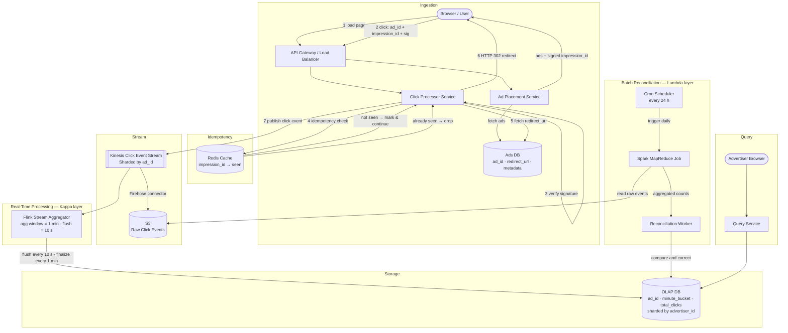

# Ad Click Aggregator — High Level Design

## Architecture Diagram



---

## 1. Requirements

### Functional Requirements

| # | Requirement |
|---|-------------|
| FR-1 | User clicks an ad and is **redirected** to the advertiser's website |
| FR-2 | Advertisers can **query click metrics** for any ad over a time range with **1-minute minimum granularity** |

**Out of scope:** ad targeting & serving decisions, cross-device tracking, offline channel integration, spam ML models.

---

### Non-Functional Requirements

| Quality | Specification |
|---------|--------------|
| **Scalability** | Support peak **10,000 ad clicks / second** across **10 million active ads** |
| **Low Latency** | Advertiser analytics queries return in **< 1 second** |
| **Fault Tolerance / Data Integrity** | No click data loss; click counts must be accurate |
| **Real-Time** | Aggregated data visible within the **1-minute granularity window**; partial results via **10-second flush intervals** |
| **Idempotency** | A single ad impression counted **at most once**, regardless of replay or bot abuse |

---

## 2. System Interface & Data Flow

### Inputs / Outputs

| Direction | Actor | Data |
|-----------|-------|------|
| **Input** | User Browser | Click event: `ad_id`, `impression_id`, `signature` |
| **Input** | Advertiser | Query: `ad_id` + time range + granularity |
| **Output** | User Browser | HTTP 302 redirect to advertiser URL |
| **Output** | Advertiser | Aggregated metrics: `(ad_id, minute_bucket, total_clicks, unique_users)` |

### Sequential Data Flow

```
1.  Browser loads page
      → Ad Placement Service returns ads + server-signed impression IDs

2.  User clicks ad
      → click event {ad_id, impression_id, sig} sent to Click Processor

3.  Click Processor verifies HMAC signature
      → forged impression IDs rejected immediately

4.  Redis idempotency check on impression_id
      → duplicate? drop silently. First time? mark and continue.

5.  Click Processor fetches redirect_url from Ads DB by ad_id
      → returns HTTP 302 to user (user lands on advertiser site)

6.  Click event published to Kinesis stream

7.  Flink consumes stream
      → aggregates per (ad_id, minute_bucket)
      → flushes partial counts every 10 s
      → finalises and writes complete minute to OLAP DB

8.  Advertiser queries Query Service
      → Query Service reads pre-aggregated rows from OLAP DB

9.  [Async] Daily Spark job reads raw events from S3
      → recomputes aggregates from scratch
      → Reconciliation Worker diffs and corrects any drift in OLAP DB
```

---

## 3. Component Breakdown

### 3.1 Ad Placement Service
- Returns ads to the browser including a **server-signed impression ID**.
- Signature: `HMAC(secret_key, ad_id ‖ impression_id ‖ timestamp)`.
- Signing prevents clients from fabricating impression IDs to bypass the idempotency gate.
- **(Out of scope)** targeting logic that decides which ad to serve.

---

### 3.2 Click Processor Service
- Horizontally auto-scaled, stateless, behind the API Gateway.
- Per-request pipeline:

  ```
  1. Verify HMAC signature          → reject if invalid (400)
  2. Redis SET NX impression_id     → reject if already set (already counted)
  3. Fetch redirect_url from Ads DB → ad_id lookup
  4. Publish click event to Kinesis
  5. Return HTTP 302 Location: <redirect_url>
  ```

- **Hot-shard mitigation** for viral ads: appends `#rand(0,N)` to the Kinesis partition key so one popular ad distributes across N shards.

---

### 3.3 Kinesis Click Event Stream
- Sharded by `ad_id` (with hot-shard suffix above).
- Per-shard limit: 1,000 records/s or 1 MB/s.
- **7-day retention policy** — Flink replays from last committed offset on crash; no data loss.
- **Firehose connector** continuously archives raw events to S3 for the reconciliation path.

---

### 3.4 Flink Stream Aggregator *(real-time layer)*
- One Flink task per ad\_id shard group; hot ad IDs handled by a single task reading across multiple shards.
- **Tumbling aggregation window:** 1 minute.
- **Flush interval:** 10 seconds — partial counts written to OLAP so advertisers see near-real-time data.
- **No checkpointing** — aggregation windows are only 1 minute; recovering by replaying 60 s of Kinesis is faster and cheaper than checkpoint restore overhead.
- Output schema: `(ad_id, minute_bucket, total_clicks, unique_users)`.

---

### 3.5 OLAP Database
- Read-optimised for range + aggregation queries (e.g. ClickHouse, Apache Druid, Amazon Redshift).
- Pre-aggregated rows → advertiser queries hit narrow, indexed row sets → **< 1 s** response.
- Sharded by **advertiser\_id** (most queries are per-advertiser across their whole portfolio).

---

### 3.6 Query Service
- Thin service translating advertiser API requests into OLAP SQL.
- Handles time-range slicing and granularity roll-ups (1 min → 1 hr → 1 day).

---

### 3.7 Redis — Idempotency Cache
- Key: `impression_id`, Value: `1`, TTL: 24 hours.
- Distributed Redis Cluster (e.g. ElastiCache) to absorb 10K writes/s at peak.
- Works for both logged-in and logged-out users (no reliance on user\_id).

---

### 3.8 Reconciliation Layer *(batch / Lambda layer)*
- **Cron job** fires once per day (tune to hourly if tighter accuracy is required).
- **Spark MapReduce** reads raw events from S3, recomputes `(ad_id, minute_bucket, total_clicks)` from scratch — ground truth.
- **Reconciliation Worker** diffs Spark output vs OLAP; overwrites divergent rows.
- Emits alerts if discrepancy rate exceeds configured threshold.

---

## 4. Deep Dives

### 4.1 Real-Time vs Batch — Hybrid Architecture

| Pattern | Description | Role here |
|---------|-------------|-----------|
| **Kappa** | Stream-only; real-time layer is the single source of truth | Primary path: Kinesis → Flink → OLAP |
| **Lambda** | Separate batch layer guarantees accuracy; real-time gives speed | Reconciliation: S3 → Spark → OLAP |
| **Hybrid (this design)** | Real-time for latency; batch for correctness | Both paths active |

> Practicality over architectural purity: pure Kappa meets the latency requirement but has no safety net for transient errors. Pure Lambda introduces multi-minute lag before data is accurate. The hybrid gives advertisers **near-real-time data** (10-second flush) with **guaranteed daily accuracy** via reconciliation.

---

### 4.2 Scalability

| Component | Strategy |
|-----------|----------|
| Click Processor | Stateless horizontal auto-scale on CPU/memory |
| Kinesis | Shard by `ad_id`; hot shards mitigated with `ad_id#[0,N)` suffix |
| Flink | Tasks scale proportionally to shard count |
| OLAP DB | Shard by `advertiser_id`; add read replicas for query load |
| Redis | Redis Cluster with consistent hashing |

---

### 4.3 Fault Tolerance & Data Integrity

| Risk | Mitigation |
|------|-----------|
| Flink task crash | 7-day Kinesis retention → replay from last offset |
| Click count drift / corruption | Daily Spark reconciliation corrects OLAP records |
| Kinesis unavailable | Managed service; treated as always-available |
| Duplicate clicks (user or bot) | Redis idempotency gate on `impression_id` |
| Forged impression IDs | Server-side HMAC signature verified before Redis check |

---

### 4.4 Idempotency — Detailed Flow

```
Ad Placement Service
  ├─ impression_id = uuid()
  └─ sig = HMAC(secret_key, ad_id ‖ impression_id ‖ unix_ts)
  └─ sends browser: { ad_id, impression_id, sig, redirect_url_hidden }

User clicks → Click Processor receives { ad_id, impression_id, sig }
  Step 1: verify HMAC(secret_key, ad_id ‖ impression_id ‖ ts) == sig
          → invalid? return 400 Bad Request

  Step 2: Redis SET NX "imp:{impression_id}" 1 EX 86400
          → already exists? drop (duplicate) — return 200 OK silently
          → set successfully? continue

  Step 3: GET redirect_url FROM ads_db WHERE ad_id = ?
  Step 4: PUBLISH click event to Kinesis
  Step 5: return HTTP 302 Location: {redirect_url}
```

---

## 5. Scale Estimates

| Metric | Value |
|--------|-------|
| Peak click rate | 10,000 clicks/s |
| Active ads | 10 million |
| Kinesis shards required | ~10 base + N hot-shard extras |
| Raw events per day | 10,000 × 86,400 ≈ **864 M events/day** |
| OLAP aggregated rows per day | 10,000 ads × 1,440 min/day ≈ **14.4 M rows/day** |
| S3 raw storage per day | ~864 M × ~200 B ≈ **~172 GB/day** |
| Redis peak key volume | up to ~864 M keys in-flight (24 h TTL at 10K writes/s) |

---

## 6. API Reference

### Click Endpoint *(browser → Click Processor)*
```
POST /click
Content-Type: application/json

{
  "ad_id":        "ad_abc123",
  "impression_id":"imp_xyz789",
  "signature":    "hmac_sha256_hex..."
}

→ 302 Location: https://nike.com/landing?ref=...
→ 400 if signature invalid
→ 200 (no-op) if duplicate impression
```

### Metrics Query Endpoint *(advertiser-facing)*
```
GET /metrics?ad_id={id}&from={iso8601}&to={iso8601}&granularity={1m|1h|1d}

200 OK
{
  "ad_id": "ad_abc123",
  "granularity": "1m",
  "buckets": [
    { "timestamp": "2026-08-13T10:00:00Z", "total_clicks": 1420, "unique_users": 1180 },
    { "timestamp": "2026-08-13T10:01:00Z", "total_clicks": 1537, "unique_users": 1290, "partial": true }
  ]
}
```

> `"partial": true` marks the current in-progress minute — data is from the most recent 10-second Flink flush.

---

*Based on system design walkthrough: Ad Click Aggregator.*
