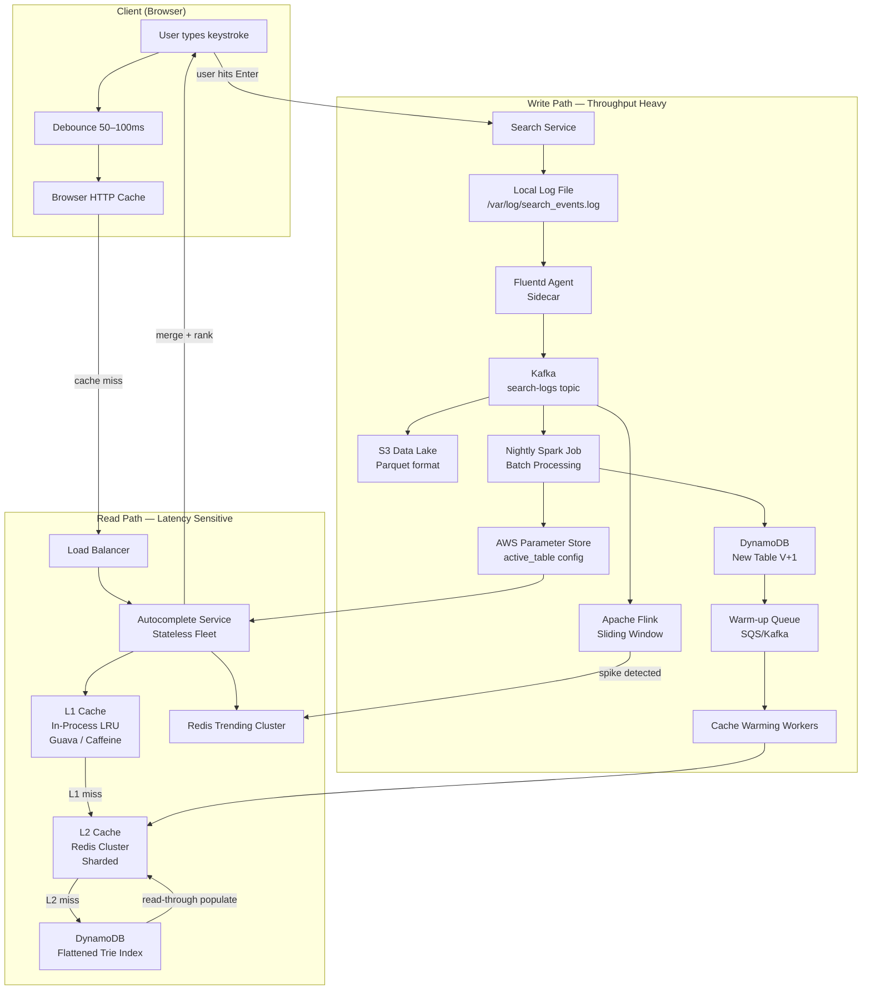
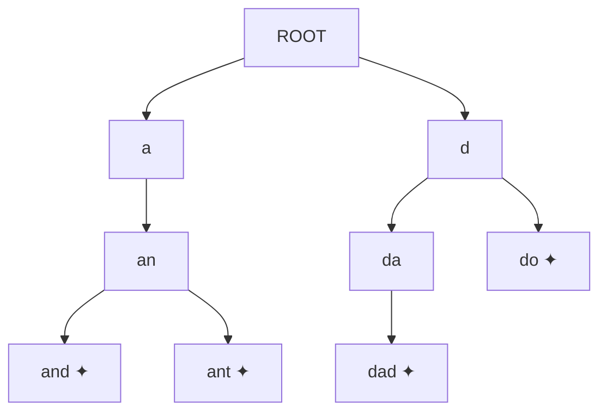
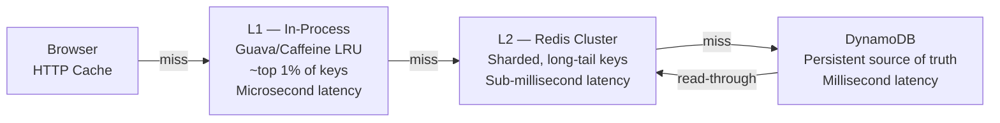
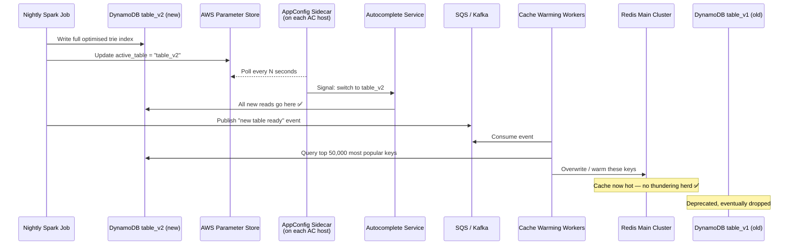
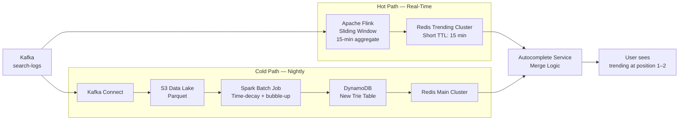
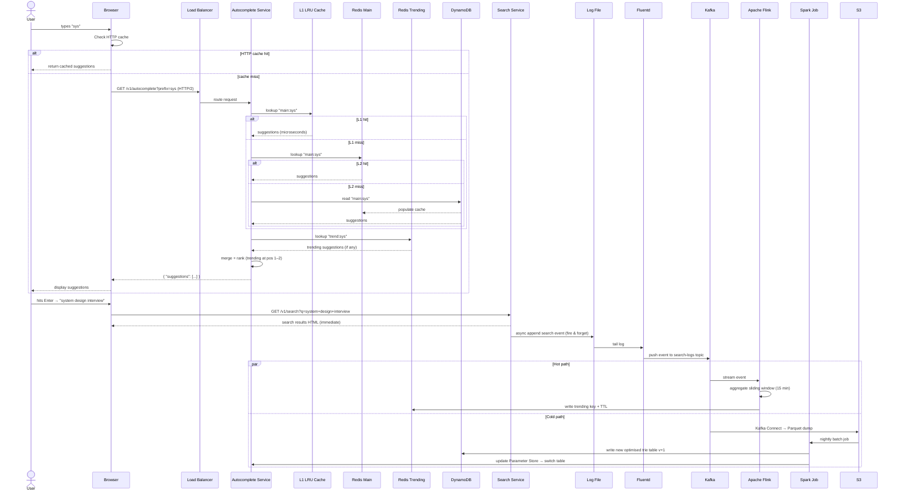

# System Design: Autocomplete / Typeahead

> **Also known as:** Type-Ahead, Search-As-You-Go  
> **Seen in:** Google Search, Amazon product search, YouTube, Twitter  
> **Core goal:** Predict the rest of a word or sentence as the user types — reducing keystrokes, guiding users toward likely queries, and responding in < 100 ms.

---

## Table of Contents

1. [Functional Requirements](#1-functional-requirements)
2. [Non-Functional Requirements & Scale Estimates](#2-non-functional-requirements--scale-estimates)
3. [Data Model](#3-data-model)
4. [API Design](#4-api-design)
5. [High-Level Architecture](#5-high-level-architecture)
6. [Deep Dive: Trie Data Structure](#6-deep-dive-trie-data-structure)
7. [Deep Dive: Multi-Level Caching](#7-deep-dive-multi-level-caching)
8. [Deep Dive: Zero-Downtime Updates (Blue-Green)](#8-deep-dive-zero-downtime-updates-blue-green)
9. [Deep Dive: Real-Time Trends](#9-deep-dive-real-time-trends)
10. [Complete End-to-End Flow](#10-complete-end-to-end-flow)
11. [Additional Discussion Points](#11-additional-discussion-points)
12. [Interview Q&A](#12-interview-qa)

---

## 1. Functional Requirements

| # | Requirement | Detail |
|---|-------------|--------|
| FR-1 | **Suggestions** | Return the **top K** (e.g. 5) most relevant suggestions as the user types each character |
| FR-2 | **Ranking** | Suggestions ranked by a combination of **historical popularity** (long-term) + **real-time trends** (breaking news / spikes) |

---

## 2. Non-Functional Requirements & Scale Estimates

### Quality Attributes

| Attribute | Requirement |
|-----------|-------------|
| **Latency** | < 100 ms P99 end-to-end on the read path |
| **Availability** | Prioritise availability over consistency → **BASE** (Basically Available, Soft-state, Eventually consistent). Stale suggestions are better than errors. |
| **Scalability** | Google-scale (see below) |

### Back-of-Envelope Calculations

```
Daily Active Users      : 500 million
Daily Searches          : 5 billion
Keystrokes per search   : ~5 (on average, user hits autocomplete service 5× per query)

Read QPS (avg)  = 5B × 5 / 86,400  ≈  290,000 QPS
Read QPS (peak) = 290,000 × 2      ≈  600,000 QPS

Write throughput = 5B / 86,400     ≈   58,000 events/sec
  (only the FINAL search commit, not intermediate keystrokes)
```

---

## 3. Data Model

Two distinct storage strategies — one for **writes/analytics**, one for **reads/serving**.

### 3.1 Storage & Analytics Layer (Write-Optimised)

| Property | Value |
|----------|-------|
| Purpose | Archiving raw search events for offline batch processing |
| Technology | **AWS S3** (object store) |
| Format | **Apache Parquet** — columnar, highly compressed, efficient for aggregation |
| Schema | `query_string`, `timestamp`, `geo_location`, `user_id` (extensible) |

### 3.2 Serving Index (Read-Optimised)

| Property | Value |
|----------|-------|
| Purpose | Serve autocomplete results < 100 ms |
| Data Structure | **Trie (prefix tree)** — flattened into a key-value store |
| Hot store | **Redis** (in-memory, serves ~99% of traffic) |
| Persistent store | **Amazon DynamoDB** (durable fallback, source of truth for the index) |
| Key format | `main:<prefix>` → `["suggestion1","suggestion2",...]` (JSON array) |
| Why NOT SQL | `LIKE 'prefix%'` is O(N) full-table scan — too slow at 600k QPS |

---

## 4. API Design

Following the **CQRS** (Command Query Responsibility Segregation) pattern — read and write endpoints are completely separate.

### 4.1 Read — Autocomplete Endpoint

```http
GET /v1/autocomplete?prefix=sys&limit=5
```

| Field | Detail |
|-------|--------|
| Protocol | **HTTP/2** — avoids repeated TCP handshake overhead on every keystroke |
| Query params | `prefix` (string), `limit` (int, default 5) |
| Response | `200 OK` → `{ "suggestions": ["system design", "sys admin", ...] }` |
| Caching | Heavy — `Cache-Control: max-age=60` header; read-only |

### 4.2 Write — Search Commit Endpoint

```http
GET /v1/search?q=system+design+interview
```

| Field | Detail |
|-------|--------|
| Primary action | Fetch and return web/product search results (HTML/JSON) |
| Secondary action | **Async log** the query event (fire-and-forget) — zero added latency to the user |
| Why this matters | This is the **ground truth** event stream that feeds ranking models and the trie rebuild |

---

## 5. High-Level Architecture



### Read Path Summary

1. **Client** fires a request on every keystroke (debounced at 50–100 ms)
2. **Browser cache** (HTTP Cache-Control) — served from local disk if valid
3. **Load Balancer** distributes HTTP/2 requests across stateless autocomplete service fleet
4. **Autocomplete Service** applies a multi-level cache lookup (L1 → L2 → DB)
5. Simultaneously queries **Redis Trending** for real-time spikes
6. **Merges** main + trending results, force-injects trending at position 1–2
7. Returns JSON suggestions

### Write Path Summary

1. User hits Enter → **Search Service** handles web results + async logs event to local file
2. **Fluentd sidecar** tails log → pushes to **Kafka** topic `search-logs`
3. **Hot path** → Flink processes sliding window → writes spikes to Redis Trending (short TTL)
4. **Cold path** → Kafka Connect dumps to S3 → nightly Spark job rebuilds trie → writes to new DynamoDB table

---

## 6. Deep Dive: Trie Data Structure

### Why Not a Database Scan?

| Approach | Time Complexity | Verdict |
|----------|-----------------|---------|
| SQL `LIKE 'prefix%'` | O(N) — full table scan | ❌ Too slow |
| Standard Trie traversal | O(C) — traverse all children | ❌ Still too slow |
| **Flattened Trie (key-value)** | **O(1)** — direct key lookup | ✅ Use this |

### Trie Structure



*Each path from root → node represents a prefix. Leaf nodes (✦) are complete queries.*

### The Flattening Optimisation

During the **offline Spark build**, we "bubble up" the top-K highest-frequency completions from leaf nodes to every ancestor prefix. This converts O(C) traversal into O(1) lookup.

```
Redis Key         →  Redis Value (JSON)
─────────────────────────────────────────────────────
main:a            →  ["and", "ant"]
main:an           →  ["and", "ant"]
main:and          →  ["and"]
main:ant          →  ["ant"]
main:d            →  ["dad", "do"]
main:da           →  ["dad"]
main:dad          →  ["dad"]
main:do           →  ["do"]
─────────────────────────────────────────────────────
trend:a           →  ["amazon prime day"]   ← separate namespace for trending
```

**Key prefix convention:** `main:` vs `trend:` — allows the autocomplete service to query both, then merge during the response phase.

### Memory Estimate

```
100 million popular queries
× ~100 bytes per entry (key + top-5 JSON array)
= ~10–20 GB RAM on a modern server
→ Entire optimised trie fits in memory ✅
```

---

## 7. Deep Dive: Multi-Level Caching



| Cache Level | Technology | Scope | Why |
|-------------|------------|-------|-----|
| Browser | HTTP `Cache-Control` | Per user | Free hit — no network at all; e.g. backspace + retype same prefix |
| L1 — In-process | Guava / Caffeine (JVM) | Per host, top 1% | Eliminates network IO for ultra-hot keys (e.g. the letter "a"); prevents hotkey meltdown |
| L2 — Distributed | Redis (sharded cluster) | Cluster-wide, long tail | Serves ~99% of remaining traffic at sub-millisecond latency |
| Fallback | DynamoDB | All keys | Durable; read-through populates Redis on miss |
| Trending | Redis (separate cluster) | Real-time spikes | Short TTL; merged at query time |

**Hotkey meltdown problem:** At 600k QPS, even O(1) Redis lookups for `"a"` would saturate a single node. The in-process L1 cache absorbs those hits entirely.

---

## 8. Deep Dive: Zero-Downtime Updates (Blue-Green)

Replacing a massive DynamoDB table without locking the database or causing a thundering herd.



**Why this matters:**
- Old table `v1` remains live and read-able throughout the entire Spark write — zero downtime
- Cache warming prevents the thundering herd: without it, millions of users would simultaneously miss Redis and hit DynamoDB before warming completes
- Parameter Store acts as a distributed feature flag — no redeploy needed

---

## 9. Deep Dive: Real-Time Trends

Handles **breaking news** — a query that spikes from 0 to millions within minutes (e.g. "earthquake", "Super Bowl winner").



| Component | Role |
|-----------|------|
| **Apache Flink** | Consumes Kafka stream, maintains a sliding window (e.g. last 15 min), detects queries crossing a frequency threshold |
| **Redis Trending** | Stores spike results with short TTL (~15 min) — auto-expires when trend dies |
| **Merge Logic** | In the Autocomplete Service: fetch `main:<prefix>` + `trend:<prefix>`, force-inject trending result at position 1 or 2 |
| **Nightly Spark** | Applies **time-decay weighting** (recent events weighted higher) + rebuilds full trie with historical accuracy |

---

## 10. Complete End-to-End Flow



---

## 11. Additional Discussion Points

### 11.1 Personalisation

- Global popularity alone is insufficient — users expect **their own recent history** to surface first
- Store last 50 searches in a **User History Service** (or client-side cookies for lowest latency)
- During the merge-and-rank phase, fetch personal keys and **force-rank at position 1**, overriding global trends

### 11.2 Privacy & Compliance (GDPR)

- **Right to be forgotten:** Spark batch job includes a filter stage that joins raw logs against a `user_deletion_requests` table
- Any data from users who requested deletion is scrubbed **before** it contributes to the public trie
- Implement at the Spark stage — not at read time — to keep the serving path clean

### 11.3 Content Moderation

- Prevent the system suggesting offensive/illegal/brand-damaging terms
- Apply a **block list** (Bloom filter or hash set) during the trie build process
- Bloom filter is O(1) lookup with near-zero memory overhead
- This sanitises the data set without adding latency to read-time lookups

### 11.4 Edge Caching (CDN)

- Top 100 global queries (e.g. "Facebook", "YouTube", "Amazon") can account for a disproportionate share of traffic
- These static JSON responses can be cached on a **CDN** (CloudFront, Akamai, Cloudflare Workers)
- Serves millions of users with near-zero latency, never touching backend servers
- Combine with aggressive `Cache-Control` headers and surrogate keys for targeted purging

### 11.5 Spell Check / Fuzzy Search

- If a trie lookup returns **zero results** (miss), trigger a secondary lookup
- Apply **Levenshtein edit distance** against a dictionary of the most common terms
- Find the closest match (e.g. "Amzon" → "Amazon")
- Return a **"Did you mean?"** suggestion
- Keep the dictionary small (top N terms) so even edit-distance search is fast

---

## 12. Interview Q&A

### Architecture & Design

**Q: Why use a Trie instead of a SQL database with a LIKE query?**  
A: `LIKE 'prefix%'` is O(N) — it must scan potentially the entire table. At 600k QPS this is completely infeasible. A flattened trie stored in Redis gives O(1) lookup time because the prefix itself is the key. We pre-compute the top-K suggestions for every possible prefix during the offline Spark build.

---

**Q: Why is the trie "flattened" into a key-value store rather than stored as an actual tree?**  
A: A real tree requires traversal to collect all completions under a prefix — O(C) where C is the number of children. By storing `prefix → [top-5 completions]` directly, we collapse that traversal to a single O(1) Redis GET. The trade-off is a larger storage footprint (every prefix duplicates its children's data), but that's acceptable given that 100M queries × ~100 bytes ≈ 10–20 GB — fits in RAM.

---

**Q: How do you handle real-time trending queries (e.g. breaking news)?**  
A: A separate hot path: Kafka → Apache Flink → Redis Trending (with short TTL). Flink maintains a sliding window (e.g. last 15 min) and writes only queries that cross a spike threshold. The autocomplete service queries both `main:<prefix>` and `trend:<prefix>` in parallel and force-injects trending results at positions 1–2 in the merged response.

---

**Q: Why split the architecture into read path and write path (CQRS)?**  
A: The two paths have fundamentally different requirements. Read path: ultra-low latency (< 100 ms P99), extremely high QPS (600k). Write path: high throughput (58k events/sec), can tolerate latency. Mixing them means optimising for two conflicting goals simultaneously. CQRS lets each path be independently scaled, deployed, and optimised.

---

**Q: How do you update the trie without downtime?**  
A: Blue-green deployment at the data layer. The Spark job writes to a brand new DynamoDB table (v+1). Once complete, it updates a config flag in AWS Parameter Store. A sidecar agent on each autocomplete host polls for this change and switches reads to the new table atomically. We also warm the top 50k Redis keys from the new table before traffic switches — preventing a thundering herd against DynamoDB.

---

**Q: What is the thundering herd problem here, and how do you prevent it?**  
A: When a new trie table is deployed, Redis is cold (empty). Without warming, every user request simultaneously misses Redis and hits DynamoDB — potentially millions of concurrent reads on a freshly-switched table. Prevention: before the config flag flips to the new table, cache warming workers proactively populate Redis with the top 50,000 most popular keys. Most traffic hits Redis and never reaches DynamoDB.

---

**Q: How does debouncing help, and what value would you use?**  
A: Without debouncing, every individual keystroke fires an HTTP request. A user typing "system design" (13 chars) would generate 13 requests. With a 50–100 ms debounce, only one request fires after the user pauses typing. This significantly reduces QPS at the cost of a tiny perceived delay — imperceptible to humans. 50 ms is aggressive (fast typers may still fire many requests), 100 ms is conservative.

---

**Q: Why does the Write endpoint use GET instead of POST?**  
A: Pragmatic — the search query is in the URL (`?q=...`), the request is idempotent, and it follows REST convention for "fetch a resource (search results)." The write side effect (logging) is async and fire-and-forget — it doesn't change the semantic meaning of the request from the client's perspective. In a stricter API design, logging would be a POST, but this simplifies the client.

---

**Q: How would you add personalisation without increasing read latency?**  
A: Store the user's last 50 searches in a fast user-history service (or client-side in a cookie/localStorage for zero-latency access). During the merge phase, the autocomplete service fetches personal keys in parallel with the trie lookup and applies them at position 1 — no sequential dependency. The additional network hop to the user-history service runs concurrently.

---

**Q: How does the system achieve < 100 ms P99?**  
A: Layered approach:
1. **HTTP/2** — eliminates TCP handshake overhead on repeated keystrokes
2. **Browser cache** — zero network for repeated prefixes
3. **In-process L1 LRU** — microsecond lookup for hot keys (top 1%)
4. **Redis L2** — sub-millisecond for 99% of remaining traffic
5. **Flattened trie** — O(1) key lookup instead of O(C) traversal
6. **Debouncing** — reduces request rate, keeping the service from being overwhelmed
7. **Stateless service fleet** — load balancer can add instances easily; no coordination overhead

---

**Q: What consistency model does this system use, and why?**  
A: BASE (Basically Available, Soft-state, Eventually consistent) — we explicitly prioritise availability over consistency. A user receiving a slightly stale suggestion list (e.g. missing a query that became popular in the last 15 minutes) is perfectly acceptable. An error or timeout is not. The trending path (Flink → Redis) provides near-real-time updates, while the nightly Spark job provides long-term accuracy.

---

**Q: How do you handle GDPR / right to be forgotten in this system?**  
A: The Spark batch job includes a filter stage that joins the raw search log data against a `user_deletion_requests` table before computing query frequencies. This ensures deleted users' queries never contribute to the public trie. The raw Parquet files in S3 are also partitioned and TTL'd so they can be targeted for deletion. Note: this does not affect real-time trending data, which should be stored without user identifiers.

---

**Q: If the Redis cluster goes down, what happens?**  
A: The autocomplete service falls back to DynamoDB (read-through). Latency increases from sub-millisecond to ~5–10 ms, but the service continues to function. The in-process L1 cache also continues serving the top 1% of keys with no degradation. This is the "prioritise availability" principle in practice.

---

### Complexity & Trade-offs

**Q: What are the trade-offs of storing top-K per prefix vs. computing them at read time?**

| Approach | Pros | Cons |
|----------|------|------|
| Pre-compute top-K (chosen) | O(1) read, extremely fast | Higher storage, stale for N hours until rebuild |
| Compute at read time | Always fresh | O(C) per request — too slow at scale |

---

**Q: How would you scale the Redis cluster if even L2 becomes a bottleneck?**  
A: Several options in order of complexity:
1. **Shard more aggressively** — consistent hashing across more Redis nodes
2. **Read replicas** — for read-heavy keys, fan out reads across replicas
3. **CDN for top-N** — the top 100 globally popular prefixes are effectively static and can be pushed to a CDN edge, bypassing Redis entirely
4. **Expand L1** — increase in-process cache size on each autocomplete host

---

*Document generated from system design walkthrough — Autocomplete / Typeahead*
