# System Design Interview: Design a Chat System
> Source: *System Design Interview* by Alex Xu — Chapter 12

---

## Table of Contents
1. [Overview](#overview)
2. [Step 1 — Scope the Problem](#step-1--scope-the-problem)
3. [Step 2 — High-Level Design](#step-2--high-level-design)
   - [Communication Protocols](#communication-protocols)
   - [High-Level Architecture](#high-level-architecture)
4. [Step 3 — Deep Dive](#step-3--deep-dive)
   - [Service Discovery](#service-discovery)
   - [Message Flows](#message-flows)
   - [Data Models](#data-models)
   - [Online Presence](#online-presence)
5. [Step 4 — Wrap Up](#step-4--wrap-up)
6. [Interview Questions & Model Answers](#interview-questions--model-answers)

---

## Overview

Design a chat system similar to Facebook Messenger / WhatsApp that supports:
- 1-on-1 chat with low delivery latency
- Small group chat (max 100 people)
- Online presence indicators
- Multiple device support (same account on multiple devices)
- Push notifications

**Scale target: 50 million DAU**

```
Popular chat apps in the market:
  WhatsApp | Line | Facebook Messenger | WeChat | Discord
```

---

## Step 1 — Scope the Problem

### Clarification Q&A (from the book)

| Question | Answer |
|---|---|
| 1-on-1 or group chat? | Both |
| Mobile app, web app, or both? | Both |
| Scale? | 50 million DAU |
| Group member limit? | 100 people max |
| Features required? | 1-on-1 chat, group chat, online indicator; text only |
| Message size limit? | Text length < 100,000 characters |
| End-to-end encryption? | Not required for now; discuss if time allows |
| Chat history retention? | Forever |
| Push notifications? | Yes |
| Notification types? | iOS push, Android push, SMS, Email |

### Core Features to Design
- **1-on-1 chat** with low delivery latency
- **Small group chat** (≤ 100 people)
- **Online presence** indicator
- **Multiple device support** — same account logged in simultaneously
- **Push notifications**

---

## Step 2 — High-Level Design

### Communication Protocols

Clients connect to a **chat service** — they never communicate directly with each other.

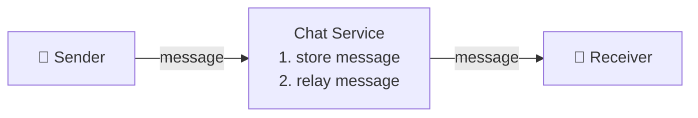

The **sender side** is straightforward — client initiates HTTP to chat service (keep-alive header avoids repeated TCP handshakes).

The **receiver side** is harder — HTTP is client-initiated, so three techniques exist:

---

#### Polling
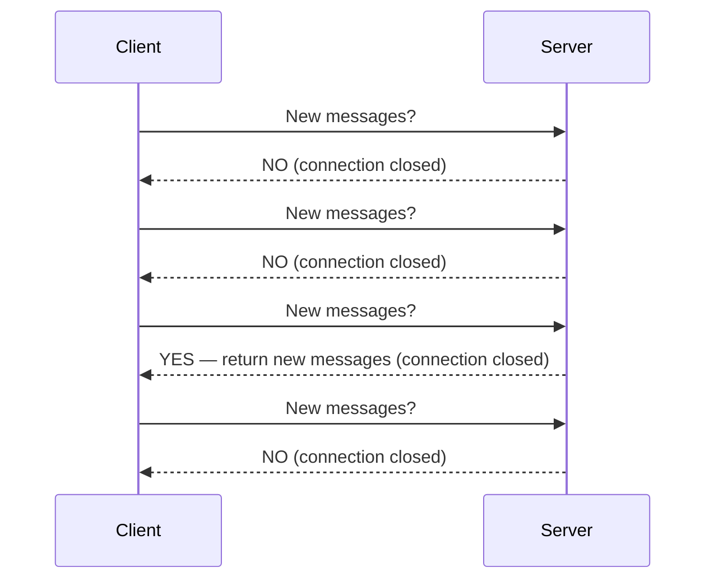
**Problem:** Wastes server resources answering "no" most of the time.

---

#### Long Polling
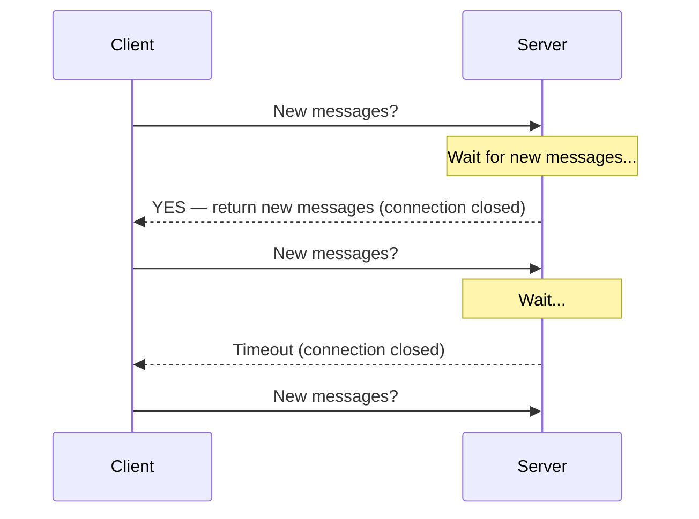
**Drawbacks:**
- Sender & receiver may land on different servers (stateless load balancing breaks this)
- No good way for server to detect if client disconnected
- Inefficient for low-activity users — still reconnects after timeout

---

#### WebSocket ✅ (chosen approach)
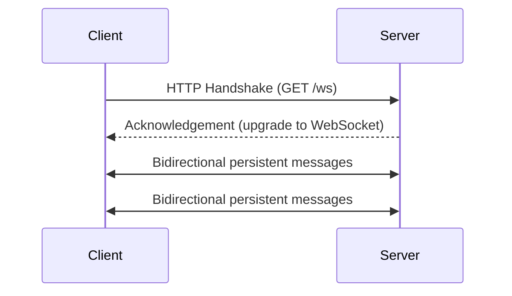

**Why WebSocket wins:**
- Bi-directional and persistent
- Starts as HTTP, upgrades to WebSocket via handshake
- Works through firewalls (uses port 80/443)
- Efficient: single persistent connection, no repeated TCP handshakes
- Simplifies both client and server implementation
- **Used for both sender AND receiver sides**

> **Important:** Only the real-time messaging part uses WebSocket. Other features (login, signup, user profile) use standard HTTP.

---

### High-Level Architecture

The system is broken into **three major categories**: stateless services, stateful services, and third-party integration.

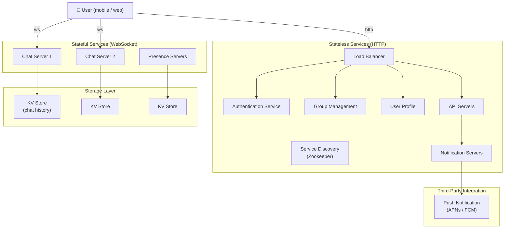

**Key roles:**
- **Load Balancer** → routes HTTP requests to stateless services
- **Chat Servers** → facilitate real-time send/receive via WebSocket
- **Presence Servers** → manage online/offline status, communicate via WebSocket
- **API Servers** → user login, signup, change profile, etc.
- **Notification Servers** → send push notifications
- **KV Store** → stores chat history (HBase used by Facebook; Cassandra used by Discord)

---

## Step 3 — Deep Dive

### Service Discovery

**Purpose:** Find the best chat server for each client based on geographic location, server capacity, etc.

**Tool:** Apache Zookeeper — registers all available chat servers and picks the best one per criteria.

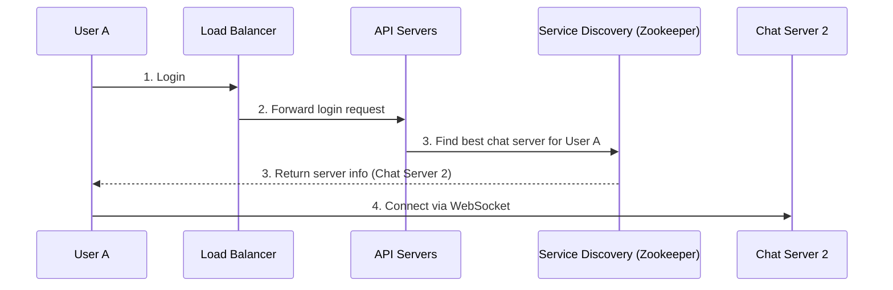

---

### Message Flows

#### 1-on-1 Chat Flow

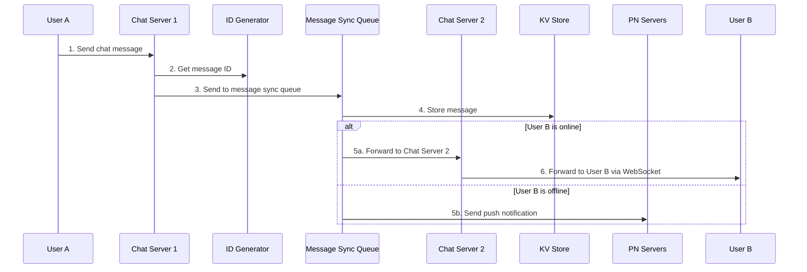

---

#### Message Synchronization Across Multiple Devices

Each device tracks `cur_max_message_id` — the latest message ID it has seen.

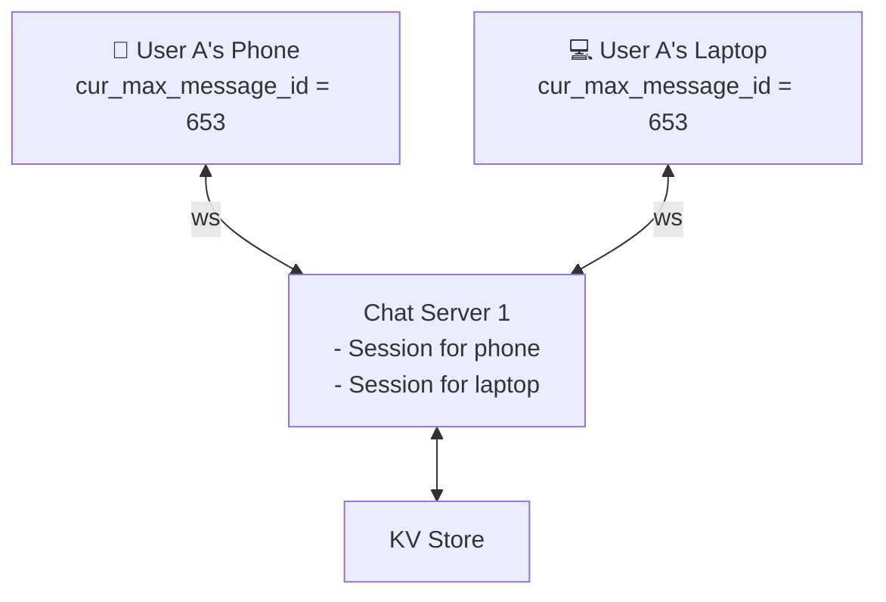

A message is considered **new** if both conditions are true:
1. Recipient ID equals the currently logged-in user ID
2. Message ID in KV store is **larger** than `cur_max_message_id`

---

#### Small Group Chat Flow

For group chat (≤ 100 members), each recipient gets their own **message sync queue** (inbox model).

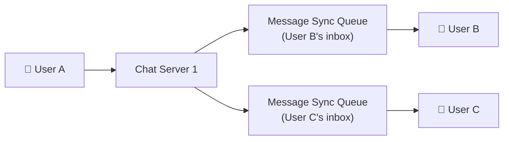

**Why inbox-per-recipient?**
- Each client only needs to check its own inbox
- Storage cost is acceptable for small groups

**WeChat limits groups to 500** for this reason — for 100,000-member groups, storing a copy per member becomes prohibitive.

---

### Data Models

#### Message Table (1-on-1 Chat)

```
┌─────────────────────────────────┐
│            message              │
├──────────────────┬──────────────┤
│  message_id (PK) │  bigint      │
│  message_from    │  bigint      │
│  message_to      │  bigint      │
│  content         │  text        │
│  created_at      │  timestamp   │
└──────────────────┴──────────────┘
```

Primary key: `message_id`
> **Note:** Cannot rely on `created_at` for ordering because two messages can be created at the same time.

---

#### Group Message Table

```
┌─────────────────────────────────────┐
│            group_message            │
├────────────────────┬────────────────┤
│  channel_id (PK)   │  bigint        │
│  message_id (PK)   │  bigint        │
│  user_id           │  bigint        │
│  content           │  text          │
│  created_at        │  timestamp     │
└────────────────────┴────────────────┘
```

Composite primary key: `(channel_id, message_id)`
- `channel_id` is the partition key — all queries in a group operate within a channel

---

#### Message ID Generation

`message_id` must be:
1. **Unique**
2. **Sortable by time** — newer messages have higher IDs

Three approaches:

| Approach | Pros | Cons |
|---|---|---|
| `auto_increment` (MySQL) | Simple | NoSQL doesn't support it |
| Global 64-bit sequence (Snowflake) | Works across DBs | Extra service dependency |
| **Local sequence per channel** ✅ | Simpler, sufficient | IDs only unique within a channel |

**Recommended:** Local sequence number generator. Ordering within a channel/group is all that's needed.

---

#### Why Key-Value Store (not Relational DB)?

| Reason | Detail |
|---|---|
| Easy horizontal scaling | KV stores scale out trivially |
| Very low read latency | O(1) key lookups |
| Relational DBs struggle at scale | Random access with large indexes is expensive |
| Industry proven | Facebook Messenger → HBase; Discord → Cassandra |

**Chat data patterns:**
- Facebook/WhatsApp process **60 billion messages/day**
- Read/write ratio ≈ **1:1** for 1-on-1 chat
- Only **recent chats** accessed frequently
- Some random access needed (search, jump to message, @mentions)

---

### Online Presence

#### User Login → Online
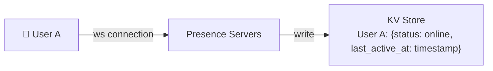

#### User Logout → Offline
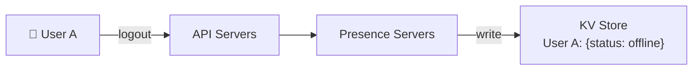

#### User Disconnection — Heartbeat Mechanism

Naive approach (mark offline on disconnect) causes poor UX — users disconnect briefly all the time (tunnels, poor signal).

**Solution: Heartbeat**

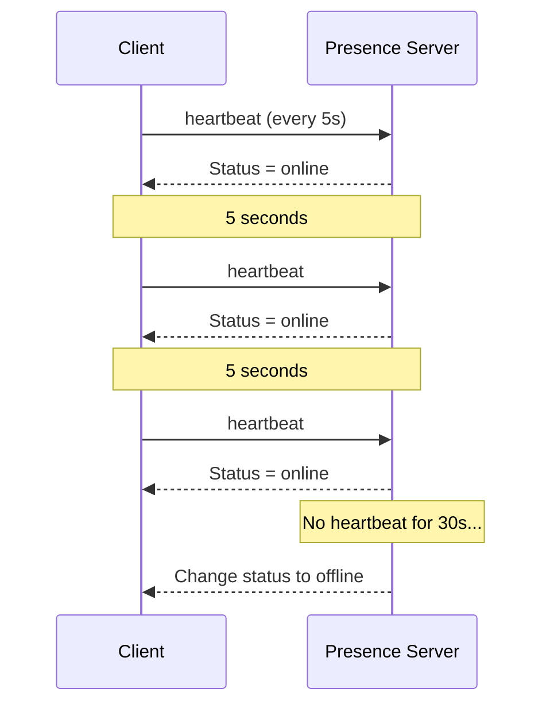

- Client sends heartbeat every **5 seconds**
- If server receives no heartbeat within **x = 30 seconds** → mark user offline
- Prevents flapping online/offline status during brief disconnects

---

#### Online Status Fanout

How do User A's friends learn about status changes?

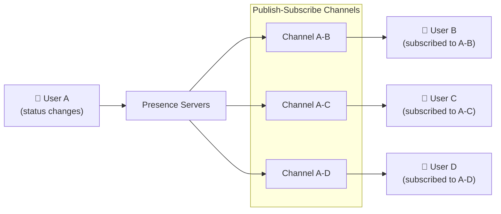

- Each **friend pair** maintains a dedicated pub-sub channel
- On status change, User A's presence server publishes to all friend channels
- **Limitation:** For large groups (100,000+ members), notifying all members is expensive
  - **Solution:** Fetch online status lazily — only when a user enters a group chat or manually refreshes the friend list

---

## Step 4 — Wrap Up

### Full System Summary

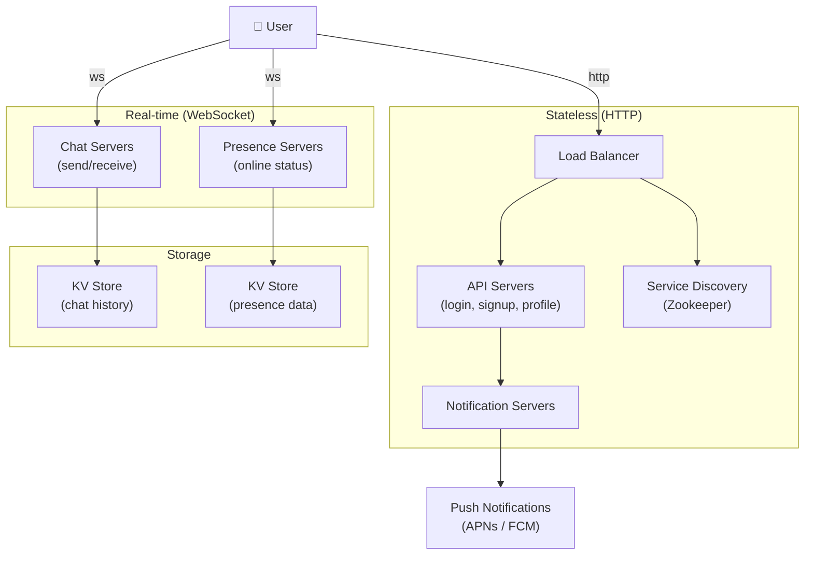

**Components recap:**
| Component | Role |
|---|---|
| Chat Servers | Real-time message send/receive via WebSocket |
| Presence Servers | Online/offline status management via WebSocket + heartbeat |
| API Servers | User login, signup, profile updates |
| Notification Servers | Push notifications when recipient is offline |
| KV Store | Chat history persistence (HBase / Cassandra) |
| Service Discovery (Zookeeper) | Assign best chat server to each client |
| Message Sync Queue | Per-user inbox for new message delivery |

---

## Interview Questions & Model Answers

### Scoping & Requirements

**Q1: How would you clarify requirements for a chat system in an interview?**
> Ask: 1-on-1 vs group chat? Mobile/web/both? Scale (DAU)? Group size limit? Feature list (attachments, E2E encryption, history)? Notification types? Message size limit?

**Q2: What features would you prioritize for an MVP?**
> 1-on-1 chat, online presence, push notifications for offline users, message persistence — in that order. Group chat is additive.

---

### Protocol Design

**Q3: Why is WebSocket preferred over HTTP polling for chat?**
> HTTP is client-initiated — the server can't push messages without being asked. WebSocket is bi-directional and persistent, allowing the server to push messages the instant they arrive. This eliminates polling overhead and reduces latency to near-zero.

**Q4: What's the difference between polling and long polling?**
> Polling: client hits the server at fixed intervals; wastes resources when there's nothing new. Long polling: client holds the connection open until the server has a message or timeout fires. Long polling is better but has drawbacks — sender/receiver may land on different servers with stateless load balancing, and it still creates unnecessary connections for inactive users.

**Q5: Can you use HTTP for the sender side?**
> Yes — HTTP with `keep-alive` is fine for sending since it's client-initiated. WebSocket is critical on the **receiver** side. However, since WebSocket is already bidirectional, it's cleaner to use it for both directions.

**Q6: Does WebSocket work through firewalls?**
> Yes. WebSocket uses port 80 (ws://) or 443 (wss://), the same ports as HTTP/HTTPS. Firewalls don't block these.

---

### Architecture

**Q7: What's the difference between stateless and stateful services in this system?**
> Stateless: traditional request/response services (login, signup, profile) that sit behind a load balancer — any instance can serve any request. Stateful: the chat service, because each client maintains a *persistent WebSocket connection* to a specific chat server. A client normally does not switch servers as long as the server is available.

**Q8: Why does service discovery matter for a chat system?**
> Because WebSocket connections are persistent and stateful, a client must connect to a specific chat server. Service discovery (via Zookeeper) finds the best server based on geographic location, server capacity, etc., and returns the server's hostname to the client. This avoids overloading any single server.

**Q9: Why can't you start with a single-server design at 50M DAU?**
> Single server = single point of failure, no horizontal scaling. At 50M DAU with ~1M concurrent users, even assuming 10KB per connection, that's ~10GB memory just for connections. More critically, zero fault tolerance — one crash takes down the entire system.

---

### Storage

**Q10: Why use a key-value store instead of a relational database for chat history?**
> Four reasons: (1) KV stores scale horizontally with ease; (2) they provide very low read latency; (3) relational DBs slow down on random access when indexes grow large — chat has a ~1:1 read/write ratio with billions of messages; (4) proven in production — Facebook Messenger uses HBase, Discord uses Cassandra.

**Q11: How would you generate unique, time-sortable message IDs?**
> Three options: (1) `auto_increment` in MySQL — doesn't work for NoSQL; (2) global Snowflake-style 64-bit ID generator — adds service dependency; (3) **local sequence number per channel** — simplest approach. Since message ordering only matters within a single channel/group, local IDs are sufficient and easier to implement.

**Q12: Why can't you use `created_at` timestamp as the message sequence key?**
> Two messages can be created at the same millisecond (especially under high load), producing a tie. `message_id` guarantees strict ordering.

**Q13: What data would you store in a relational DB vs KV store?**
> Relational DB: user profiles, settings, friend lists — structured data with relationships. KV Store: chat message history — high volume, simple access patterns, needs horizontal scale.

---

### Message Flow

**Q14: Walk me through what happens when User A sends a message to User B.**
> 1. User A sends message to Chat Server 1 (WebSocket). 2. Chat Server 1 gets a message_id from the ID generator. 3. Message is sent to User B's message sync queue. 4. Message is persisted to KV store. 5a. If User B is online → forwarded to Chat Server 2 → delivered via WebSocket. 5b. If User B is offline → push notification sent via PN servers.

**Q15: How does message sync work across multiple devices?**
> Each device tracks `cur_max_message_id` — the highest message ID it has received. A message is "new" for a device if the recipient matches AND the message_id in KV > `cur_max_message_id`. Since both devices share the same WebSocket session on the same chat server, the chat server maintains separate session state per device.

**Q16: How does group chat message delivery scale with group size?**
> For small groups (≤ 100), the inbox-per-recipient model works — each member gets a copy in their message sync queue. For large groups (100,000+), this becomes prohibitive. WeChat caps groups at 500. For very large groups, you'd shift to a fanout-on-read model or use a pub/sub architecture where members subscribe to the group channel.

---

### Online Presence

**Q17: How do you handle the user disconnection problem in presence tracking?**
> Naive approach — mark offline on disconnect — causes flapping because users disconnect briefly all the time (poor signal, tunnels). Solution: **heartbeat mechanism**. The client sends a heartbeat every 5 seconds. If the presence server receives no heartbeat for x=30 seconds, the user is marked offline. This smooths out transient disconnects.

**Q18: How do you fan out online status to a user's friends?**
> Publish-subscribe model. Each friend pair maintains a dedicated channel. When User A's status changes, the presence server publishes to all of User A's friend channels. Friends subscribe to channels for users they care about and receive status updates via WebSocket.

**Q19: What's the bottleneck with online status fanout at scale?**
> For large groups (e.g. 100,000 members), a single status change generates 100,000 events. This is expensive. **Solution:** lazy/on-demand fetching — only retrieve online status when a user opens a group chat or manually refreshes the friend list, rather than pushing every change.

---

### Tradeoffs & Extensions

**Q20: What are the tradeoffs between WebSocket and SSE (Server-Sent Events) for chat?**
> SSE is server-to-client only (unidirectional) — fine for notifications but not for chat where the client also sends. WebSocket is bidirectional. SSE is simpler and works over plain HTTP/2. For a chat system, WebSocket is the right choice because we need both directions on the same persistent connection.

**Q21: How would you add end-to-end encryption?**
> Each user generates a public/private key pair. Public keys are stored on the server. When User A sends to User B, the message is encrypted client-side with User B's public key. The server stores and relays encrypted blobs but cannot read them. Key exchange is done at connection setup. The server never sees plaintext. Signal Protocol is the standard implementation.

**Q22: How would you handle message delivery guarantees (at-least-once vs exactly-once)?**
> At-least-once is the practical default — messages are stored in KV, and re-delivery on reconnect is handled via `cur_max_message_id`. For exactly-once, client-side deduplication using `message_id` is needed — the receiver discards duplicates it has already seen. The message sync queue should also be idempotent.

**Q23: How would you scale chat servers if one becomes a hotspot?**
> Service discovery (Zookeeper) monitors server load and capacity. When a server is overloaded, new connections are routed elsewhere. For existing connections, graceful re-routing requires: (1) signaling the client to reconnect, (2) draining the server, (3) client picks a new server from service discovery. Message queues buffer in-flight messages during re-routing.

**Q24: How would you implement read receipts (single tick / double tick)?**
> Add `delivery_status` to the message table: `sent`, `delivered`, `read`. When the recipient's chat server receives the message, it sends an ack back through the message sync queue. When the recipient opens the message, the client sends a `read` event. Both events propagate back to the sender's chat server via WebSocket.

---

*Document generated from System Design Interview (Alex Xu), Chapter 12.*
