# Consistent Hashing — System Design Interview Guide

> **Source**: Chapter 5, *System Design Interview* (Alex Xu)  
> **Use case**: Interviewer reference sheet — concepts, diagrams, and question bank

---

## Table of Contents

1. [The Rehashing Problem](#1-the-rehashing-problem)
2. [What Is Consistent Hashing?](#2-what-is-consistent-hashing)
3. [Hash Space and Hash Ring](#3-hash-space-and-hash-ring)
4. [Placing Servers and Keys on the Ring](#4-placing-servers-and-keys-on-the-ring)
5. [Server Lookup](#5-server-lookup)
6. [Adding a Server](#6-adding-a-server)
7. [Removing a Server](#7-removing-a-server)
8. [Two Problems with the Basic Approach](#8-two-problems-with-the-basic-approach)
9. [Virtual Nodes](#9-virtual-nodes)
10. [Finding Affected Keys on Change](#10-finding-affected-keys-on-change)
11. [Benefits Summary](#11-benefits-summary)
12. [Real-World Usage](#12-real-world-usage)
13. [Interview Question Bank](#13-interview-question-bank)

---

## 1. The Rehashing Problem

When you have `n` cache servers, a common load-balancing approach is:

```
serverIndex = hash(key) % N
```

### Example: 4 servers, 8 keys

| Key  | Hash     | hash % 4 |
|------|----------|----------|
| key0 | 18358617 | 1        |
| key1 | 26143584 | 0        |
| key2 | 18131146 | 2        |
| key3 | 35863496 | 0        |
| key4 | 34085809 | 1        |
| key5 | 27581703 | 3        |
| key6 | 38164978 | 2        |
| key7 | 22530351 | 3        |

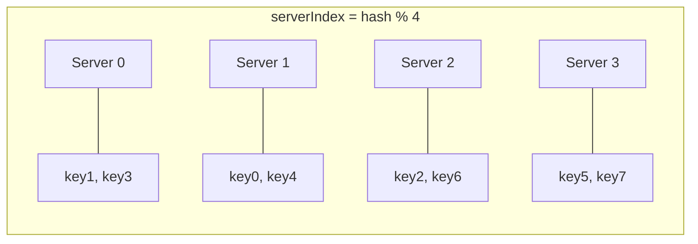

### What happens when Server 1 goes offline? (N becomes 3)

| Key  | Hash     | hash % 3 |
|------|----------|----------|
| key0 | 18358617 | 0        |
| key1 | 26143584 | 0        |
| key2 | 18131146 | 1        |
| key3 | 35863496 | 2        |
| key4 | 34085809 | 1        |
| key5 | 27581703 | 0        |
| key6 | 38164978 | 1        |
| key7 | 22530351 | 0        |

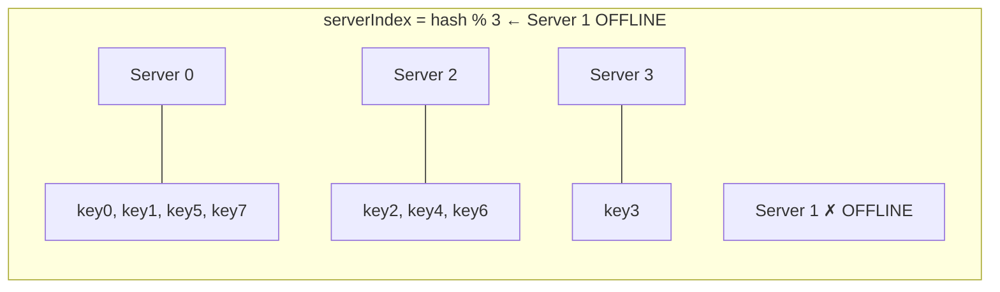

**Problem**: Most keys are redistributed — not just the ones from Server 1. Cache clients connect to wrong servers → **massive cache miss storm**.

---

## 2. What Is Consistent Hashing?

> *"Consistent hashing is a special kind of hashing such that when a hash table is re-sized and consistent hashing is used, only `k/n` keys need to be remapped on average, where `k` is the number of keys, and `n` is the number of slots."*
> — Wikipedia

With traditional modular hashing, nearly **all** keys are remapped when `n` changes.  
With consistent hashing, only **`k/n` keys** are remapped — a fraction.

---

## 3. Hash Space and Hash Ring

Using **SHA-1** as the hash function:
- Output range: `x0` → `x1` → ... → `xn`
- Space: `0` to `2^160 − 1`

Connect the two ends to form a **ring**:

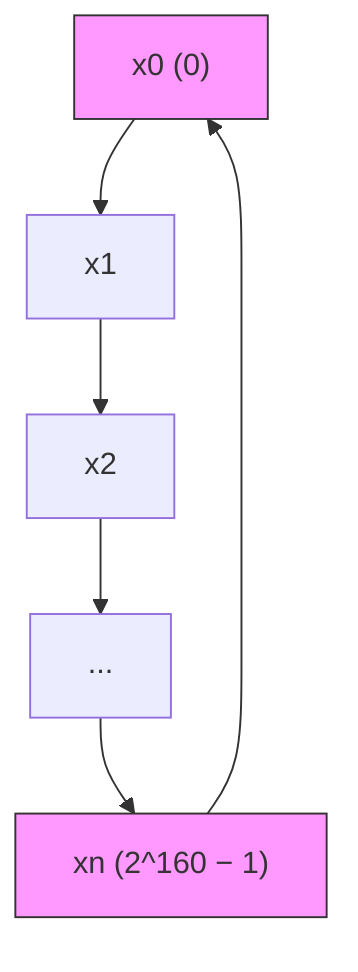

```
      x0 ──────────── x1
     /                  \
   xn                   x2
     \                  /
      x(n-1) ─── ... ── x3
```

The ring wraps: `xn` connects back to `x0`.

---

## 4. Placing Servers and Keys on the Ring

Both **servers** and **keys** are hashed onto the same ring using the hash function.

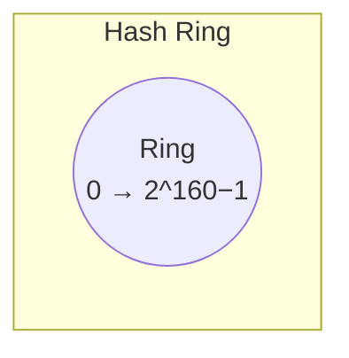

```
                    key0
                     ●
         s3 ●                  ● s0
                  (ring)
         key3 ●            ● key1
                             ● s1
              s2 ●
                    ● key2
```

**Mapping rule**: Hash function maps server names (IP/hostname) and keys to positions on the ring.

---

## 5. Server Lookup

To find which server stores a key:

> **Go clockwise from the key's position on the ring until you hit the first server.**

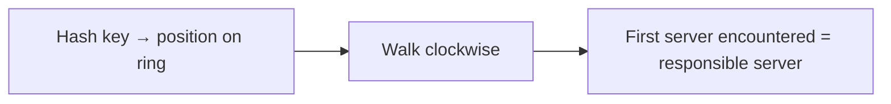

### Visual: 4 servers, 4 keys

```
              key0
               ●──────────► s0 ●
    s3 ●◄──────●key3            |
        ↑                       ↓ key1 ●──► s1 ●
        |                              
    key2 ●──► s2 ●
```

| Key  | Clockwise → Server |
|------|--------------------|
| key0 | server 0           |
| key1 | server 1           |
| key2 | server 2           |
| key3 | server 3           |

---

## 6. Adding a Server

When **server 4** is added to the ring:

- Only keys between `s3` and `s4` (anticlockwise arc) need to be remapped to `s4`
- All other keys remain on their existing servers

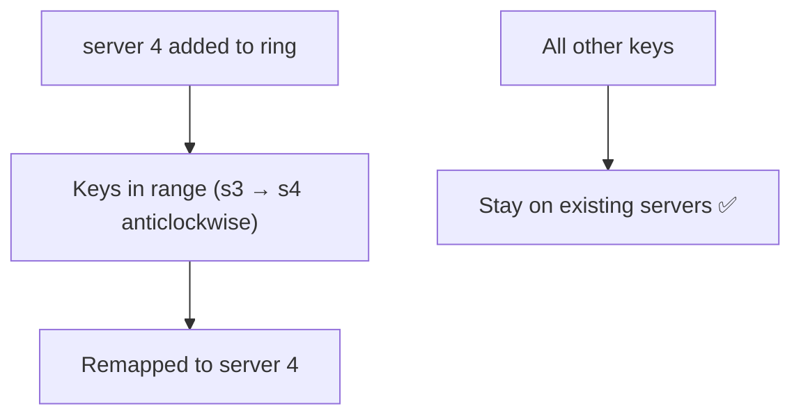

```
Before:   ...── s3 ──── key0 ──── s0 ──...
After:    ...── s3 ── s4(new) ─── s0 ──...
                  ↑
              key0 moves here
```

**Only `key0` is redistributed. `key1`, `key2`, `key3` are unaffected.**

---

## 7. Removing a Server

When **server 1** is removed from the ring:

- Only keys previously on `s1` are remapped — to `s2` (next clockwise)
- All other keys are unaffected

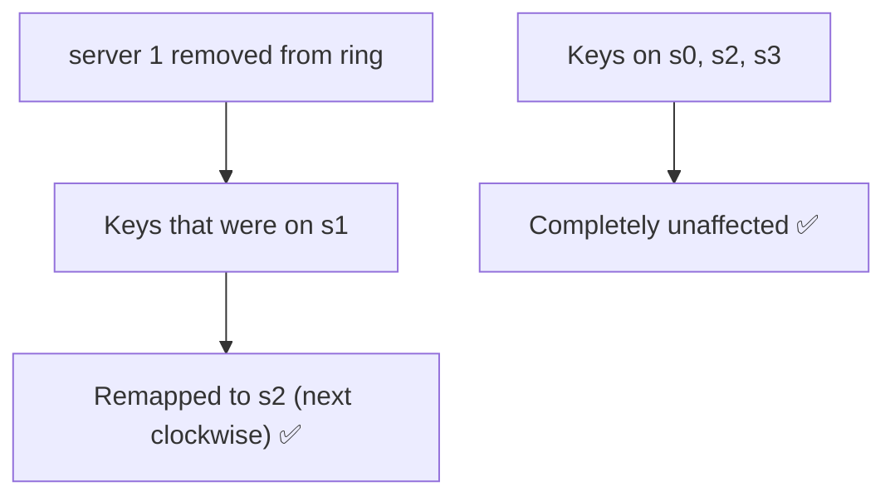

```
Before:   ── s0 ── key1 ── s1 ── key2 ── s2 ──
After:    ── s0 ──────────────── key1,key2 ── s2 ──
                         ↑
                      s1 removed; key1 flows to s2
```

---

## 8. Two Problems with the Basic Approach

The basic consistent hashing algorithm (Karger et al., MIT) has two issues:

### Problem 1: Unequal Partition Sizes

When a server is added or removed, partition sizes become unequal.

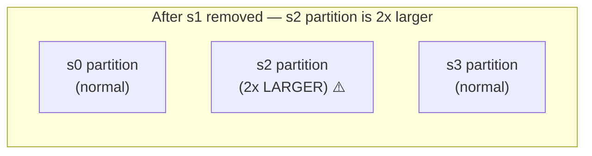

```
  s3 ──────────── s0
 /    normal        \  normal
●                    ●
 \                  /
  s2 ──────────────
   ↑
   s2's partition is now 2× the size of s0 and s3
   (it absorbed all of s1's space)
```

### Problem 2: Non-Uniform Key Distribution (Hotspot)

If servers happen to cluster on one side of the ring, most keys land on one server.

```
Most keys ──► s2 ●
             ↑
         s0, s1, s3 are clustered together
         and share very little of the ring
```

**Solution to both**: **Virtual Nodes**

---

## 9. Virtual Nodes

Each physical server is represented by **multiple virtual nodes** on the ring.

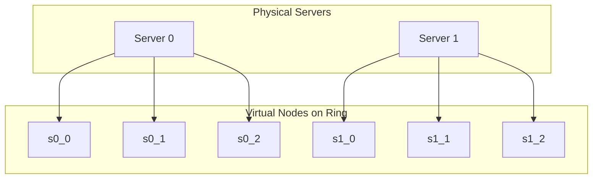

### Ring with virtual nodes (3 per server, 2 servers):

```
    s1_1       s0_2
      ●           ●
 s0_0 ●               ● s1_0
               ring
 s1_2 ●               ● s0_1
        ●
       (key → clockwise to nearest virtual node → resolve to physical server)
```

### Key lookup with virtual nodes

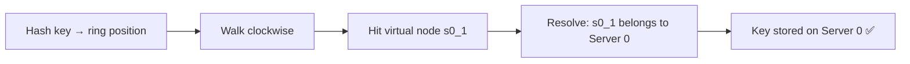

### Tradeoff: How many virtual nodes?

| Virtual Nodes | Key Distribution | Memory Cost |
|---------------|-----------------|-------------|
| 1–10          | Uneven ⚠️       | Low         |
| ~100          | Std dev ~10%    | Moderate    |
| ~200          | Std dev ~5%     | Higher      |
| Higher        | More balanced   | Increases   |

> **Rule of thumb**: 100–200 virtual nodes per physical server balances distribution vs memory overhead.

---

## 10. Finding Affected Keys on Change

### When a server is ADDED (e.g., server 4)

The affected range = from `s4`'s position, **anticlockwise** to the previous server (`s3`).

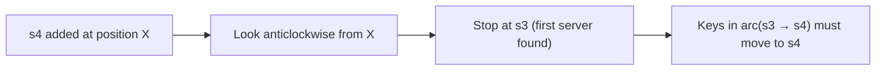

```
  s3 ──── [affected range] ──── s4 (new) ──── s0
           ↑ keys here
           moved from s0 → s4
```

### When a server is REMOVED (e.g., server 1)

The affected range = from `s1`'s position, **anticlockwise** to the previous server (`s0`).

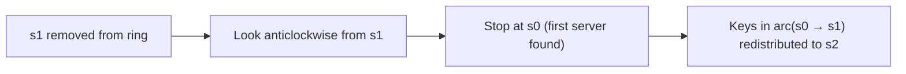

```
  s0 ──── [affected range] ──── s1 (removed) ──── s2
           ↑ keys here
           moved from s1 → s2
```

---

## 11. Benefits Summary

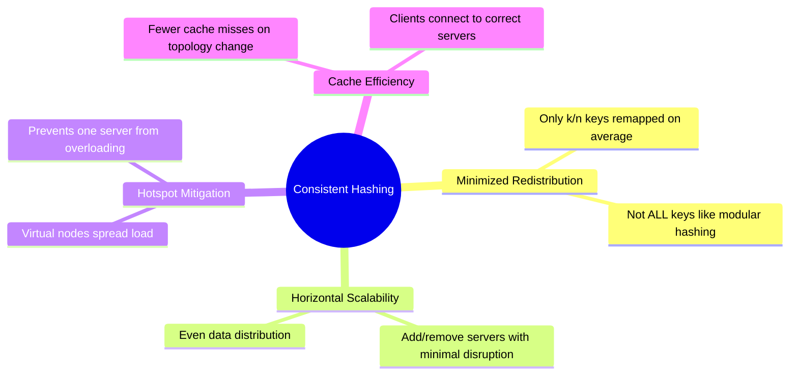

| Problem | Modular Hashing | Consistent Hashing |
|---------|-----------------|--------------------|
| Server added | ~100% keys remapped | Only `k/n` keys remapped |
| Server removed | ~100% keys remapped | Only `k/n` keys remapped |
| Unequal partitions | N/A | Solved by virtual nodes |
| Hotspot keys | Uncontrolled | Mitigated by virtual nodes |

---

## 12. Real-World Usage

| System | How Consistent Hashing Is Used |
|--------|-------------------------------|
| **Amazon DynamoDB** | Partitioning component for key distribution across nodes |
| **Apache Cassandra** | Data partitioning across cluster nodes |
| **Discord** | Chat application message routing |
| **Akamai CDN** | Content delivery network routing |
| **Maglev** | Google's network load balancer |

---

## 13. Interview Question Bank

Use these to probe depth of understanding at each stage of the explanation.

---

### Conceptual Foundations

1. **Why does modular hashing break when a server is added or removed? Walk me through the math.**
2. **What is the core insight that makes consistent hashing "consistent"?**
3. **What hash function would you use in a production system and why? What properties matter?**
4. **What does `k/n` keys remapped on average actually mean in practice for a 1000-node cluster?**
5. **Is consistent hashing a data structure, an algorithm, or a protocol? How do you think about it?**

---

### Hash Ring Design

6. **How do you map a server to a position on the ring? What input do you hash?**
7. **If two servers hash to the same position on the ring, how do you handle collisions?**
8. **The ring is conceptually circular — how would you implement this in code? What data structure?**
9. **How does the clockwise lookup work in O(log n) time? What data structure supports this?**
   > *Expected answer: sorted array or balanced BST / TreeMap; binary search for successor*
10. **What is the time complexity of: key lookup / server add / server remove with a basic ring implementation?**

---

### Virtual Nodes

11. **Without virtual nodes, what two failure modes exist in basic consistent hashing?**
12. **How does adding virtual nodes fix both the unequal partition and hotspot problems?**
13. **How do you decide how many virtual nodes to assign per physical server?**
14. **If a high-capacity server should store more data than a low-capacity one, how do you model that with virtual nodes?**
    > *Expected: assign proportionally more virtual nodes to high-capacity servers*
15. **What is the memory overhead of virtual nodes? How does it scale with the number of nodes and virtual replicas?**
16. **What happens to virtual nodes when a physical server crashes vs. graceful removal?**

---

### Fault Tolerance & Replication

17. **Consistent hashing tells you which server is responsible for a key. How would you add replication on top of it?**
    > *Expected: walk clockwise to find next N servers as replicas (DynamoDB preference list)*
18. **If a server is temporarily partitioned (not dead), how does consistent hashing behave? Could you get stale reads?**
19. **How does consistent hashing interact with quorum reads/writes (R + W > N)?**
20. **What is "hinted handoff" and how does it relate to consistent hashing?**

---

### Operations & Edge Cases

21. **When server 4 is added, you said only keys in the arc (s3 → s4) are affected. How do you actually migrate those keys — what does the migration flow look like?**
22. **Can you do a zero-downtime server addition with consistent hashing? What's the protocol?**
23. **What happens if the load balancer's ring view and a client's ring view are momentarily out of sync?**
24. **How do you handle a "thundering herd" when a server rejoins after being offline?**
25. **If a key is extremely "hot" (millions of QPS, e.g. a celebrity's profile), does consistent hashing help? What additional technique would you layer on?**
    > *Expected: consistent hashing mitigates hotspots across servers, but a single hot key still hits one server — need application-level caching or key sharding like `key#1`, `key#2`*

---

### System Design Integration

26. **Where in a distributed cache system (like Memcached or Redis Cluster) does consistent hashing sit? Who owns the ring — the client or the server?**
27. **How does Amazon DynamoDB use consistent hashing differently from a simple cache pool?**
28. **Compare consistent hashing to range-based partitioning (like HBase). When would you choose one over the other?**
29. **Compare consistent hashing to rendezvous hashing (highest random weight). What are the tradeoffs?**
30. **If you were designing a distributed rate limiter, would you use consistent hashing? What problems would it solve and what new ones would it introduce?**

---

### Coding / Implementation

31. **Implement `addServer(server)`, `removeServer(server)`, and `getServer(key)` using a sorted map of virtual nodes.**
32. **Your `getServer` must be O(log n). What's your data structure and how does the ring wrap-around work in code?**
33. **How do you generate deterministic virtual node positions for a given server name?**
    > *Expected: `hash("server0#0")`, `hash("server0#1")`, ..., `hash("server0#k")` — append replica index*
34. **Write a test to verify that adding a new server only redistributes keys in the expected arc.**
35. **How would you detect and handle a hash collision between two virtual nodes in your implementation?**

---

### Trade-off and Depth Questions

36. **Consistent hashing minimizes key movement, but does it guarantee even distribution? Explain the variance.**
37. **At what number of virtual nodes does the distribution become "good enough"? How did you arrive at that number?**
38. **What are the consistency guarantees of consistent hashing? (Hint: it's about partitioning topology, not data consistency.)**
39. **How would consistent hashing behave in a geo-distributed system where latency between regions differs?**
40. **Is there any scenario where you'd prefer simple modular hashing over consistent hashing?**
    > *Expected: fixed-size, never-changing server pools where simplicity outweighs flexibility*

---

## Quick Reference: Algorithm Steps

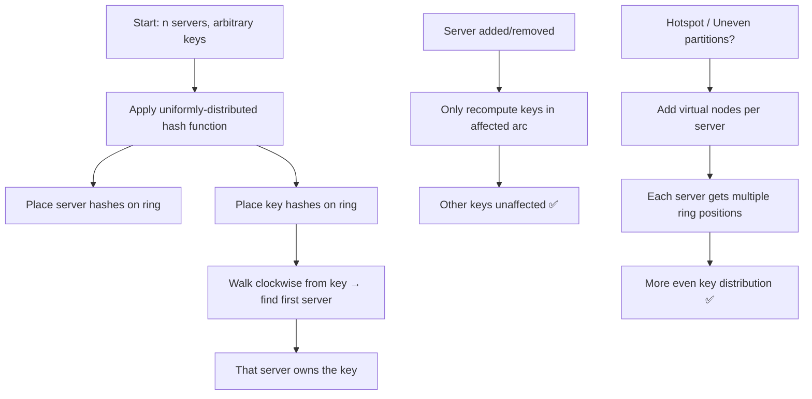

---

*Generated from Alex Xu, System Design Interview, Chapter 5 — Consistent Hashing (pp. 75–87)*
