# Consistent Hashing — System Design Interview Guide

> **Source**: Chapter 5, *System Design Interview* (Alex Xu)  
> **Use case**: Interviewer reference sheet — concepts, diagrams, and question bank

---

## Table of Contents

1. [The Rehashing Problem](#1-the-rehashing-problem)
2. [What Is Consistent Hashing?](#2-what-is-consistent-hashing)
3. [Hash Space and Hash Ring](#3-hash-space-and-hash-ring)
4. [Placing Servers and Keys on the Ring](#4-placing-servers-and-keys-on-the-ring)
5. [Server Lookup](#5-server-lookup)
6. [Adding a Server](#6-adding-a-server)
7. [Removing a Server](#7-removing-a-server)
8. [Two Problems with the Basic Approach](#8-two-problems-with-the-basic-approach)
9. [Virtual Nodes](#9-virtual-nodes)
10. [Finding Affected Keys on Change](#10-finding-affected-keys-on-change)
11. [Benefits Summary](#11-benefits-summary)
12. [Real-World Usage](#12-real-world-usage)
13. [Interview Question Bank](#13-interview-question-bank)

---

## 1. The Rehashing Problem

When you have `n` cache servers, a common load-balancing approach is:

```
serverIndex = hash(key) % N
```

### Example: 4 servers, 8 keys

| Key  | Hash     | hash % 4 |
|------|----------|----------|
| key0 | 18358617 | 1        |
| key1 | 26143584 | 0        |
| key2 | 18131146 | 2        |
| key3 | 35863496 | 0        |
| key4 | 34085809 | 1        |
| key5 | 27581703 | 3        |
| key6 | 38164978 | 2        |
| key7 | 22530351 | 3        |

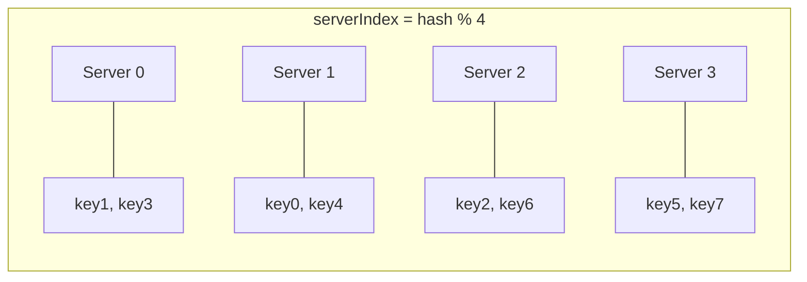

### What happens when Server 1 goes offline? (N becomes 3)

| Key  | Hash     | hash % 3 |
|------|----------|----------|
| key0 | 18358617 | 0        |
| key1 | 26143584 | 0        |
| key2 | 18131146 | 1        |
| key3 | 35863496 | 2        |
| key4 | 34085809 | 1        |
| key5 | 27581703 | 0        |
| key6 | 38164978 | 1        |
| key7 | 22530351 | 0        |

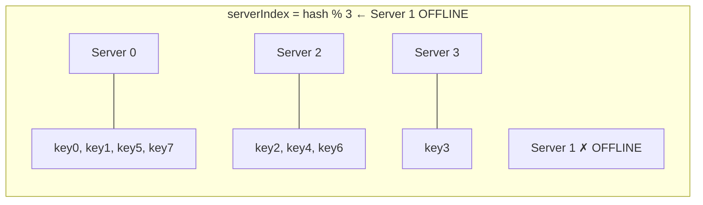

**Problem**: Most keys are redistributed — not just the ones from Server 1. Cache clients connect to wrong servers → **massive cache miss storm**.

---

## 2. What Is Consistent Hashing?

> *"Consistent hashing is a special kind of hashing such that when a hash table is re-sized and consistent hashing is used, only `k/n` keys need to be remapped on average, where `k` is the number of keys, and `n` is the number of slots."*
> — Wikipedia

With traditional modular hashing, nearly **all** keys are remapped when `n` changes.  
With consistent hashing, only **`k/n` keys** are remapped — a fraction.

---

## 3. Hash Space and Hash Ring

Using **SHA-1** as the hash function:
- Output range: `x0` → `x1` → ... → `xn`
- Space: `0` to `2^160 − 1`

Connect the two ends to form a **ring**:

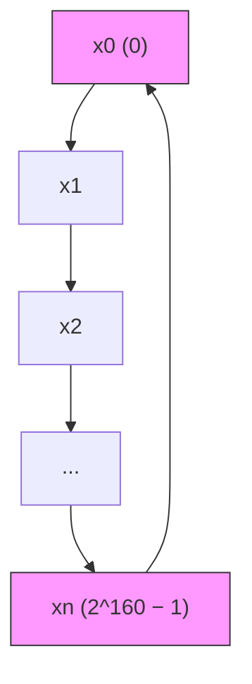

```
      x0 ──────────── x1
     /                  \
   xn                   x2
     \                  /
      x(n-1) ─── ... ── x3
```

The ring wraps: `xn` connects back to `x0`.

---

## 4. Placing Servers and Keys on the Ring

Both **servers** and **keys** are hashed onto the same ring using the hash function.

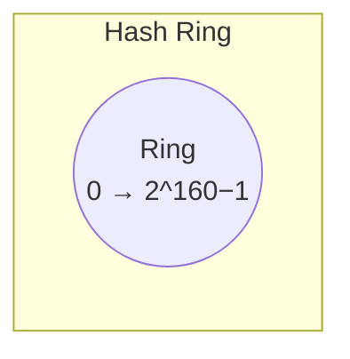

```
                    key0
                     ●
         s3 ●                  ● s0
                  (ring)
         key3 ●            ● key1
                             ● s1
              s2 ●
                    ● key2
```

**Mapping rule**: Hash function maps server names (IP/hostname) and keys to positions on the ring.

---

## 5. Server Lookup

To find which server stores a key:

> **Go clockwise from the key's position on the ring until you hit the first server.**

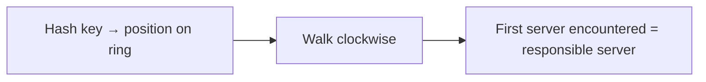

### Visual: 4 servers, 4 keys

```
              key0
               ●──────────► s0 ●
    s3 ●◄──────●key3            |
        ↑                       ↓ key1 ●──► s1 ●
        |                              
    key2 ●──► s2 ●
```

| Key  | Clockwise → Server |
|------|--------------------|
| key0 | server 0           |
| key1 | server 1           |
| key2 | server 2           |
| key3 | server 3           |

---

## 6. Adding a Server

When **server 4** is added to the ring:

- Only keys between `s3` and `s4` (anticlockwise arc) need to be remapped to `s4`
- All other keys remain on their existing servers

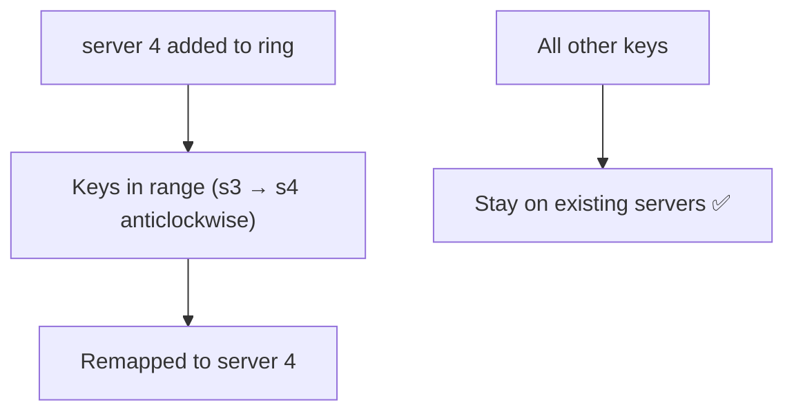

```
Before:   ...── s3 ──── key0 ──── s0 ──...
After:    ...── s3 ── s4(new) ─── s0 ──...
                  ↑
              key0 moves here
```

**Only `key0` is redistributed. `key1`, `key2`, `key3` are unaffected.**

---

## 7. Removing a Server

When **server 1** is removed from the ring:

- Only keys previously on `s1` are remapped — to `s2` (next clockwise)
- All other keys are unaffected

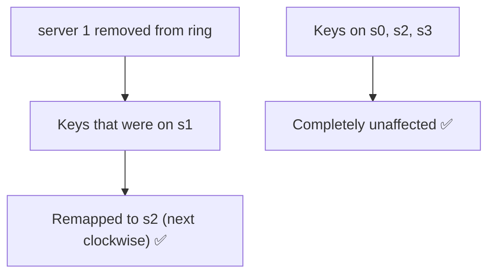

```
Before:   ── s0 ── key1 ── s1 ── key2 ── s2 ──
After:    ── s0 ──────────────── key1,key2 ── s2 ──
                         ↑
                      s1 removed; key1 flows to s2
```

---

## 8. Two Problems with the Basic Approach

The basic consistent hashing algorithm (Karger et al., MIT) has two issues:

### Problem 1: Unequal Partition Sizes

When a server is added or removed, partition sizes become unequal.

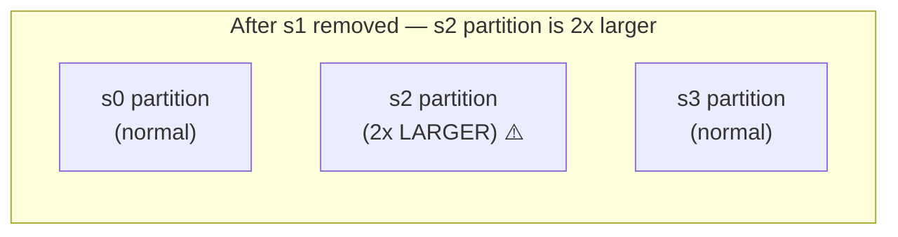

```
  s3 ──────────── s0
 /    normal        \  normal
●                    ●
 \                  /
  s2 ──────────────
   ↑
   s2's partition is now 2× the size of s0 and s3
   (it absorbed all of s1's space)
```

### Problem 2: Non-Uniform Key Distribution (Hotspot)

If servers happen to cluster on one side of the ring, most keys land on one server.

```
Most keys ──► s2 ●
             ↑
         s0, s1, s3 are clustered together
         and share very little of the ring
```

**Solution to both**: **Virtual Nodes**

---

## 9. Virtual Nodes

Each physical server is represented by **multiple virtual nodes** on the ring.

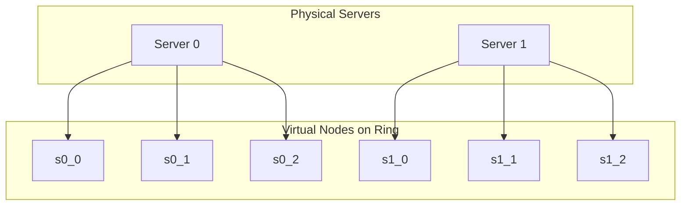

### Ring with virtual nodes (3 per server, 2 servers):

```
    s1_1       s0_2
      ●           ●
 s0_0 ●               ● s1_0
               ring
 s1_2 ●               ● s0_1
        ●
       (key → clockwise to nearest virtual node → resolve to physical server)
```

### Key lookup with virtual nodes

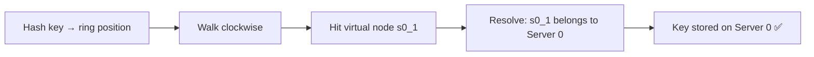

### Tradeoff: How many virtual nodes?

| Virtual Nodes | Key Distribution | Memory Cost |
|---------------|-----------------|-------------|
| 1–10          | Uneven ⚠️       | Low         |
| ~100          | Std dev ~10%    | Moderate    |
| ~200          | Std dev ~5%     | Higher      |
| Higher        | More balanced   | Increases   |

> **Rule of thumb**: 100–200 virtual nodes per physical server balances distribution vs memory overhead.

---

## 10. Finding Affected Keys on Change

### When a server is ADDED (e.g., server 4)

The affected range = from `s4`'s position, **anticlockwise** to the previous server (`s3`).

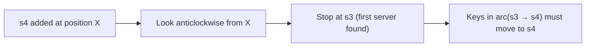

```
  s3 ──── [affected range] ──── s4 (new) ──── s0
           ↑ keys here
           moved from s0 → s4
```

### When a server is REMOVED (e.g., server 1)

The affected range = from `s1`'s position, **anticlockwise** to the previous server (`s0`).

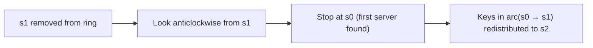

```
  s0 ──── [affected range] ──── s1 (removed) ──── s2
           ↑ keys here
           moved from s1 → s2
```

---

## 11. Benefits Summary

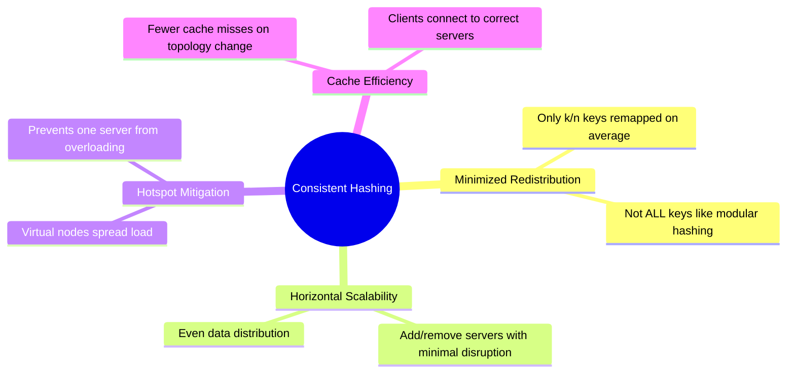

| Problem | Modular Hashing | Consistent Hashing |
|---------|-----------------|--------------------|
| Server added | ~100% keys remapped | Only `k/n` keys remapped |
| Server removed | ~100% keys remapped | Only `k/n` keys remapped |
| Unequal partitions | N/A | Solved by virtual nodes |
| Hotspot keys | Uncontrolled | Mitigated by virtual nodes |

---

## 12. Real-World Usage

| System | How Consistent Hashing Is Used |
|--------|-------------------------------|
| **Amazon DynamoDB** | Partitioning component for key distribution across nodes |
| **Apache Cassandra** | Data partitioning across cluster nodes |
| **Discord** | Chat application message routing |
| **Akamai CDN** | Content delivery network routing |
| **Maglev** | Google's network load balancer |

---

## 13. Interview Question Bank

> Format: **Q** = question to ask the candidate | **A** = expected answer / what to listen for

---

### Category 1: Conceptual Foundations

---

**Q1. Why does modular hashing break when a server is added or removed? Walk me through the math.**

> **A:** With `serverIndex = hash(key) % N`, the modulus `N` is baked into every lookup. When N changes (say from 4 to 3 after a server dies), the same hash value now maps to a completely different index for most keys. For example, `hash(key0) = 18358617`: with N=4 it goes to server 1; with N=3 it goes to server 0. This is not an edge case — statistically, roughly `(N-1)/N` of all keys get a different server index after any topology change. For a 100-server cluster removing one server, ~99% of keys point to a different server. Every one of those is a cache miss, causing a "miss storm" that can cascade and overload origin servers.

---

**Q2. What is the core insight that makes consistent hashing "consistent"?**

> **A:** The insight is that both servers and keys are mapped to the same address space (the ring), and a key's server is determined by *relative position* (nearest server clockwise), not by a global `% N` formula. When a server is added/removed, only the keys in the *local arc* around that server change mapping. The key-to-server relationship for all other keys remains the same because their nearest clockwise server hasn't moved. The word "consistent" refers to this stability — most keys get a consistent answer even as the ring changes.

---

**Q3. What hash function would you use in a production system and why? What properties matter?**

> **A:** The key properties needed are: **(1) uniform distribution** — outputs spread evenly across the ring to avoid hotspots; **(2) determinism** — same input always produces the same output; **(3) avalanche effect** — small input changes produce very different outputs (so server names that differ by one character don't cluster). SHA-1 is the textbook choice (2^160 space), but it's cryptographically heavier than needed. In production, **MurmurHash3** or **xxHash** are preferred — non-cryptographic, extremely fast (~GB/s), and have excellent distribution. MD5 is acceptable but deprecated for security reasons. The ring size should be large enough that collisions are negligible.

---

**Q4. What does `k/n` keys remapped on average actually mean in practice for a 1000-node cluster?**

> **A:** If you have 1 million keys across 1000 servers, each server holds ~1000 keys on average. When you add one server (n goes from 1000 to 1001), only `k/n = 1,000,000/1000 = 1,000` keys need to move — just 0.1% of the total. Compare to modular hashing where ~999,000 keys (99.9%) would get new mappings. The `k/n` formula gives you the minimum possible redistribution — you can't do better without violating locality. Note: this is an *average*; without virtual nodes there can be significant variance from this ideal.

---

**Q5. Is consistent hashing a data structure, an algorithm, or a protocol? How do you think about it?**

> **A:** It's primarily an **algorithm** (a technique for key-to-server assignment) that relies on a specific **data structure** (the hash ring, typically implemented as a sorted map/TreeMap). It's not a protocol — it doesn't specify communication between nodes; it's purely a routing/mapping strategy. A good candidate might also frame it as a *partitioning scheme* — a way to divide keyspace across nodes such that the partition boundaries shift minimally on topology changes. The ring is the conceptual model; TreeMap with binary search is the practical implementation.

---

### Category 2: Hash Ring Design

---

**Q6. How do you map a server to a position on the ring? What input do you hash?**

> **A:** You hash a stable, unique identifier for the server — typically its **IP address** or **hostname**. For example: `position = hash("192.168.1.1")`. Using hostname is fine if it's immutable; using IP is more reliable. The output of the hash function is a number in `[0, 2^160-1]` for SHA-1, and that number is the server's position on the ring. For virtual nodes, you append a replica index: `hash("192.168.1.1#0")`, `hash("192.168.1.1#1")`, etc. to get multiple deterministic, spread-out positions for the same server.

---

**Q7. If two servers hash to the same position on the ring, how do you handle collisions?**

> **A:** With a large enough ring (2^160 for SHA-1), the probability of two real server identifiers colliding is astronomically small — essentially zero in any real deployment. But in code, you should still handle it defensively. Common approaches: **(1) probe forward** — if position X is occupied, try `hash(server + salt)` or increment; **(2) use a composite key** — append a counter until you find a free slot; **(3) reject and alert** — treat it as a configuration error, since it likely indicates a bug (two servers with identical IDs). Virtual nodes reduce collision risk further because you have more points and can retry per-replica.

---

**Q8. The ring is conceptually circular — how would you implement this in code? What data structure?**

> **A:** Use a **TreeMap** (Java) or **sorted dict** (Python `SortedDict`) that maps ring position (long) → server name. The "circular" property is implemented by: when `getServer(key)` does a `ceilingKey(hash(key))` lookup and finds no entry at or above that position, it wraps around to `firstKey()` — the smallest key in the map, which is the "next clockwise" server. This avoids actually building a circular structure; the wrap is just a conditional on `null` return. In Python you'd do `bisect_right` on a sorted list of positions, then `% len(positions)` for wrap-around.

---

**Q9. How does the clockwise lookup work in O(log n) time? What data structure supports this?**

> **A:** The ring is stored as a sorted structure of `(position, server)` pairs. `getServer(key)` computes `pos = hash(key)` then finds the **smallest position ≥ pos** — this is a "successor query". In Java's `TreeMap`, that's `ceilingKey(pos)` — O(log n) because TreeMap is a Red-Black BST. In Python, use `sortedcontainers.SortedList` with `bisect_right`. A plain sorted array also works — binary search for the insertion point, take the next element, wrap to index 0 if past the end. All operations (add, remove, lookup) are O(log n) where n = total virtual nodes on the ring.

---

**Q10. What is the time complexity of key lookup / server add / server remove?**

> **A:**
> | Operation | Time Complexity | Notes |
> |-----------|----------------|-------|
> | `getServer(key)` | O(log V) | V = total virtual nodes; binary search / TreeMap ceilingKey |
> | `addServer(server)` | O(R log V) | R = virtual nodes per server; R insertions into sorted structure |
> | `removeServer(server)` | O(R log V) | R deletions from sorted structure |
> | Space | O(V) = O(S × R) | S = physical servers, R = virtual nodes per server |
>
> For typical values (S=100 servers, R=150 virtual nodes), V=15,000 — log(15,000) ≈ 14, so lookups are extremely fast.

---

### Category 3: Virtual Nodes

---

**Q11. Without virtual nodes, what two failure modes exist in basic consistent hashing?**

> **A:** **(1) Unequal partition sizes**: When a server is added or removed, the arc that was previously one server's responsibility is now split or merged unevenly. If s1 is removed, s2 absorbs all of s1's arc, potentially doubling its partition size while s0 and s3 are unaffected. Over multiple add/remove events, partitions become highly skewed. **(2) Non-uniform key distribution (hotspot)**: If server positions cluster by chance on one half of the ring (which SHA-1 can produce for small N), one server gets most keys and others get very few — a natural hotspot even with no failures.

---

**Q12. How does adding virtual nodes fix both problems?**

> **A:** **(1) Unequal partitions**: With 150 virtual nodes per server, when a server is removed, its 150 positions are removed from the ring. Each removal is a small arc, and those keys disperse to 150 different servers (whichever is next clockwise for each arc). Load is spread across many servers, not dumped on one neighbor. **(2) Hotspot**: With many virtual nodes, the law of large numbers kicks in. Even if real server hashes cluster, the virtual node hashes spread uniformly across the ring. Each server ends up owning many small, spread-out arcs rather than one potentially huge contiguous arc.

---

**Q13. How do you decide how many virtual nodes to assign per physical server?**

> **A:** It's a tradeoff between **distribution quality** and **memory/computation cost**. Research shows: ~100 virtual nodes gives ~10% standard deviation from ideal distribution; ~200 nodes gives ~5%. Beyond 300–500 nodes, gains diminish. A practical starting point is **150 virtual nodes per server**. You should also factor in: **(1) cluster size** — for very large clusters (1000+ nodes), fewer virtual nodes per server may suffice because the sheer number of physical nodes provides natural balance; **(2) available memory** — each virtual node entry is a ring position + server reference, typically 50–100 bytes; **(3) operational SLAs** — if you need tight load guarantees, go higher.

---

**Q14. If a high-capacity server should store more data than a low-capacity one, how do you model that with virtual nodes?**

> **A:** Assign **proportionally more virtual nodes** to higher-capacity servers. If server A has 2x the memory/CPU of server B, give A 200 virtual nodes and B 100 virtual nodes. This means A owns ~2x the ring arcs and thus receives ~2x the keys. This is a clean, configurable way to implement weighted load balancing without changing the core algorithm. DynamoDB uses a similar approach where tokens (virtual node positions) are assigned based on server capacity. The ring-based model makes this weighting natural — no special-casing needed.

---

**Q15. What is the memory overhead of virtual nodes? How does it scale?**

> **A:** Total ring entries = `S × R` where S = physical servers, R = virtual nodes per server. Each entry stores a ring position (8 bytes for a long) + a server reference (pointer, ~8 bytes) = ~16–24 bytes per entry. For 100 servers × 150 virtual nodes = 15,000 entries × 24 bytes = **~360 KB**. This is negligible. Even at 10,000 servers × 200 virtual nodes = 2M entries × 24 bytes = **~48 MB** — still very manageable. The overhead is linear in `S × R`, and in practice this structure lives in client memory (not on disk), so it's rarely a bottleneck.

---

**Q16. What happens to virtual nodes when a physical server crashes vs. graceful removal?**

> **A:** **Graceful removal**: the operator explicitly calls `removeServer(server)`, which iterates over all R virtual node positions for that server and removes them from the ring. Clean and atomic from the ring's perspective. **Crash**: the server's virtual nodes remain on the ring until a health check or gossip protocol detects the failure and triggers removal. During the window between crash and detection, client requests route to the dead server and fail — hence why you need failure detection (heartbeats, Phi accrual failure detector) and the ring update must be propagated to all clients/routers. The ring itself doesn't know about crashes; that's the responsibility of the orchestration layer above it.

---

### Category 4: Fault Tolerance & Replication

---

**Q17. Consistent hashing tells you which server is responsible for a key. How would you add replication on top of it?**

> **A:** The standard approach (used in DynamoDB) is the **preference list**: for a given key, hash it to a position, then walk clockwise to find the **next N distinct physical servers** — those are the N replicas. "Distinct physical servers" is important with virtual nodes: you skip virtual nodes that belong to a physical server already in your list. This gives you N servers that collectively own the key. Writes go to all N; reads can be satisfied by any R of them (where R+W > N for strong consistency). The preference list changes only when the ring topology changes — consistent hashing makes this natural and minimal.

---

**Q18. If a server is temporarily partitioned (not dead), how does consistent hashing behave? Could you get stale reads?**

> **A:** Yes, stale reads are possible. Consistent hashing is a *routing* mechanism — it has no awareness of data freshness. If s1 is partitioned and clients route to s2 (via sloppy quorum or hinted handoff), s2 may serve stale data or reject reads depending on the consistency level configured. During the partition, s1 may accept writes from a different partition segment, causing divergence. When s1 rejoins, you need **anti-entropy / read repair** to reconcile versions. Consistent hashing tells you *where* data lives, not *how fresh* it is — data consistency is a separate concern handled by vector clocks, CRDTs, or quorum protocols layered on top.

---

**Q19. How does consistent hashing interact with quorum reads/writes (R + W > N)?**

> **A:** Consistent hashing determines the **preference list** (the N servers responsible for a key). Quorum protocols then operate over that list. For a write: send to all N, wait for W acknowledgments. For a read: send to N, wait for R responses, return the latest version. The constraint R + W > N guarantees at least one overlapping server between any read and write set, ensuring you always see the latest write. Consistent hashing makes the preference list stable and minimal — it doesn't grow/shrink arbitrarily — which keeps quorum logic manageable. If the ring changes during an operation (e.g., a server leaves mid-write), you may need to handle the case where preference lists seen by different clients differ transiently.

---

**Q20. What is "hinted handoff" and how does it relate to consistent hashing?**

> **A:** Hinted handoff is a durability technique used when a target server (in the preference list) is temporarily unavailable. Instead of failing the write, a different server (not in the preference list) accepts the write and stores a "hint" — metadata saying "this data belongs to server X, deliver it when X comes back." This allows writes to succeed even during partial failures, improving availability. The connection to consistent hashing: the preference list (derived from the ring) defines the *intended* owners. Hinted handoff is the fallback when intended owners are unreachable. When the original server recovers, the hint is used to replay the write to the correct server. DynamoDB implements this extensively.

---

### Category 5: Operations & Edge Cases

---

**Q21. When server 4 is added, only keys in the arc (s3 → s4) are affected. What does the actual migration flow look like?**

> **A:** The migration protocol:
> 1. **Add s4 to the ring** (update the sorted map on coordinator/all clients).
> 2. **Identify affected keys**: scan from s4's position anticlockwise to s3 — these keys currently live on s0 (the old clockwise successor of that arc).
> 3. **Copy data**: s0 streams the affected keys to s4. This can be done lazily (copy on first miss) or eagerly (bulk transfer).
> 4. **Verify**: once s4 confirms it has all keys in the arc, s0 can delete its copies.
> 5. **Serve traffic**: s4 starts serving reads/writes for its arc.
> In practice, systems like Cassandra use **streaming** for this. The risk is a window where s4 has partial data — mitigated by having s0 still serve as fallback during migration, or by running both servers simultaneously ("double-write") until migration completes.

---

**Q22. Can you do zero-downtime server addition? What's the protocol?**

> **A:** Yes. The key is **not cutting over immediately**. The protocol:
> 1. Add new server to ring in "shadow" mode — it receives writes immediately (double-write from the upstream).
> 2. Migrate existing keys from old owner to new server in the background.
> 3. Once migration is complete and verified, update the ring's "read routing" to point to the new server.
> 4. Stop double-writes; new server is now primary.
> This is essentially a **blue-green migration at the key-arc level**. The double-write window ensures no data loss. An alternative is the **bootstrap phase** in Cassandra: new node joins, gets streamed data, only becomes active after stream completes. During bootstrap, reads still go to old nodes.

---

**Q23. What happens if the load balancer's ring view and a client's ring view are momentarily out of sync?**

> **A:** This is a real distributed systems problem. If a client still has the old ring (before s4 was added) and routes key0 to s0, but the data has already migrated to s4, the client gets a miss or stale data. Solutions: **(1) Server-side redirect**: s0 knows it no longer owns key0 and returns a redirect to s4. **(2) Ring version propagation**: use a configuration service (ZooKeeper, etcd, Consul) to push ring updates to all clients; until a client has the latest version, it may get redirected. **(3) Consistent routing via a proxy**: all clients go through a stateful proxy that has the authoritative ring — clients never hold ring state themselves. The tradeoff is the proxy is a potential bottleneck. Most real systems (Memcached clients, Redis Cluster) use client-side ring with gossip-based updates and accept brief inconsistency.

---

**Q24. How do you handle a "thundering herd" when a server rejoins after being offline?**

> **A:** When a server comes back, all keys it was responsible for need to be fetched back from wherever they were served during the outage. This can cause: **(1) A write burst** — hinted handoff replays all queued writes simultaneously. **(2) A read burst** — clients start routing to the rejoined server, but it may have cold/stale cache, causing a flood of cache misses that hit the origin/DB. Mitigations: **(a) Gradual ring reintegration** — don't add the server to the ring immediately; let it warm up by shadowing requests first. **(b) Rate-limit hinted handoff replay** — don't replay all hints at once; spread over minutes. **(c) Request coalescing** — if 1000 requests for the same key all miss, only one goes to origin (request collapsing / dog-pile prevention). **(d) Cache warming** — proactively pre-populate from a snapshot before rejoining.

---

**Q25. If a key is "hot" (millions of QPS for one key), does consistent hashing help? What do you layer on top?**

> **A:** Consistent hashing helps distribute *different* keys across servers evenly — it does not help when a *single* key is hot. One key maps to one position, which maps to one server (or its N replicas). If that key gets millions of QPS, those replicas get hammered regardless of how balanced the ring is. Solutions layered on top: **(1) Local in-process cache** — cache the hot key in each application server's heap; requests never leave the process. **(2) Key sharding / synthetic scatter** — store the key as `key#0`, `key#1`, ..., `key#k` and randomly pick one on read; distribute writes to all k shards. **(3) Read replicas** — add more read replicas specifically for hot keys. **(4) CDN / edge caching** — for read-heavy hot keys, push to edge. The core insight is: consistent hashing solves distribution across keys, not traffic concentration within a single key.

---

### Category 6: System Design Integration

---

**Q26. In a distributed cache like Memcached, who owns the ring — the client or the server?**

> **A:** In **Memcached**, the ring lives on the **client side**. Each client library (Java, Python, etc.) maintains a local copy of the server list and computes `getServer(key)` locally before making the network call. Servers are stateless and have no knowledge of each other. This is efficient (no extra hop) but means ring updates must be pushed to all clients, and inconsistency windows exist. In **Redis Cluster**, the ring (called "slot map") is maintained by the cluster itself — servers gossip to keep slot maps consistent, and clients are told which server owns which slot range. The client still caches the slot map locally but can be redirected via `MOVED` responses if its map is stale. This is more operationally robust but adds complexity.

---

**Q27. How does Amazon DynamoDB use consistent hashing differently from a simple cache pool?**

> **A:** Several key differences: **(1) Replication**: DynamoDB always replicates to N nodes (typically 3), using the preference list from the ring. A cache pool might not replicate at all. **(2) Virtual nodes (tokens)**: DynamoDB assigns each physical node multiple token (virtual node) positions; tokens can be rebalanced without rehashing data — just by moving token assignments. **(3) Persistence**: DynamoDB persists data; cache pools don't. So migration on ring change is more expensive and must be transactional. **(4) Vector clocks / versioning**: DynamoDB attaches version metadata to handle concurrent writes — consistent hashing tells you *where* to store, but DynamoDB also manages *what version* is authoritative. **(5) Sloppy quorum + hinted handoff**: DynamoDB accepts writes to non-preferred nodes during failures and replays them later — a pure cache pool typically just returns a miss.

---

**Q28. Compare consistent hashing to range-based partitioning (HBase). When would you choose one vs. the other?**

> **A:**

> | Aspect | Consistent Hashing | Range Partitioning (HBase) |
> |--------|-------------------|---------------------------|
> | Key distribution | Uniform (hash-based, random) | Ordered; supports range scans |
> | Range queries | Not efficient — keys scatter | Efficient — keys in same range co-located |
> | Hotspot risk | Low (hash spreads evenly) | High (sequential writes hit last region) |
> | Rebalancing | Minimal key movement | Region splits; may cascade |
> | Use case | Cache, KV store, session data | Time-series, sorted data, analytics |
>
> Choose consistent hashing when: keys are opaque (UUIDs, user IDs), you need uniform load, and you don't need range scans. Choose range partitioning when: you need `scan(key_start, key_end)` queries, or your access pattern is ordered (e.g., latest events, leaderboards).

---

**Q29. Compare consistent hashing to rendezvous hashing (HRW). What are the tradeoffs?**

> **A:** **Rendezvous hashing** (Highest Random Weight): for each key, compute `hash(key, serverID)` for every server and pick the server with the highest score. No ring required. Comparison:

> | Aspect | Consistent Hashing | Rendezvous Hashing |
> |--------|-------------------|--------------------|
> | Server lookup time | O(log V) with ring | O(S) — must score all servers |
> | Ring data structure | Required (sorted map) | Not required |
> | Distribution quality | Requires virtual nodes for balance | Naturally balanced without them |
> | Server add/remove | O(R log V) | O(1) — just add to server list |
> | Scalability | Better for large S | Gets slower as S grows |
>
> Rendezvous hashing is simpler (no ring, no virtual nodes) and has better inherent distribution, but O(S) lookup makes it impractical for very large clusters (1000+ servers). Consistent hashing with virtual nodes wins at scale. Rendezvous is used in CDN URL routing, load balancers with small server pools.

---

**Q30. Would you use consistent hashing for a distributed rate limiter? What does it solve and what does it break?**

> **A:** **What it solves**: Sticky routing — all requests for user X consistently hit the same rate limiter node, so the counter state is local and accurate. No need for cross-node counter synchronization. **What it breaks or complicates**: **(1) Node failure** — if rate limiter node for user X dies, X's requests route to a new node with a cold counter, effectively resetting their rate limit window → users can burst. **(2) Uneven traffic** — a viral user (high QPS) lands on one node regardless of virtual nodes (same hot key problem). **(3) Deployment/rolling restart** — rebalancing shifts users between nodes, temporarily relaxing limits. Mitigations: replicate counters to the next N nodes on the ring; use sliding window with TTL so a reset isn't catastrophic. Alternatives: centralized Redis counter with local approximate caching, or a token-bucket algorithm with eventual-consistency sync.

---

### Category 7: Coding / Implementation

---

**Q31. Implement `addServer`, `removeServer`, and `getServer` using a sorted map. Show the key logic.**

> **A (reference implementation in Java):**
> ```java
> public class ConsistentHashRing {
>     private final TreeMap<Long, String> ring = new TreeMap<>();
>     private final int virtualNodes;
>     private final MessageDigest md;
>
>     public ConsistentHashRing(int virtualNodes) throws NoSuchAlgorithmException {
>         this.virtualNodes = virtualNodes;
>         this.md = MessageDigest.getInstance("MD5");
>     }
>
>     private long hash(String key) {
>         byte[] digest = md.digest(key.getBytes(StandardCharsets.UTF_8));
>         // Use first 8 bytes as a long for the ring position
>         return ((long)(digest[3] & 0xFF) << 24) | ((long)(digest[2] & 0xFF) << 16)
>              | ((long)(digest[1] & 0xFF) << 8)  | ((long)(digest[0] & 0xFF));
>     }
>
>     public void addServer(String server) {
>         for (int i = 0; i < virtualNodes; i++) {
>             ring.put(hash(server + "#" + i), server);
>         }
>     }
>
>     public void removeServer(String server) {
>         for (int i = 0; i < virtualNodes; i++) {
>             ring.remove(hash(server + "#" + i));
>         }
>     }
>
>     public String getServer(String key) {
>         if (ring.isEmpty()) return null;
>         long pos = hash(key);
>         Map.Entry<Long, String> entry = ring.ceilingEntry(pos);
>         // Wrap around to the first entry if no entry at or after pos
>         return (entry != null ? entry : ring.firstEntry()).getValue();
>     }
> }
> ```
> The critical detail is the `ceilingEntry` + `firstEntry` wrap-around for the circular ring.

---

**Q32. Your `getServer` must be O(log n). What's your data structure and how does ring wrap-around work?**

> **A:** Use Java's `TreeMap<Long, String>` (backed by a Red-Black tree). For clockwise lookup: `ring.ceilingKey(hash(key))` returns the smallest key ≥ hash(key) in O(log n). If it returns `null` (hash(key) is past the last entry), the next clockwise server is `ring.firstKey()` — the smallest key, which "wraps around." This avoids building a circular data structure; the wrap is a single conditional check. In Python: maintain a `sorted list` of positions and a `dict` mapping position → server. Use `bisect.bisect_right(positions, hash(key)) % len(positions)` — the `%` handles wrap-around naturally.

---

**Q33. How do you generate deterministic virtual node positions for a server?**

> **A:** Append the replica index to the server identifier before hashing: `hash("192.168.1.1#0")`, `hash("192.168.1.1#1")`, ..., `hash("192.168.1.1#149")`. This is deterministic (same server name always produces the same positions), spread-out (the avalanche property of the hash function means consecutive indices produce uncorrelated positions), and collision-resistant (different servers get different positions with overwhelming probability). The `#` separator is a convention — any separator that prevents accidental prefix collisions works. Avoid simple concatenation like `"server1" + "0"` vs `"server" + "10"` — use a clear delimiter.

---

**Q34. How would you write a test to verify adding a new server only redistributes keys in the expected arc?**

> **A:**
> ```java
> @Test
> void addingServerOnlyRedistributesKeysInAffectedArc() {
>     ConsistentHashRing ring = new ConsistentHashRing(150);
>     ring.addServer("s0"); ring.addServer("s1"); ring.addServer("s2"); ring.addServer("s3");
>
>     // Record where 10,000 random keys map BEFORE adding s4
>     Map<String, String> before = new HashMap<>();
>     for (String key : generateKeys(10_000)) {
>         before.put(key, ring.getServer(key));
>     }
>
>     ring.addServer("s4"); // Add new server
>
>     int redistributed = 0;
>     for (Map.Entry<String, String> e : before.entrySet()) {
>         String newServer = ring.getServer(e.getKey());
>         if (!newServer.equals(e.getValue())) {
>             redistributed++;
>             // Key should only move TO s4, never between other servers
>             assertEquals("s4", newServer,
>                 "Key moved to unexpected server: " + newServer);
>         }
>     }
>
>     // Should be approximately k/n = 10000/5 = 2000 keys
>     assertTrue(redistributed > 1500 && redistributed < 2500,
>         "Expected ~2000 redistributed keys, got: " + redistributed);
> }
> ```
> The key assertion: any key that moved must have moved specifically to s4, never from s0→s1 or any other pair.

---

**Q35. How do you detect and handle a hash collision between two virtual nodes?**

> **A:** Detection: when inserting into the TreeMap, check if the position already exists — `ring.containsKey(position)`. If it does and the existing value is a *different* server, you have a collision. Handling options: **(1) Skip** — don't insert, accept that this virtual node is lost (minor distribution impact for a single collision). **(2) Probe** — try `position + 1` or re-hash with a modified input (`server + "#" + i + "_retry"`) until you find a free slot. **(3) Log and alert** — collisions should be extremely rare; a collision in production may indicate a hash function quality issue worth investigating. **(4) Use a higher-precision hash** — move from 32-bit to 64-bit or 128-bit positions to reduce collision probability. In practice, with SHA-1's 2^160 space, collisions between real virtual node identifiers are computationally impossible.

---

### Category 8: Trade-offs and Depth

---

**Q36. Consistent hashing minimizes key movement, but does it guarantee even distribution? Explain the variance.**

> **A:** No, it does not *guarantee* even distribution — it only *improves* it. Without virtual nodes, the variance can be very high: with N servers on a ring, the standard deviation of partition sizes is approximately `O(1/√N)` of the mean, meaning for small N (like 3–5 servers) one server can hold 2–3x the average load. Virtual nodes reduce this variance significantly. With 100 virtual nodes per server, standard deviation drops to ~10% of mean; with 200, ~5%. This is because the Central Limit Theorem applies — with more independent samples on the ring, the aggregate converges to the mean. The distribution is never perfectly uniform; it's probabilistically balanced within a tunable tolerance.

---

**Q37. At what number of virtual nodes does distribution become "good enough"? How do you arrive at that number?**

> **A:** The empirically-observed answer is **100–200 virtual nodes per server** for most production systems, based on online research cited in Alex Xu's book. The theoretical basis: standard deviation of partition size ≈ `1 / sqrt(V)` where V is total virtual nodes on ring. For S=10 servers × R=150 vnodes = 1500 total positions: std dev ≈ 1/√1500 ≈ 2.6% of mean. For most distributed caches, ≤5% imbalance is acceptable. You can derive your own target by simulating: generate S servers, assign R vnodes each, compute partition size distribution across 10,000 trials, tune R until p99 imbalance meets your SLA. The right number also depends on cluster size — for a 500-server cluster, even R=50 may give acceptable balance due to the large N.

---

**Q38. What are the consistency guarantees of consistent hashing? (Hint: it's topology, not data.)**

> **A:** Consistent hashing provides **routing consistency** — a given key always maps to the same server as long as the ring topology doesn't change. It does **not** provide **data consistency** (linearizability, read-your-writes, etc.). Those are the responsibility of the replication and consensus layer above it. Specifically: consistent hashing tells you *which server(s)* are responsible for a key; it says nothing about whether the data on those servers is up-to-date, whether concurrent writes conflict, or whether replicas are in sync. The word "consistent" in the name refers to the mathematical property that a small change to the set of servers causes a small change to the key mapping — not to the CAP theorem's notion of consistency.

---

**Q39. How would consistent hashing behave in a geo-distributed system with different inter-region latencies?**

> **A:** Basic consistent hashing is topology-unaware — it routes purely by hash position, ignoring geography. This can cause a key in us-east-1 to be routed to a server in eu-west-1, incurring 100ms+ latency. Solutions: **(1) Regional rings** — maintain a separate ring per region; only route to local servers. Cross-region replication is handled asynchronously. **(2) Rack/zone-aware virtual nodes** — when building the preference list (for replication), skip virtual nodes in the same AZ to ensure replicas span failure domains. DynamoDB and Cassandra both do this. **(3) Latency-weighted routing** — use client-side metrics to prefer nearby servers when multiple replicas can serve a read. The ring handles *which servers own data*; a separate routing layer handles *which replica to read from* based on latency.

---

**Q40. Is there any scenario where you'd prefer simple modular hashing over consistent hashing?**

> **A:** Yes, several valid scenarios: **(1) Fixed, immutable server pool** — if you have exactly N servers and N will never change (e.g., a fixed-size local cache tier), modular hashing is simpler, has no ring overhead, and equally distributes load. **(2) In-memory single-machine partitioning** — sharding a local HashMap into N buckets for concurrent access doesn't need consistent hashing; modular is fine because "adding a partition" means rebuilding anyway. **(3) Very small N with known-static topology** — a 2-server primary/secondary setup where routing is hardcoded. **(4) When you control all servers and can do coordinated restarts** — if a maintenance window allows you to take down all servers simultaneously (like a batch processing cluster), the "cache miss storm" problem doesn't apply. The general rule: use consistent hashing when your topology changes dynamically under live traffic; use modular hashing for static, controlled environments where simplicity beats flexibility.

---

---

## Quick Reference: Algorithm Steps

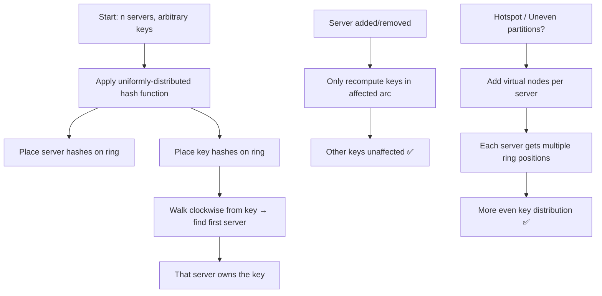

---

*Generated from Alex Xu, System Design Interview, Chapter 5 — Consistent Hashing (pp. 75–87)*
