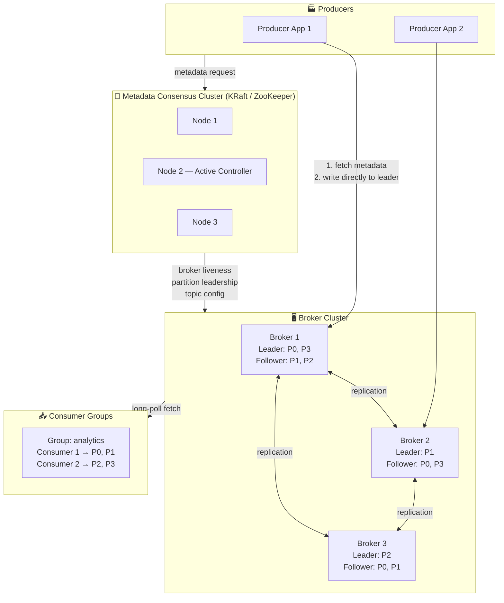
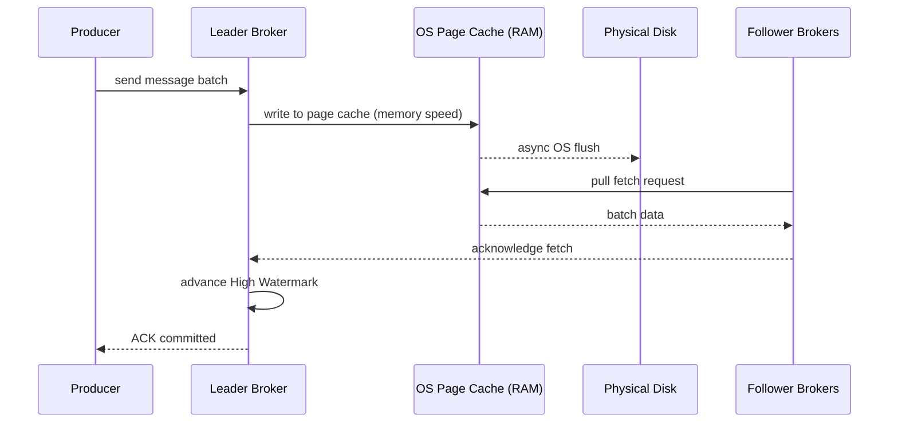
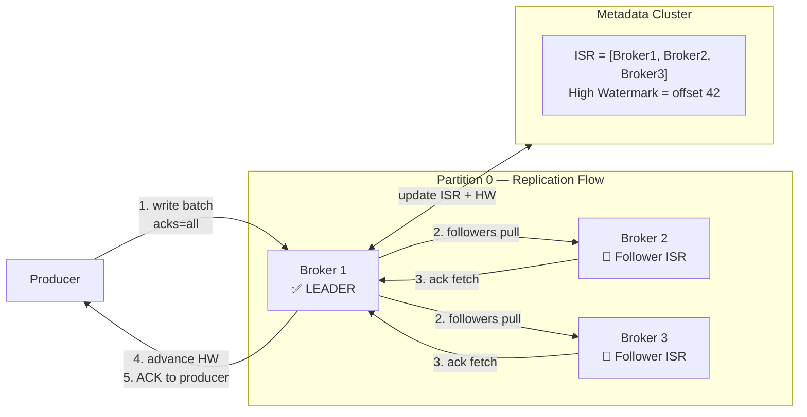
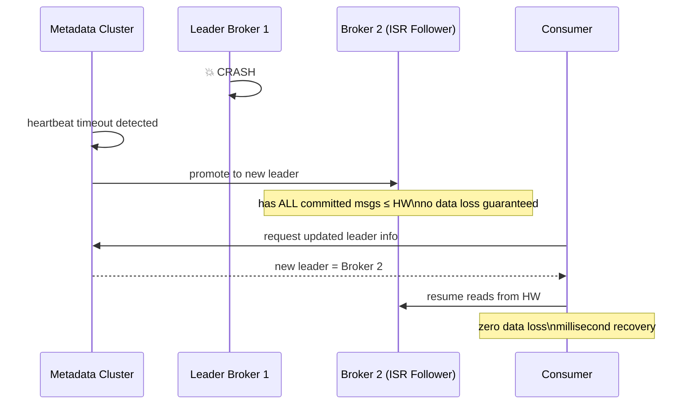
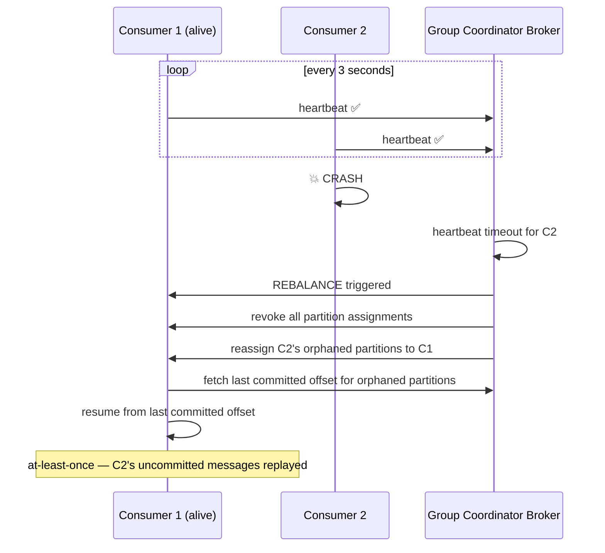
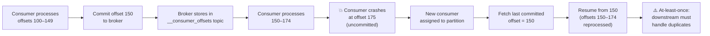
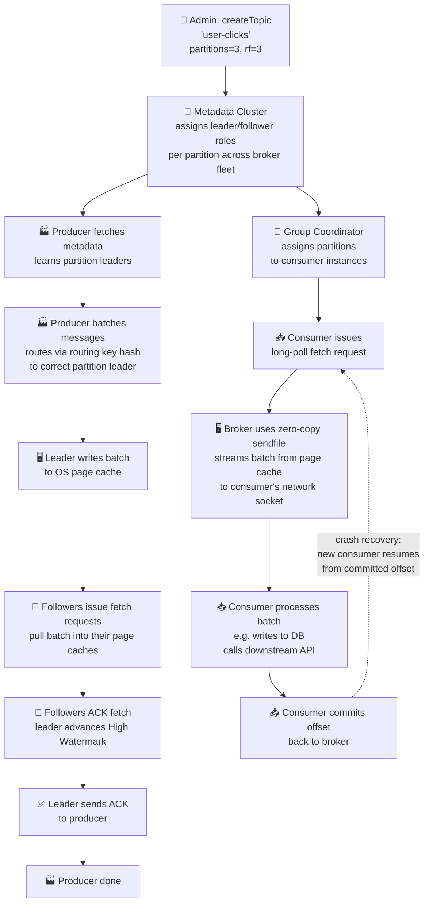
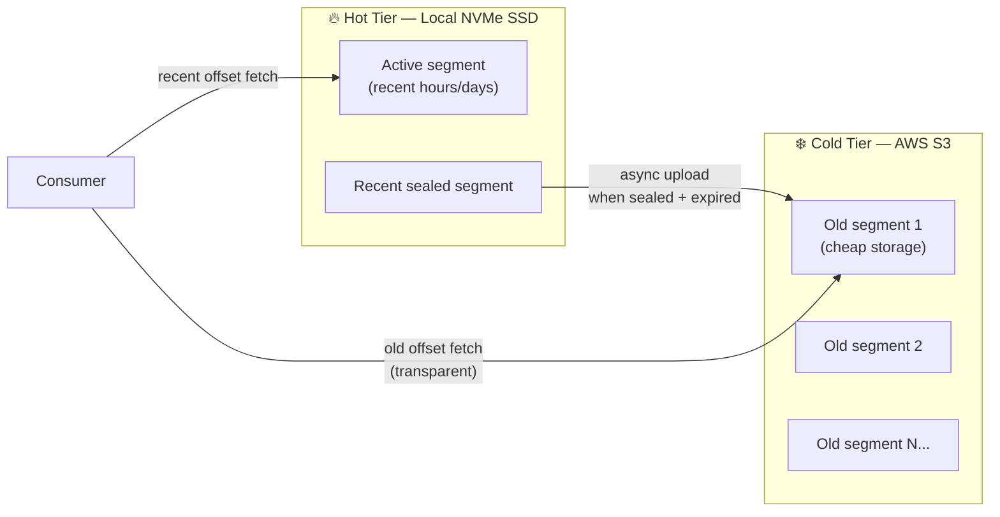

# Distributed Message Queue (Kafka-Style) — System Design

> A complete HLD reference document for interview preparation, covering architecture, deep dives, and common interview questions.

---

## Table of Contents

1. [Requirements](#1-requirements)
2. [API Design](#2-api-design)
3. [Core Concepts & Data Model](#3-core-concepts--data-model)
4. [High-Level Architecture](#4-high-level-architecture)
5. [Deep Dive 1 — Performance & IO Optimization](#5-deep-dive-1--performance--io-optimization)
6. [Deep Dive 2 — Replication & Durability](#6-deep-dive-2--replication--durability)
7. [Deep Dive 3 — Consumer Rebalancing](#7-deep-dive-3--consumer-rebalancing)
8. [Complete End-to-End Flow](#8-complete-end-to-end-flow)
9. [Additional Discussion Points](#9-additional-discussion-points)
10. [Interview Questions & Answers](#10-interview-questions--answers)
11. [Quick Reference Cheat Sheet](#11-quick-reference-cheat-sheet)

---

## 1. Requirements

### Functional Requirements

| # | Requirement | Description |
|---|-------------|-------------|
| 1 | **Topic Management** | Users configure logical channels (topics) within broker clusters |
| 2 | **Publishing** | Producers push messages to specific topics |
| 3 | **Consuming** | Consumers subscribe to topics and retrieve messages via pull |
| 4 | **Data Retention** | Messages stored durably for a configurable period regardless of consumption state |
| 5 | **Delivery Semantics** | At-least-once by default; exactly-once discussed as extension |
| 6 | **Ordering Guarantee** | Strict temporal ordering within a partition; no cross-partition guarantee |

### Non-Functional Requirements

| # | Requirement | Target |
|---|-------------|--------|
| 1 | **Throughput** | Millions of messages/sec (GBs/sec) |
| 2 | **Write Latency** | < 10ms to acknowledge a published message |
| 3 | **Consumption Latency** | Near real-time |
| 4 | **Availability** | No data loss on broker crash; recover in milliseconds |
| 5 | **Scalability** | Horizontal scale via partitioning |
| 6 | **Durability** | Configurable replication factor across broker nodes |

---

## 2. API Design

> Note: Real implementations use optimized binary protocols over TCP (not REST), but the conceptual interface below maps cleanly to interview discussions.

### `createTopic`
```
createTopic(
  topicName:         string,   // logical channel identifier
  partitionCount:    int,      // number of data shards for parallel processing
  replicationFactor: int       // copies of each partition across broker nodes
)
```

### `publish`
```
publish(
  topicName:  string,
  routingKey: string | null,  // null → round-robin partition selection
  payload:    bytes
)
```

### `consume`
```
consume(
  topicName:       string,
  consumerGroupId: string,
  maxBatchSize:    int
) → MessageBatch
```

> Uses a **pull model** (Kafka) rather than push (RabbitMQ). Consumers apply natural back pressure by slowing their fetch rate. Implemented with **long polling** — broker holds the connection open when no messages exist and returns as soon as data arrives.

### `commitOffset`
```
commitOffset(
  topicName:       string,
  consumerGroupId: string,
  partitionId:     int,
  offset:          long
)
```

> Records the last successfully processed position. Allows consumers to resume after failures without reprocessing previously consumed messages.

---

## 3. Core Concepts & Data Model

### 3.1 Brokers

Stateful servers (e.g. EC2 instance + SSD) that receive, store, and serve messages. Each broker manages its own local file system **directly** — no external database layer.

### 3.2 Topics & Partitions

```
Topic: "user-clicks"  (logical concept)
├── Partition 0  → Leader on Broker 1 | Followers on Broker 2, Broker 3
├── Partition 1  → Leader on Broker 2 | Followers on Broker 1, Broker 3
└── Partition 2  → Leader on Broker 3 | Followers on Broker 1, Broker 2
```

| Concept | Purpose |
|---------|---------|
| **Topic** | Logical grouping of related messages |
| **Partition** | Physical shard; enables horizontal scaling; ordering guaranteed within |
| **Replication Factor** | Number of copies per partition; enables fault tolerance |

### 3.3 Append-Only Commit Log

Each partition is a **sequential append-only file** on the broker's local disk.

- New messages always written to the **end of file** → sequential IO
- Sequential IO is dramatically faster than random IO on HDDs and SSDs
- Modern drives sustain **hundreds of MB/sec** write throughput sequentially

### 3.4 Segments

To prevent a single enormous unmanageable file, partitions are broken into rolling segments:

```
Partition 0/
├── 00000000000000000000.log   ← sealed, 1 GB
├── 00000000000000000000.index ← sparse offset index
├── 00000000000001048576.log   ← sealed, 1 GB
├── 00000000000001048576.index
└── 00000000000002097152.log   ← active (writes go here)
```

- Expired segments → **delete entire file** without pausing reads or writes
- Old segments → **async upload to S3** for cheap long-term retention (tiered storage)

### 3.5 Offset Indexing

Every message receives a **sequential, immutable offset ID**.

```
Sparse Index (in-memory):
  offset 0      → byte position 0
  offset 1000   → byte position 16384
  offset 2000   → byte position 32768

Segment File (on disk):
  [msg offset=0][msg offset=1]...[msg offset=999][msg offset=1000]...
```

The broker maintains an in-memory sparse index mapping logical offsets to byte positions in segment files. Consumers jump directly to any offset without full-file scans.

---

## 4. High-Level Architecture



### Component Summary

| Component | Responsibility |
|-----------|----------------|
| **Producer** | Caches cluster metadata locally; routes messages directly to partition leader |
| **Broker** | Stateful node; hosts partition segment files; handles reads/writes for its leader partitions |
| **Metadata Cluster** (KRaft/ZooKeeper) | Tracks broker liveness, topic config, partition leadership; the system "brain" |
| **Consumer Group** | Set of consumers sharing a topic subscription; each partition assigned to exactly one consumer in the group |

---

## 5. Deep Dive 1 — Performance & IO Optimization

### 5.1 Page Cache Writes



- Writes go to **Linux page cache (RAM)** — not directly to disk
- OS flushes asynchronously; writes are essentially **memory-speed** operations
- Even if the leader loses power, data survives in follower RAM / disks

### 5.2 Zero-Copy Network Transfer

**Traditional approach — 4 copies, 4 context switches:**
```
Disk
 └─[DMA copy]→ Kernel Buffer
               └─[CPU copy]→ User Space (app reads data)
                             └─[CPU copy]→ Kernel Socket Buffer
                                           └─[DMA copy]→ NIC
```

**Kafka zero-copy via `sendfile()` — 1 copy, 2 context switches:**
```
Disk
 └─[DMA copy]→ OS Page Cache (Kernel Space)
               └─[sendfile syscall]→ Network Socket Buffer
                                     └─[DMA copy]→ NIC

Message payload NEVER enters JVM heap or user space.
```

Why is this valid? Kafka treats messages as **opaque binary blobs** — it never needs to inspect content, so there's no reason to bring data into user space.

### 5.3 Message Batching

```
Producer local buffer:
  ├── Accumulate messages for up to 10ms
  │     OR until buffer reaches 16KB
  └── Send as single compressed batch

Broker:
  └── Stores batch as compressed block on disk (no per-message overhead)

Consumer:
  └── Receives entire compressed batch in one network round-trip
      └── Decompresses locally
```

| Technique | Benefit |
|-----------|---------|
| Sequential append-only IO | 100s MB/s sustained write throughput |
| OS page cache writes | Memory-speed writes; no blocking disk sync |
| Zero-copy `sendfile` | Data never in JVM heap; 1 DMA copy total |
| Message batching + compression | Fewer syscalls, less CPU, less network bandwidth |
| Follower-pull replication | Leader not burdened with pushing to followers |

---

## 6. Deep Dive 2 — Replication & Durability

### 6.1 Leader-Follower Architecture



### 6.2 In-Sync Replicas (ISR)

The ISR is the set of followers that are:
- Actively fetching from the leader
- Fully caught up within a configurable lag threshold

A message is **committed** only when all ISR members have acknowledged it. Lagging followers are removed from ISR until they resync.

### 6.3 High Watermark (HW)

```
Leader log:   [0][1][2][3][4][5]  ← Log End Offset = 5
Follower 2:   [0][1][2][3]
Follower 3:   [0][1][2][3][4]

High Watermark = 3
  → Highest offset replicated to ALL ISR members
  → Consumers can only read up to offset 3
  → Offsets 4 and 5 are uncommitted; may be lost if leader crashes
```

**Why this matters:** Consumers never read data that might be rolled back on a leader failure.

### 6.4 Failover Flow



### 6.5 ACK Modes Comparison

| `acks` | Who Acknowledges | Data Loss Risk | Latency |
|--------|-----------------|----------------|---------|
| `0` | Nobody (fire & forget) | High | Lowest |
| `1` | Leader only | If leader crashes before replication | Low |
| `all` / `-1` | All ISR members | None (as long as ≥1 ISR survives) | Slightly higher |

---

## 7. Deep Dive 3 — Consumer Rebalancing

### 7.1 Partition-to-Consumer Assignment

```
Topic: user-clicks (4 partitions: P0, P1, P2, P3)

Scenario A — 3 consumers in group:
  Consumer 1 → P0, P1
  Consumer 2 → P2
  Consumer 3 → P3

Scenario B — 5 consumers in group:
  Consumer 1 → P0
  Consumer 2 → P1
  Consumer 3 → P2
  Consumer 4 → P3
  Consumer 5 → ⛔ IDLE (no partitions left)
```

**Key rule:** Max parallelism = number of partitions. Excess consumers sit idle.

### 7.2 Heartbeat & Rebalance Flow



### 7.3 Offset Commit & Crash Recovery



---

## 8. Complete End-to-End Flow



---

## 9. Additional Discussion Points

### 9.1 Tiered Storage



- Local NVMe: ~$0.10–0.30/GB/month
- S3: ~$0.023/GB/month — ~10x cheaper
- Broker fetches from S3 transparently if consumer requests historical offset

### 9.2 Exactly-Once Semantics (EOS)

Default behavior = **at-least-once** due to network retry duplicates.

| Mechanism | How it works |
|-----------|-------------|
| **Idempotent Producer** | Broker assigns unique `producerID`; each batch carries `sequenceNumber`; broker deduplicates retries automatically |
| **Transactional Writes** | Producer wraps writes across multiple topics in a 2-phase commit; all writes commit or all abort — no partial state |
| **Consumer isolation** | Set `isolation.level=read_committed` so consumers only see fully committed transactions |

### 9.3 Back Pressure & Quotas (Noisy Neighbor Prevention)

```
Rogue producer exceeds byte-rate quota
        ↓
Broker intentionally delays response (throttle delay)
        ↓
TCP back pressure fills producer send buffer
        ↓
Producer naturally slows down at the socket level
        ↓
Other tenants' disk/network bandwidth preserved
```

---

## 10. Interview Questions & Answers

### Fundamentals

**Q: Why use a message queue instead of direct service-to-service calls?**

Decouples producers from consumers — neither needs to know about the other. Handles traffic spikes gracefully (messages queue on durable storage instead of crashing downstream services). Enables replay, fan-out to multiple independent consumer groups, and async processing. Also provides natural audit logs of all events.

---

**Q: What is a partition and why does it exist?**

A partition is a physical shard of a topic stored as an append-only log on one broker's disk. Partitions allow a single topic to scale beyond a single machine's capacity, enable parallel consumption (each consumer in a group handles a different partition), and are the unit of ordering — messages within a partition are strictly ordered, but there's no ordering guarantee across partitions.

---

**Q: How does a producer decide which partition to write to?**

If a routing key is provided, it's hashed (`murmurHash(key) % numPartitions`) — all messages with the same key land in the same partition, preserving ordering for that key. If no routing key is provided, round-robin is used across partitions to balance load.

---

**Q: What is the difference between push and pull models?**

| | Push (RabbitMQ) | Pull (Kafka) |
|--|----------------|--------------|
| Who drives fetch | Broker | Consumer |
| Back pressure | Hard — broker can overwhelm slow consumers | Natural — consumers fetch at their own pace |
| Slow consumer handling | Requires flow control protocols | Consumer simply fetches less frequently |
| Implementation | Long-lived connections, push callbacks | Long-poll fetch requests |

---

### Performance

**Q: How can a disk-based queue be faster than an in-memory queue like Redis?**

Kafka exploits the OS page cache. Writes go to RAM first — the OS flushes to disk asynchronously, giving effectively memory-speed write performance. For reads, recently-written data is almost always still in the page cache, so reads also hit RAM. Add zero-copy `sendfile` (data never enters JVM heap) and message batching (amortized syscall overhead), and throughput exceeds what you'd get with random Redis operations.

---

**Q: Explain zero-copy and why it matters.**

Traditional file serving requires 4 memory copies and 4 context switches: disk → kernel buffer → user space → kernel socket buffer → NIC. Kafka uses the `sendfile` syscall: disk → OS page cache → network socket, with one DMA copy and two context switches. The payload never enters the JVM heap. This is safe because Kafka never inspects message content — it treats everything as opaque bytes.

---

**Q: What is the Linux page cache?**

RAM managed by the Linux kernel to cache recently accessed disk file contents. When Kafka writes a message it goes into the page cache (memory speed). The OS handles async disk flush. On reads, data recently written is almost certainly still in the page cache — served from RAM with zero disk IO. Follower replication is also fast because followers pull from the leader's hot page cache.

---

### Replication & Durability

**Q: What is the ISR and why does it exist?**

The ISR (In-Sync Replicas) is the subset of follower brokers actively fetching from the leader and caught up within a configurable threshold. A message is only considered committed when all ISR members have it. This balances durability (you don't need all replicas — just ISR members) with availability (if a follower lags, it's removed from ISR and commits aren't blocked waiting for it).

---

**Q: What is the High Watermark?**

The highest offset that has been replicated to every current ISR member. Consumers can only read up to this offset. This prevents consumers from reading data that might be lost if the leader crashes before followers have replicated it. It's the safety boundary between "committed and durable" and "written but not yet safe."

---

**Q: What happens when a partition leader crashes?**

The metadata cluster (KRaft) detects the missing heartbeat, selects a new leader from the ISR list, and updates cluster metadata. Because every ISR member is guaranteed to have all committed messages up to the HW, the new leader has complete data. Producers and consumers fetch updated metadata and redirect to the new leader. Recovery typically takes milliseconds — consumers often don't notice.

---

**Q: What's the difference between `acks=1` and `acks=all`?**

`acks=1`: Leader acknowledges immediately without waiting for followers. If the leader crashes before replication, that message is permanently lost. `acks=all`: Leader waits for all ISR members to acknowledge before responding to the producer. No data loss as long as at least one ISR member survives. Slightly higher latency due to the follower round-trip.

---

### Consumer Groups & Rebalancing

**Q: Can two consumers in the same group read from the same partition?**

No. Within a consumer group, each partition is exclusively assigned to one consumer instance at a time. This prevents double-processing. Different consumer groups each get their own independent read cursor (offset) and don't interfere with each other — both groups see all messages.

---

**Q: What happens when a consumer crashes mid-processing?**

The group coordinator detects a missed heartbeat and triggers a rebalance. The crashed consumer's partitions are reassigned to surviving consumers. The new consumer fetches the last committed offset for those partitions and resumes from there. Any messages processed but not committed by the crashed consumer will be reprocessed — this is the at-least-once guarantee.

---

**Q: What limits consumer parallelism?**

The number of partitions. If a group has more consumers than partitions, excess consumers sit idle. Maximum effective parallelism = partition count. This is why choosing partition count carefully at topic creation matters — it's hard to change later (a partition count increase requires rerouting existing data).

---

**Q: What is a consumer group rebalance?**

The process of redistributing partition assignments across all consumers in a group. Triggers: consumer joins, consumer crashes (heartbeat timeout), scale-up/down event, partition count change. Classic protocol: stop-the-world — all consumers pause. Cooperative incremental rebalancing (newer Kafka): only affected partitions are moved, minimizing disruption.

---

### Advanced / Deep Dives

**Q: How would you achieve exactly-once delivery?**

Two mechanisms working together: (1) **Idempotent producer** — each producer has a unique `producerID`, each batch has a `sequenceNumber`, broker rejects duplicate retries. (2) **Transactions** — a transaction coordinator manages a 2-phase commit across multiple topic writes. On consumer side, set `isolation.level=read_committed` to only see fully committed transactions.

---

**Q: How does tiered storage work and why is it needed?**

Storing months of logs on local NVMe is expensive. Tiered storage offloads sealed, cold segment files to S3 asynchronously. The local broker only retains recent hot segments. The broker fetches from S3 transparently when a consumer requests a historical offset. Reduces storage costs by ~10x while preserving full historical replay capability.

---

**Q: How does Kafka prevent a noisy neighbor from degrading cluster performance?**

Brokers enforce **network-level byte-rate quotas** per client ID. If a producer exceeds its quota, the broker intentionally delays its ACK response. This propagates as natural TCP back pressure — the producer's socket send buffer fills and the application slows at the OS level. No explicit rate-limiting logic needed in the producer.

---

**Q: Why are segments more efficient than deleting individual messages for TTL cleanup?**

Deleting individual messages would require rewriting segment files, which is expensive and blocks reads/writes. Segments are immutable once sealed. When a segment's age exceeds the retention period, the entire file is deleted atomically — a cheap O(1) file system `unlink` call. Reads and writes to the active segment continue uninterrupted.

---

## 11. Quick Reference Cheat Sheet

```
KEY TERMS
──────────────────────────────────────────────────────────────────
Topic              Logical channel for a category of messages
Partition          Physical shard of a topic; ordered; on one broker's disk
Segment            Rolling file (e.g. 1 GB) within a partition; immutable once sealed
Offset             Sequential immutable ID per message within a partition
Broker             Stateful server storing and serving partition data
Producer           Client that pushes messages to a topic
Consumer           Client that pulls messages from a topic
Consumer Group     Set of consumers sharing a subscription
                   Each partition → exactly one consumer in group
ISR                In-Sync Replicas: followers caught up with the leader
High Watermark     Highest offset replicated to all ISR members; consumer read boundary
Group Coordinator  Broker acting as membership manager for a consumer group
KRaft / ZooKeeper  Consensus cluster for broker liveness and partition leadership

DELIVERY SEMANTICS
──────────────────────────────────────────────────────────────────
At-most-once       Fast, possible data loss, no retries
At-least-once      Default; duplicates possible; consumers must be idempotent
Exactly-once       Idempotent producer + transactions; highest overhead

PERFORMANCE STACK (ordered by impact)
──────────────────────────────────────────────────────────────────
1. Sequential append-only IO    → 100s MB/s sustained disk throughput
2. OS page cache writes         → memory-speed writes, async disk flush
3. Zero-copy sendfile()         → no JVM heap involvement, one DMA copy
4. Batching + compression       → fewer round-trips, less CPU, less bandwidth
5. Follower-pull replication    → leader not burdened with pushing to followers

PARTITION COUNT RULES
──────────────────────────────────────────────────────────────────
Max consumer parallelism  = partition count
Extra consumers           = idle (no partition to consume)
Ordering guaranteed       = within a single partition only
Routing key absent        = round-robin across partitions
Routing key present       = hash(key) % partitions → deterministic assignment
```

---

*Based on Kafka architecture and distributed systems principles. Key references: Apache Kafka documentation, KRaft protocol spec, Linux `sendfile(2)` man page.*
