# Chapter 15: Design Google Drive — System Design Interview Notes

> Source: *System Design Interview* (Alex Xu), Chapter 15, pp. 250–271

---

## Table of Contents
1. [Requirements & Scope](#1-requirements--scope)
2. [Back of the Envelope Estimation](#2-back-of-the-envelope-estimation)
3. [APIs](#3-apis)
4. [High-Level Design Evolution](#4-high-level-design-evolution)
5. [Detailed Architecture](#5-detailed-architecture)
6. [Deep Dive: Block Servers](#6-deep-dive-block-servers)
7. [Metadata Database Schema](#7-metadata-database-schema)
8. [Upload Flow](#8-upload-flow)
9. [Download Flow](#9-download-flow)
10. [Notification Service](#10-notification-service)
11. [Save Storage Space](#11-save-storage-space)
12. [Failure Handling](#12-failure-handling)
13. [Design Tradeoffs](#13-design-tradeoffs)
14. [Interview Q&A — DB Choice & Why](#14-interview-qa--db-choice--why)

---

## 1. Requirements & Scope

### Functional Requirements
- **Add files** — drag and drop into Google Drive
- **Download files**
- **Sync files across devices** — file added on one device auto-syncs to others
- **See file revisions**
- **Share files** with friends, family, coworkers
- **Send notifications** when a file is edited, deleted, or shared

### Out of Scope
- Google Docs real-time collaborative editing

### Clarifying Questions (Candidate vs Interviewer)

| Candidate | Interviewer |
|---|---|
| Most important features? | Upload/download, file sync, notifications |
| Mobile app, web app, or both? | Both |
| Supported file formats? | Any file type |
| Files need to be encrypted? | Yes |
| File size limit? | 10 GB or smaller |
| How many users? | 10 million DAU |

### Non-Functional Requirements
- **Reliability** — data loss is unacceptable
- **Fast sync speed** — slow sync causes abandonment
- **Low bandwidth usage** — critical for mobile users
- **Scalability** — handle high traffic volumes
- **High availability** — works even when servers are offline or have network errors

---

## 2. Back of the Envelope Estimation

| Metric | Value |
|---|---|
| Total signed-up users | 50 million |
| DAU | 10 million |
| Free space per user | 10 GB |
| Files uploaded per user per day | 2 |
| Average file size | 500 KB |
| Read : Write ratio | 1 : 1 |
| Total storage | 50M x 10 GB = **500 Petabytes** |
| Upload QPS | 10M x 2 / 24h / 3600s = **240** |
| Peak QPS | 240 x 2 = **480** |

---

## 3. APIs

All APIs require user authentication over HTTPS.

### 3.1 Upload a File

Two upload modes:
- **Simple upload** — small files
- **Resumable upload** — large files or unreliable networks

```
POST https://api.example.com/files/upload?uploadType=resumable
Params:
  - uploadType=resumable
  - data: local file to upload
```

Resumable upload — 3 steps:
1. Send initial request to retrieve the resumable URL
2. Upload the data and monitor upload state
3. If interrupted, resume from last checkpoint

### 3.2 Download a File

```
GET https://api.example.com/files/download
Params:
  - path: "/recipes/soup/best_soup.txt"
```

### 3.3 Get File Revisions

```
GET https://api.example.com/files/list_revisions
Params:
  - path: "/recipes/soup/best_soup.txt"
  - limit: 20
```

---

## 4. High-Level Design Evolution

### Stage 1 — Directory Namespace (Figure 15-3)

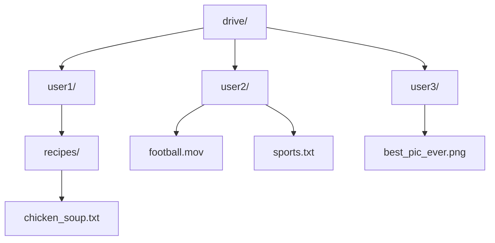

### Stage 2 — Storage Full (Figure 15-4)

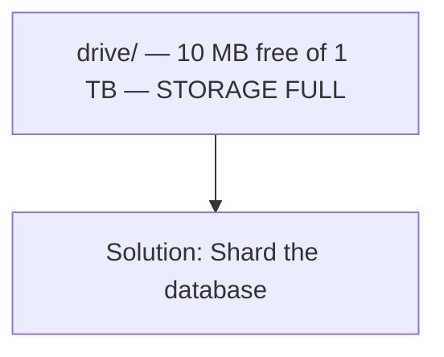

### Stage 2 — Shard by user_id (Figure 15-5)

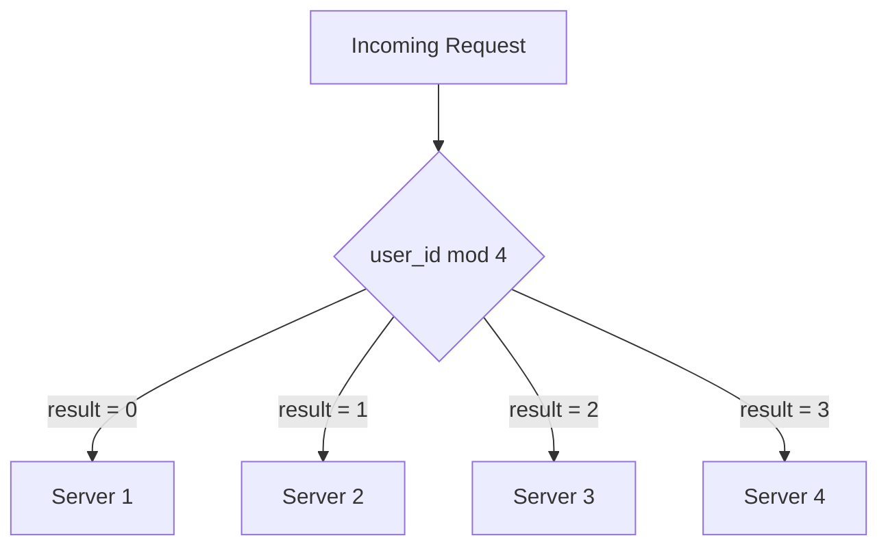

### Stage 3 — S3 Same-Region Replication (Figure 15-6a)

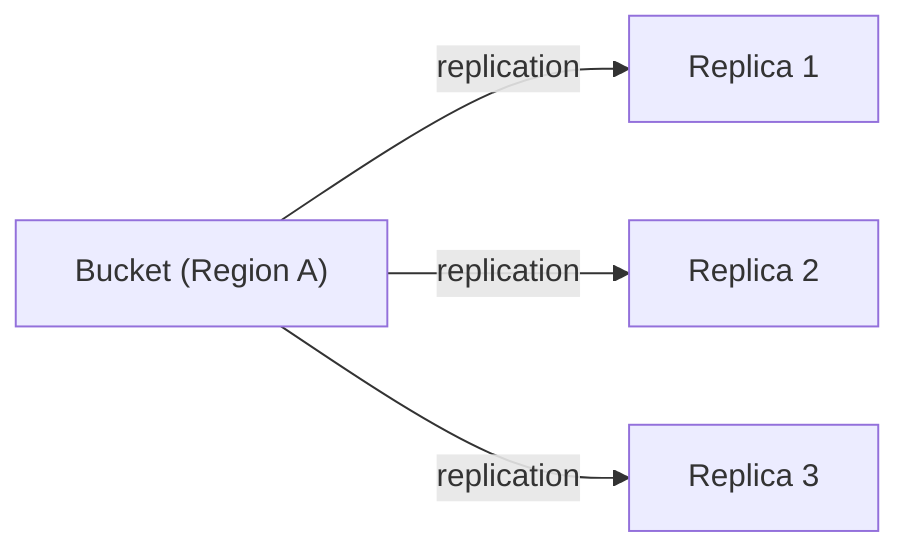

### Stage 3 — S3 Cross-Region Replication (Figure 15-6b)

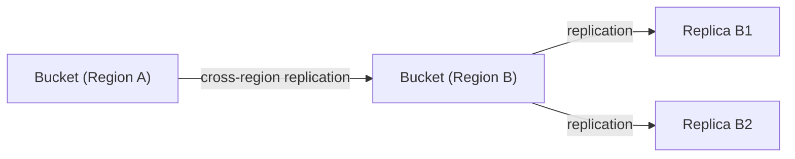

### Stage 4 — Decoupled Architecture (Figure 15-7)

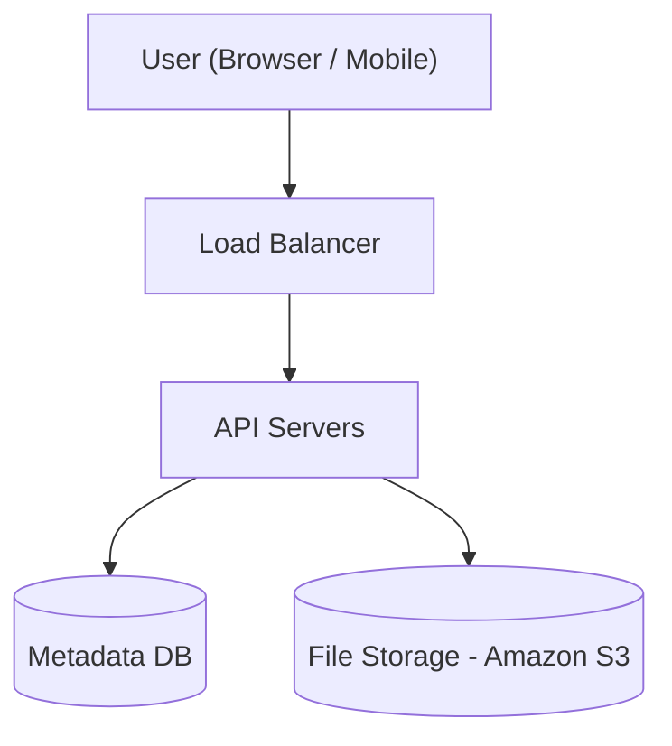

---

## 5. Detailed Architecture — Full High-Level Design (Figure 15-10)

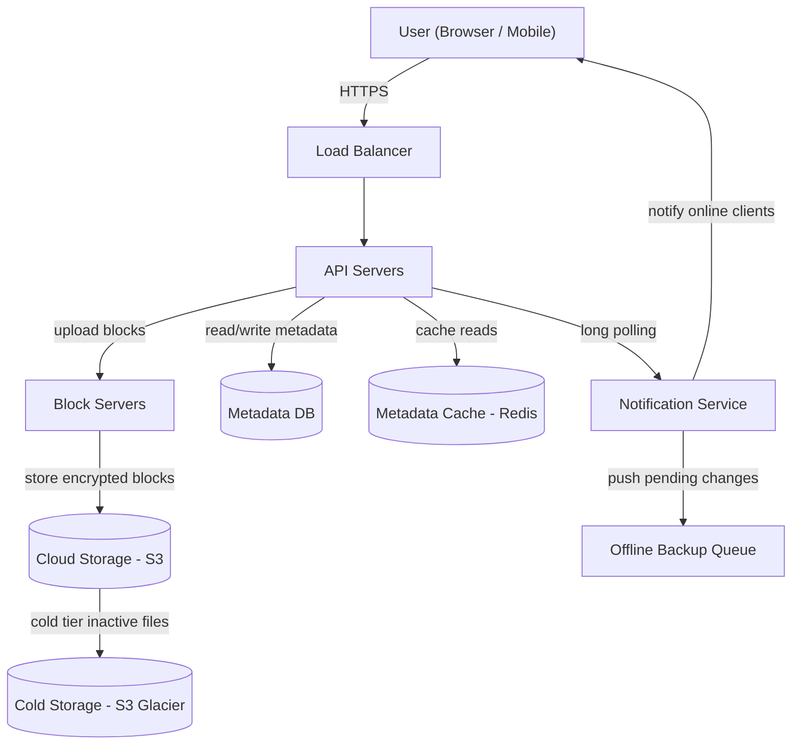

### Component Summary

| Component | Role |
|---|---|
| **Load balancer** | Distributes traffic evenly; redistributes when a server goes down |
| **API servers** | User auth, upload flow management, file metadata updates |
| **Metadata database** | Stores metadata for users, files, blocks, versions — NOT actual file content |
| **Metadata cache** | Caches hot metadata for fast reads |
| **Block servers** | Split, compress, encrypt files; handle delta sync on updates |
| **Cloud storage** | Object storage (S3); stores actual encrypted file blocks |
| **Cold storage** | S3 Glacier for inactive files — much cheaper than S3 standard |
| **Notification service** | Pub/sub — notifies clients when files are added/edited/deleted |
| **Offline backup queue** | Persists pending changes for offline clients to sync later |

---

## 6. Deep Dive: Block Servers

### Block Server Upload Pipeline — New File (Figure 15-11)

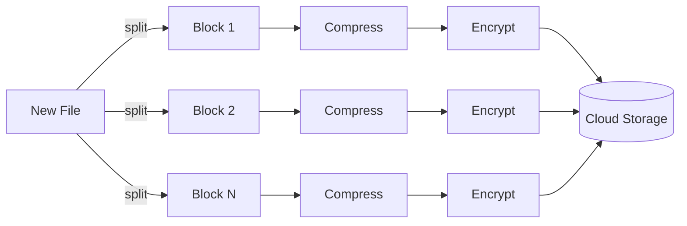

Block size limit: **4 MB** (Dropbox reference)

Compression algorithms:
- Text files — gzip / bzip2
- Images and videos — format-specific algorithms

### Delta Sync — Only Modified Blocks Transferred (Figure 15-12)

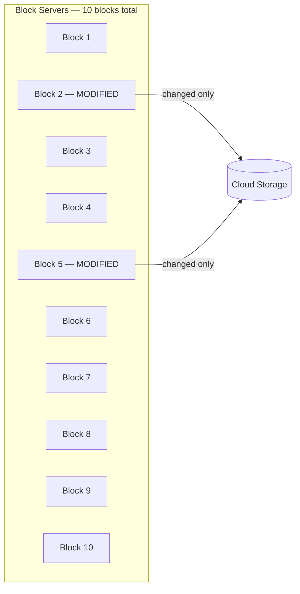

---

## 7. Metadata Database Schema (Figure 15-13)

> **Why Relational DB (not NoSQL)?**
> Strong consistency (ACID) is required. The same file must look identical to all clients at the same time. NoSQL defaults to eventual consistency — different replicas can hold different values momentarily. Relational DB gives ACID natively; replicating this in NoSQL sync logic is complex and error-prone.

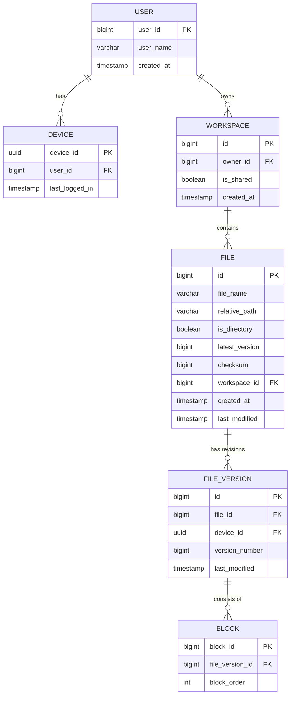

### Table Purpose

| Table | Purpose |
|---|---|
| **user** | Basic user info: username, email, profile photo |
| **device** | Device info; push_id for mobile notifications. One user can have multiple devices |
| **workspace** | Root directory; can be shared |
| **file** | Latest file state |
| **file_version** | Immutable revision history — rows never updated after insert |
| **block** | Reconstruct any version by fetching all blocks for a file_version_id ordered by block_order |

---

## 8. Upload Flow (Figure 15-14)

Two requests sent **in parallel** from Client 1: add metadata + upload content.

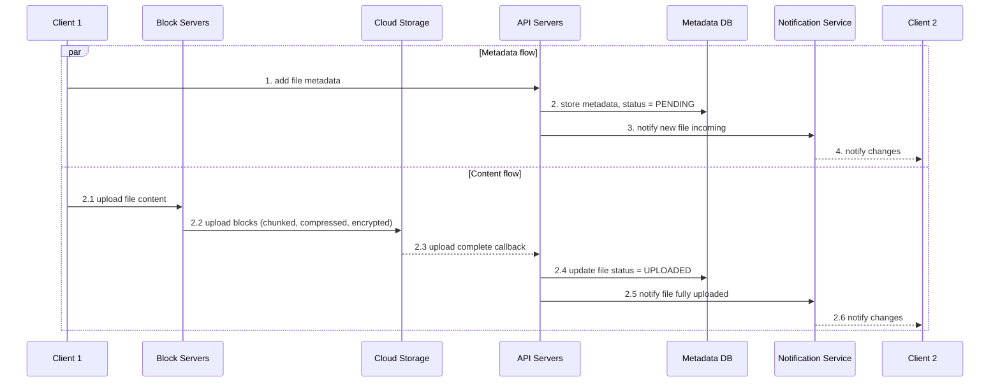

### Upload Steps in Detail

1. Client 1 sends file metadata to API servers — stored in Metadata DB with status **"pending"**
2. Notification service informed — notifies Client 2 a new file is incoming
3. Client 1 simultaneously uploads file content to block servers
4. Block servers chunk, compress, encrypt, and upload blocks to cloud storage
5. Cloud storage triggers upload completion callback to API servers
6. File status updated to **"uploaded"** in Metadata DB
7. Notification service notifies all relevant clients the file is fully available

---

## 9. Download Flow (Figure 15-15)

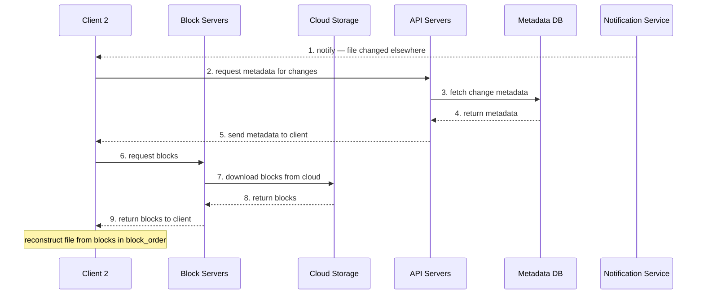

**How does a client know a file changed?**
- **Online** — notification service pushes a notification; client pulls latest changes
- **Offline** — changes cached in offline backup queue; client pulls when back online

---

## 10. Notification Service

### Long Polling vs WebSocket Comparison

| Option | Best For | Google Drive? |
|---|---|---|
| **Long polling** | Infrequent, unidirectional server to client | Chosen |
| **WebSocket** | Real-time bi-directional communication (chat) | Overkill |

**Why long polling?**
- File change notifications are infrequent — no continuous burst of data
- Communication is unidirectional: server tells client about changes, not vice versa
- WebSocket is purpose-built for chat/gaming apps, not file sync
- Dropbox uses the same approach

### Long Polling Flow

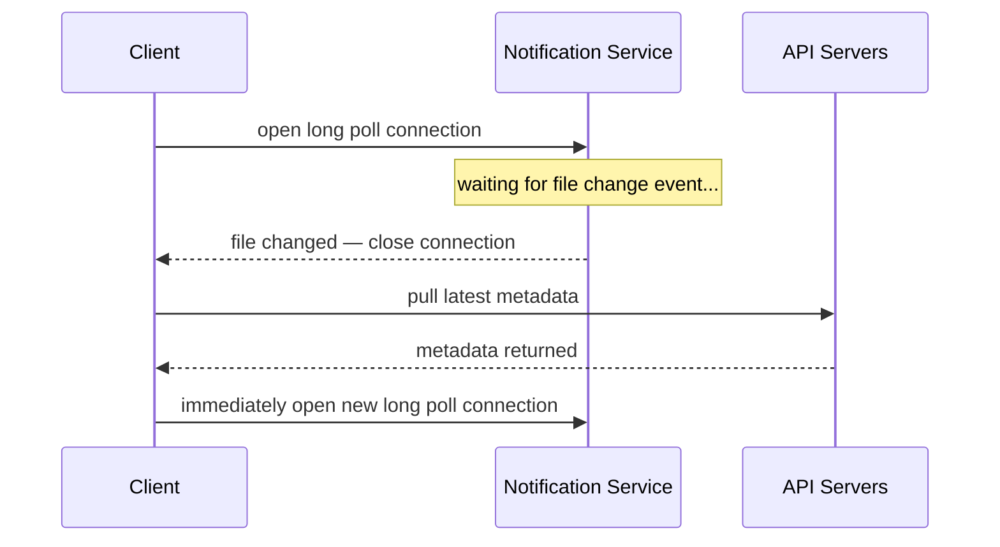

---

## 11. Save Storage Space

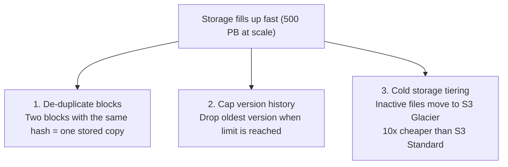

---

## 12. Failure Handling

| Component | Failure | Recovery |
|---|---|---|
| **Load balancer** | Primary fails | Secondary becomes active via heartbeat monitoring |
| **Block server** | Server fails | Other block servers pick up pending jobs |
| **Cloud storage** | Regional outage | Files replicated in multiple regions; fetch from healthy region |
| **API server** | Server fails | Stateless — load balancer redirects to other servers |
| **Metadata cache** | Node goes down | Other replicas serve; new node spun up |
| **Metadata DB master** | Goes down | Promote slave to master; bring up new slave |
| **Metadata DB slave** | Goes down | Use other slaves for reads; replace the failed slave |
| **Notification service** | Server fails | 1M+ long poll connections drop; clients reconnect gradually to a different server |
| **Offline backup queue** | Queue fails | Queues are replicated; consumers re-subscribe |

---

## 13. Design Tradeoffs

### Option A (current): Upload via Block Servers

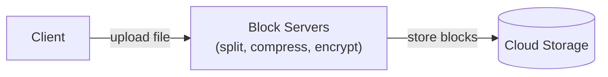

### Option B (alternative): Upload Directly to Cloud

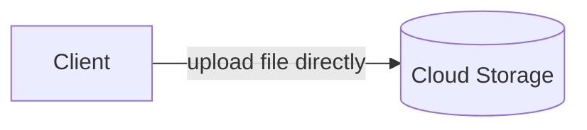

### Comparison

| Aspect | Option A — Block Servers | Option B — Direct to Cloud |
|---|---|---|
| Upload speed | Slightly slower (extra hop) | Faster — file transferred once |
| Logic location | Centralized in block servers | Must re-implement on iOS, Android, Web |
| Security | Server-side encryption (safer) | Client-side encryption (risky) |
| Maintenance | Single codebase | Three platform implementations |

**Verdict**: Block servers win — centralized security and maintainability.

### Alternative: Separate Presence Service
Move online/offline detection from notification servers into a dedicated **Presence Service** so other services (chat, analytics) can reuse it.

---

## 14. Interview Q&A — DB Choice & Why

---

### Q1: Why relational DB for metadata? Why not NoSQL?

**Core issue: consistency.**

The system needs **strong consistency** — the same file must look identical to all clients simultaneously. If User A uploads a file and User B sees a stale version, that is a critical correctness bug.

- **Relational DB (MySQL/PostgreSQL)** — ACID is natively supported: Atomicity, Consistency, Isolation, Durability
- **NoSQL (DynamoDB, Cassandra, MongoDB)** — defaults to eventual consistency; replicas can diverge momentarily
- To achieve strong consistency with NoSQL, you would implement guarantees in application-level sync logic — complex, error-prone, and re-inventing what SQL gives for free

**Scaling strategy:**
- **Read replicas** for horizontal read scaling (1:1 read:write ratio from estimation)
- **Sharding** on `user_id` or `workspace_id` for write scaling
- **Metadata cache** (Redis) for hot data — always invalidate on write

---

### Q2: What is the metadata cache and why not always query the DB?

Metadata (file paths, version numbers, checksums) is read far more often than written. Redis/Memcached reduces latency for hot data.

**Consistency rule enforced:**
- On every DB write, invalidate or update the corresponding cache entry
- Cache and DB master must always hold the same value

---

### Q3: Why S3 (object storage) for file blocks instead of a database or filesystem?

- S3 is designed for binary blobs of arbitrary size at petabyte scale
- Provides same-region and cross-region replication out of the box — files survive regional outages
- Far cheaper per GB than block storage or relational DB at 500 PB scale
- Access pattern is simple: PUT and GET by key — no need for querying or indexing
- A relational DB with binary blob columns would be massively inefficient at this scale

---

### Q4: Why split files into blocks instead of storing whole files?

- **Delta sync** — only modified blocks transferred on update, saves bandwidth
- **Parallel upload** — blocks uploaded concurrently, faster
- **Resumability** — interrupted upload resumes from last successful block, not from scratch
- **De-duplication** — identical blocks (same hash) stored once, shared across users and versions

---

### Q5: Why long polling for notifications instead of WebSocket?

- Google Drive notifications are infrequent and unidirectional (server notifies client)
- WebSocket is designed for bi-directional real-time streams — right for chat, wrong for file sync
- Long polling is simpler, sufficient, and less resource-intensive
- Dropbox uses the same approach

---

### Q6: How are sync conflicts handled?

**First write wins:**
1. First version processed by the system is saved as canonical
2. Later conflicting version is flagged as a conflict copy
3. User is shown both copies and can choose to merge or override
4. Example conflict filename: `SystemDesignInterview_user2_conflicted_copy_2019-05-01`

---

### Q7: How do you guarantee no data loss?

- Block replication within a region (S3 same-region replication)
- Cross-region replication — regional failure cannot cause data loss
- Metadata DB master-slave replication — promote slave on master failure
- Offline backup queue — change intent persisted; synced when client reconnects

---

### Q8: How do you reduce storage costs at 500 PB scale?

1. **Block de-duplication** — identical hash = shared block storage across users
2. **Versioning caps** — limit stored revisions; oldest dropped when cap is reached
3. **Cold storage tiering** — inactive files move to S3 Glacier (~10x cheaper than S3 Standard)

---

### Q9: What are the most interesting DB schema decisions?

- **file_version rows are immutable** — never updated after insert; preserves revision history integrity
- **block has block_order** — reconstruct any file version by fetching blocks for a file_version_id sorted by block_order
- **checksum on file** — enables de-duplication and integrity verification
- **Separate device table** — one user can have multiple devices; push notifications are device-scoped, not user-scoped
- **file vs file_version** — file = current state; file_version = immutable history; clean separation of concerns

---

### Q10: Why are two requests sent in parallel during upload?

1. **Metadata flow** — Client to API servers to Metadata DB (store entry, status = "pending")
2. **Content flow** — Client to Block servers to Cloud storage

They are independent — metadata storage does not depend on content upload completing. Parallelism minimizes total upload latency. Final status is set to "uploaded" only after cloud storage confirms completion.

---

### Q11: How would the design change if files could be larger than 10 GB?

- Resumable uploads become even more critical
- S3 multipart upload natively handles files up to 5 TB
- Block size tuned upward to reduce block count per file
- Block servers need higher parallelism in the upload pipeline
- block table may need partitioning by file_version_id at extreme scale

---

*Source: System Design Interview — An Insider's Guide, Vol. 1 (Alex Xu)*
