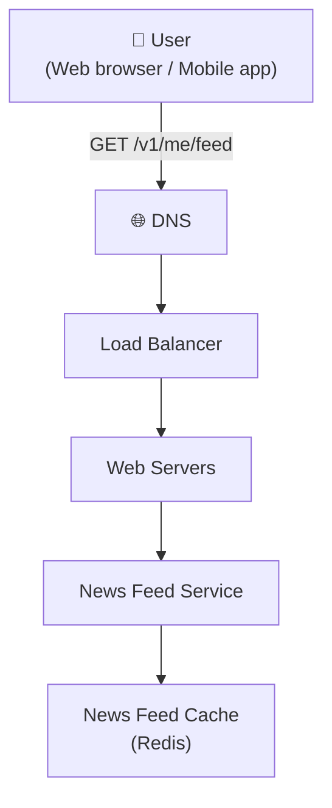
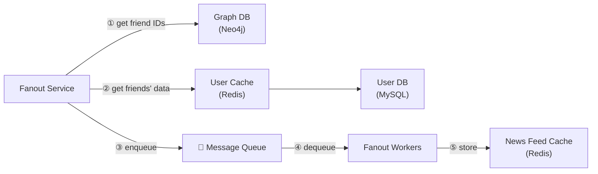
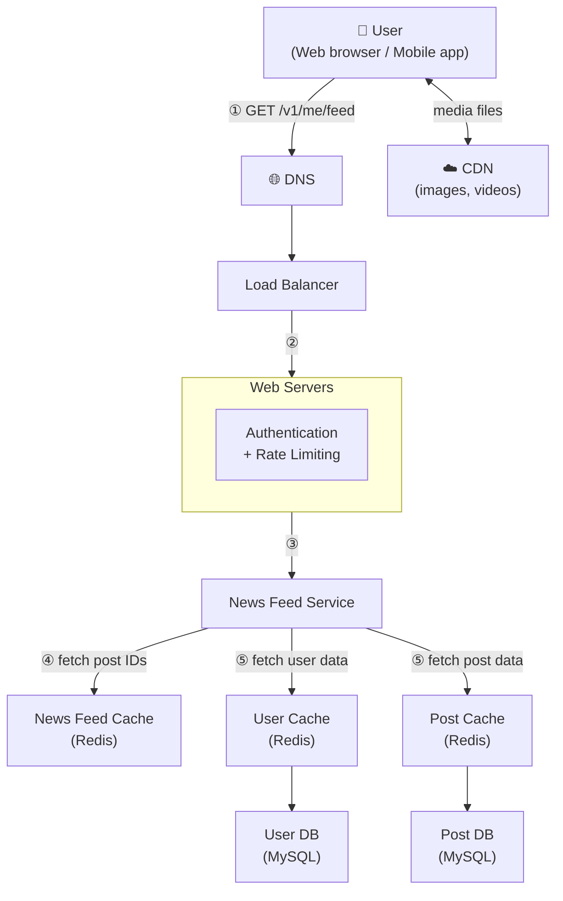
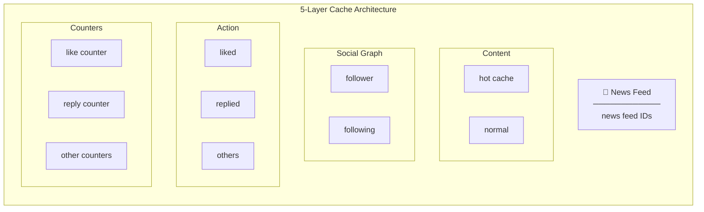
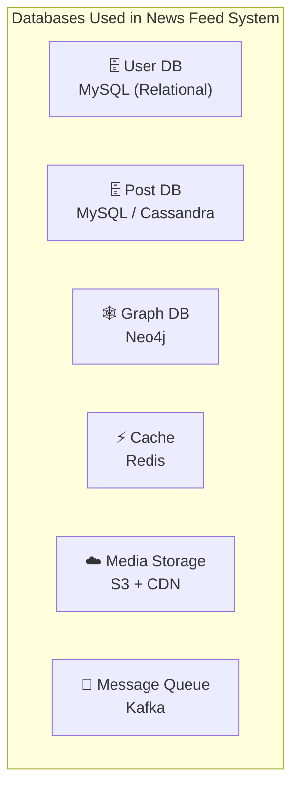

# System Design: News Feed System
> *Based on Chapter 11 — System Design Interview (Alex Xu)*

---

## Table of Contents
1. [Problem Statement](#problem-statement)
2. [Step 1 — Clarify Requirements](#step-1--clarify-requirements)
3. [Step 2 — High-Level Design](#step-2--high-level-design)
4. [Step 3 — Deep Dive](#step-3--deep-dive)
5. [Database Choices & Rationale](#database-choices--rationale)
6. [Step 4 — Wrap Up & Scalability](#step-4--wrap-up--scalability)
7. [Interview Q&A](#interview-qa)

---

## Problem Statement

Design a **news feed system** — a constantly updating list of stories in the middle of a user's home page. It includes status updates, photos, videos, links, and app activity from friends, pages, and groups the user follows.

**Similar questions:** Design Facebook News Feed, Instagram Feed, Twitter Timeline.

---

## Step 1 — Clarify Requirements

### Candidate–Interviewer Dialogue

| Question | Answer |
|---|---|
| Mobile app, web app, or both? | Both |
| What are the key features? | User can publish posts; see friends' posts on feed |
| Is the feed sorted reverse chronological or by score? | Reverse chronological (keep it simple) |
| Max friends per user? | **5,000** |
| Traffic volume? | **10 million DAU** |
| Can posts contain media (images, videos)? | Yes — both images and videos |

### Two Core Flows
- **Feed Publishing** — when a user publishes a post, data is written to cache/DB and pushed to friends' feeds
- **Newsfeed Building** — feed is built by aggregating friends' posts in reverse chronological order

---

## Step 2 — High-Level Design

### APIs

#### Feed Publishing API
```
POST /v1/me/feed
Params:
  - content: text of the post
  - auth_token: authenticates the API request
```

#### Newsfeed Retrieval API
```
GET /v1/me/feed
Params:
  - auth_token: authenticates the API request
```

---

### Figure 11-2: Feed Publishing — High-Level

```mermaid
flowchart TD
    User["👤 User\n(Web browser / Mobile app)"]
    DNS["🌐 DNS"]
    LB["Load Balancer"]
    WS["Web Servers"]
    PS["Post Service"]
    FS["Fanout Service"]
    NS["Notification Service"]
    PC["Post Cache\n(Redis)"]
    NFC["News Feed Cache\n(Redis)"]
    PDB["Post DB\n(MySQL / Cassandra)"]

    User -->|POST /v1/me/feed?content=Hello&auth_token={token}| DNS
    DNS --> LB
    LB --> WS
    WS --> PS
    WS --> FS
    WS --> NS
    PS --> PC
    PS --> PDB
    FS --> NFC
```

**Component Responsibilities:**
- **Load Balancer** — distributes incoming traffic to web servers
- **Web Servers** — redirect traffic to appropriate internal services
- **Post Service** — persists the post in database and cache
- **Fanout Service** — pushes new post to friends' news feed cache
- **Notification Service** — notifies friends that new content is available

---

### Figure 11-3: Newsfeed Building — High-Level



---

## Step 3 — Deep Dive

### Feed Publishing Deep Dive

#### Figure 11-4: Feed Publishing — Detailed

```mermaid
flowchart TD
    User["👤 User\n(Web browser / Mobile app)"]
    DNS["🌐 DNS"]
    LB["Load Balancer"]

    subgraph WS["Web Servers"]
        Auth["Authentication\n+ Rate Limiting"]
    end

    PS["Post Service"]
    NS["Notification Service"]
    PC["Post Cache\n(Redis)"]
    PDB["Post DB\n(MySQL)"]
    FanoutSvc["Fanout Service"]
    GraphDB["Graph DB\n(Neo4j)"]
    MQ["📨 Message Queue\n(Kafka / RabbitMQ)"]
    FW["Fanout Workers"]
    UC["User Cache\n(Redis)"]
    UDB["User DB\n(MySQL)"]
    NFC["News Feed Cache\n(Redis)"]

    User -->|POST /v1/me/feed?content=Hello&auth_token={token}| DNS
    DNS --> LB
    LB --> WS
    WS --> PS
    WS --> NS
    PS --> PC
    PS --> PDB
    WS --> FanoutSvc
    FanoutSvc -->|① get friend IDs| GraphDB
    FanoutSvc -->|② get friends' data| UC
    UC --> UDB
    FanoutSvc -->|③ push to queue| MQ
    MQ -->|④ consume| FW
    FW -->|⑤ write feed| NFC
```

#### Web Servers
- Enforce **authentication** — only valid `auth_token` users can post
- Apply **rate limiting** — cap posts per user per time window to prevent spam

#### Fanout Service — Step-by-Step
1. **Get friend IDs** from the Graph DB (optimized for social graph traversal)
2. **Get friends' data** from User Cache (filtered by user settings — muted users excluded)
3. **Push** friends list + new post ID to a Message Queue
4. **Fanout Workers** consume the queue asynchronously
5. Workers **write `<post_id, user_id>`** entries to the News Feed Cache

---

### Fanout Models — Push vs Pull

#### Figure 11-5: Fanout Service Detail



#### Fanout on Write (Push Model)

| | |
|---|---|
| **How** | News feed pre-computed at write time; delivered to friends' cache immediately after publish |
| ✅ **Pro** | Feed generation is real-time; fetching is fast |
| ✅ **Pro** | Feed retrieval fast — already pre-computed |
| ❌ **Con** | Hotkey problem — users with many friends cause massive fanout |
| ❌ **Con** | Wastes resources computing feeds for inactive users |

#### Fanout on Read (Pull Model)

| | |
|---|---|
| **How** | News feed generated on demand when user loads their home page |
| ✅ **Pro** | No wasted compute for inactive users |
| ✅ **Pro** | No hotkey problem — no data pushed to friends |
| ❌ **Con** | Fetching feed is slow — not pre-computed |

#### Hybrid Approach (Recommended)

> Use **push model for most users**. For **celebrities / users with massive follower counts**, let followers **pull** on demand. Use **consistent hashing** to distribute requests evenly and mitigate the hotkey problem.

---

### News Feed Cache Structure

#### Figure 11-6: News Feed Cache Table

The cache stores only IDs (not full objects) to keep memory usage small:

```
┌──────────┬──────────┐
│  post_id │  user_id │
├──────────┼──────────┤
│  post_id │  user_id │
│  post_id │  user_id │
│  post_id │  user_id │
│  post_id │  user_id │
│  post_id │  user_id │
│  post_id │  user_id │
│  post_id │  user_id │
└──────────┴──────────┘
```

**Why IDs only?**
- Storing entire user/post objects in cache consumes too much memory
- A configurable limit is set (most users don't scroll past recent posts → low cache miss rate)

---

### Newsfeed Retrieval Deep Dive

#### Figure 11-7: News Feed Retrieval — Detailed



**Retrieval Steps:**
1. User sends `GET /v1/me/feed`
2. Load balancer redistributes to web servers
3. Web servers call the News Feed Service
4. News Feed Service gets list of **post IDs** from News Feed Cache
5. Service fetches full **user objects** (User Cache → User DB) and **post objects** (Post Cache → Post DB) to **hydrate** the feed
6. Fully hydrated feed returned as **JSON** to the client
7. **Media files** (images, videos) loaded from **CDN** for fast retrieval

---

### Cache Architecture — 5 Layers

#### Figure 11-8: Cache Layers



| Layer | What it Stores |
|---|---|
| **News Feed** | `<post_id, user_id>` pairs forming each user's feed |
| **Content** | Every post's data; popular posts go to hot cache |
| **Social Graph** | User relationship data (follower / following lists) |
| **Action** | Whether a user liked, replied, or took other actions on a post |
| **Counters** | Like counts, reply counts, follower counts, etc. |

---

## Database Choices & Rationale

### Overview



---

### 1. User DB — MySQL (Relational)

**What it stores:** User profiles — name, email, auth tokens, account settings, privacy preferences.

**Why MySQL?**
- User data is **highly structured** with a well-defined, stable schema
- Requires **ACID transactions** — e.g., updating account + writing audit log atomically
- Rich **JOIN support** for analytics and admin queries
- Mature ecosystem with proven reliability at scale (used by Facebook, Twitter)

**Scaling:**
- **Read replicas** to handle high read traffic (profile lookups happen on every feed load)
- **Sharding by user_id** once single-node limits are hit

---

### 2. Post DB — MySQL or Cassandra (depending on scale)

**What it stores:** Post content, metadata (timestamp, author, media URLs), visibility settings.

**Why MySQL at moderate scale?**
- Posts have a structured schema and benefit from ACID guarantees on writes
- Easy to query by post_id for hydration

**Why Cassandra at large scale?**
- Post writes are extremely high-volume and write-heavy (every user action creates entries)
- Cassandra is a **wide-column NoSQL** store optimised for **high write throughput**
- Data is naturally **time-series** shaped (post_id + timestamp) — Cassandra's partition model fits this perfectly
- **No single point of failure** — masterless, peer-to-peer replication across nodes
- Trade-off: eventual consistency is acceptable since a post appearing a few hundred ms late is fine

---

### 3. Graph DB — Neo4j (or equivalent)

**What it stores:** Social relationships — who follows whom, friendship edges, mutual friends.

**Why a Graph DB?**
- The social graph is fundamentally a **network of nodes (users) and edges (relationships)**
- Queries like *"get all friends of user X"* or *"find friends-of-friends"* require traversing many hops
- In a relational DB, this means **expensive recursive JOINs** on a `friends` table — O(n²) at scale
- Graph DBs like Neo4j store relationships as **first-class citizens**, making traversal O(depth) rather than O(rows)
- Enables features like friend recommendations, mutual friend counts, and degree-of-separation queries

**Alternative:** Adjacency list stored in a key-value store (Redis hash) for simpler graphs at high throughput, trading traversal power for raw speed.

---

### 4. Cache — Redis

**What it stores:** All 5 cache layers (News Feed, Content, Social Graph, Actions, Counters).

**Why Redis?**
- **In-memory** — sub-millisecond read/write latency, critical for feed retrieval speed
- **Rich data structures** — sorted sets (ZSet) for ordered feeds, hashes for user/post objects, counters with atomic increment
- **Sorted Sets for feed ordering:** `ZADD feed:{user_id} {timestamp} {post_id}` — automatically ordered by score, efficient range queries with `ZRANGE`
- **Horizontal scaling** via Redis Cluster — shards data across nodes with consistent hashing
- **TTL support** — automatically evict stale feed entries without manual cleanup

**Key Redis patterns used:**
```
News Feed:    ZADD   feed:{user_id} {unix_ts} {post_id}      → sorted by time
Post data:    HSET   post:{post_id} content "..." author_id "..."
User data:    HSET   user:{user_id} name "..." avatar_url "..."
Like count:   INCR   likes:{post_id}
Follower set: SADD   followers:{user_id} {follower_id}
```

---

### 5. Media Storage — S3 + CDN

**What it stores:** Images, videos, and other binary media attached to posts.

**Why object storage (S3)?**
- Media files are **large, unstructured blobs** — not suited for a relational or document DB
- S3 provides **virtually unlimited, durable object storage** at low cost
- Files are **immutable after upload** — perfect fit for S3's key-value model
- Built-in redundancy (11 nines durability)

**Why CDN in front of S3?**
- Users are globally distributed — serving media from a single S3 region would be slow for users far away
- CDN (e.g. CloudFront, Fastly) **caches media at edge locations** closest to the user
- Dramatically reduces **latency and origin bandwidth costs**
- Post DB stores only the S3/CDN URL — the client fetches media directly, offloading the application servers entirely

---

### 6. Message Queue — Kafka

**What it stores:** Pending fanout tasks — `{ post_id, author_id, friend_ids[] }` messages.

**Why Kafka?**
- The fanout operation (updating N friends' caches) is the **most write-intensive operation** in the system
- Kafka **decouples the write path** — Post Service publishes one message, Fanout Workers consume at their own pace
- Handles **traffic spikes** without dropping work — messages are durably persisted on disk
- **Exactly-once / at-least-once delivery** semantics with consumer group offsets
- Scales to millions of messages/second with partitioning
- **Replay capability** — if fanout workers crash, they resume from the last committed offset, nothing is lost

---

### Database Summary Table

| Component | Technology | Type | Reason |
|---|---|---|---|
| User profiles | **MySQL** | Relational SQL | Structured schema, ACID, JOIN support |
| Post content (moderate scale) | **MySQL** | Relational SQL | Structured data, ACID writes |
| Post content (large scale) | **Cassandra** | Wide-column NoSQL | High write throughput, time-series fit |
| Social graph (friendships) | **Neo4j** | Graph DB | Efficient multi-hop traversal, relationships as first-class |
| News feed / post / user cache | **Redis** | In-memory Key-Value | Sub-ms latency, sorted sets, TTL, horizontal scale |
| Media files | **S3** | Object Storage | Unstructured blobs, durable, cheap at scale |
| Media delivery | **CDN** | Edge Cache | Low-latency global delivery, origin offload |
| Fanout task queue | **Kafka** | Message Queue | Decoupled async processing, durable, replay |

---

## Step 4 — Wrap Up & Scalability

### Scaling the Database
- **Vertical scaling vs Horizontal scaling** — scale out (horizontal) as DAU grows
- **SQL vs NoSQL** — consider NoSQL (e.g., Cassandra) for high write throughput on posts
- **Master-slave replication** — writes to master, reads from replicas
- **Read replicas** — offload read-heavy news feed retrieval
- **Consistency models** — eventual consistency acceptable for feeds; strong consistency for post counts
- **Database sharding** — shard by user ID to distribute load

### Other Talking Points
- **Keep web tier stateless** — session state in Redis, not in-process
- **Cache as much as possible** — all 5 layers of the cache architecture
- **Support multiple data centers** — geo-routing for latency, active-active or active-passive failover
- **Loose coupling with message queues** — fanout workers decouple write path from feed update
- **Monitor key metrics** — QPS during peak hours, latency for feed refresh, cache hit rate

---

## Interview Q&A

### Clarification Questions (You should ask these)

1. **Is this for a mobile app, web app, or both?**
2. **What are the key features required?** (publish posts, view friends' posts, likes, comments?)
3. **Is the feed sorted by reverse chronological order or ranked by relevance/score?**
4. **What is the maximum number of friends a user can have?**
5. **What is the expected traffic volume?** (DAU, posts per second)
6. **Can posts contain media (images, videos) or just text?**

---

### Deep-Dive Questions (Expect these from the interviewer)

#### Architecture & Design

**Q: What are the two main flows in a news feed system?**
> **Feed Publishing** (write path) and **Newsfeed Building/Retrieval** (read path). Publishing writes to DB/cache and fans out to friends. Retrieval reads from cache and hydrates the feed with full user/post data.

**Q: Why do we use a Message Queue in the fanout service?**
> To decouple the write path from the fan-out operation. The post service doesn't block waiting for fanout to complete — it publishes to a queue and returns. Fanout Workers consume asynchronously, improving write latency and allowing the system to absorb traffic spikes.

**Q: What is a Graph Database used for here, and why not a relational DB?**
> The Graph DB stores social relationships (follower/following). Graph DBs (like Neo4j) are optimized for traversal queries like "get all friends of user X" which would require expensive recursive JOINs in a relational model at scale.

**Q: Why do we store only IDs in the News Feed Cache, not full post objects?**
> Memory efficiency. Storing entire user and post objects for every `<post_id, user_id>` mapping would consume enormous memory. IDs are tiny; full objects are fetched on demand from their respective caches at read time.

**Q: How does media content (images/videos) get served efficiently?**
> Media is stored in **S3** and served via a **CDN**. The news feed returns metadata and CDN URLs — the client fetches media directly from the edge node closest to them, reducing latency and origin server load.

---

#### Fanout Models

**Q: Explain Fanout on Write vs Fanout on Read. Which would you choose?**
> - **Fanout on Write (Push):** Pre-compute feed at write time. Fast reads, but hotkey problem for celebrities, wastes resources for inactive users.
> - **Fanout on Read (Pull):** Compute on demand. No wasted compute, but slow reads.
> - **Best:** Hybrid — push for regular users, pull for high-follower-count accounts. Consistent hashing distributes load evenly.

**Q: What is the "hotkey problem" and how do you solve it?**
> When a celebrity posts, fanout on write must update millions of cache entries simultaneously — causing a spike on specific cache servers. Solutions: (1) Fanout on read for celebrity accounts, (2) Consistent hashing to spread cache keys, (3) Rate-limit fanout workers.

**Q: How do you handle inactive users to avoid wasting cache resources?**
> Skip pre-computing feeds for users who haven't logged in recently. Use fanout-on-read for them, or compute lazily when they next log in.

---

#### Database Questions

**Q: Why use Cassandra for posts instead of MySQL at scale?**
> At 10M DAU, post writes can reach thousands/second. Cassandra is designed for **high write throughput** with linear horizontal scalability. Its wide-column model maps naturally to post data (partition key = user_id, clustering key = timestamp). MySQL single-master becomes a bottleneck; sharding MySQL adds operational complexity where Cassandra handles it natively.

**Q: Why Redis over Memcached for the feed cache?**
> Redis supports **sorted sets (ZSets)** — perfect for storing a time-ordered list of post IDs per user. Memcached is a simple key-value store with no native ordering. Redis also supports **atomic operations** (INCR for counters), **TTL per key**, **persistence options**, and **Pub/Sub** — all useful in a feed system.

**Q: How do you shard the User DB?**
> Shard by `user_id` using consistent hashing. This distributes users evenly across shards and minimizes resharding overhead when adding nodes. Hotspots are rare since user profile reads/writes are distributed across the user population.

**Q: Why not store the social graph in MySQL?**
> A `friends` table in MySQL works up to a point. But at 10M users with up to 5,000 friends each, queries like "get all friends of friends of X" become recursive multi-hop JOINs — O(n²) in the worst case. A Graph DB like Neo4j stores edges as first-class indexed relationships, making traversal O(depth), not O(table size).

**Q: What happens if the News Feed Cache goes down?**
> Requests fall through to the News Feed Service which reads directly from Post DB with a fan-in query across friends' posts. This is slower (the cache miss path) but the system stays functional. When the cache comes back up, it's populated lazily (on next user request) or eagerly via a warm-up job.

---

#### Caching

**Q: Walk me through the 5 layers of the cache architecture.**
> 1. **News Feed** — `<post_id, user_id>` pairs for each user's feed
> 2. **Content** — post data; popular posts go to "hot cache"
> 3. **Social Graph** — follower/following relationships
> 4. **Action** — user interactions (liked, replied, etc.)
> 5. **Counters** — aggregate counts (likes, replies, followers)

**Q: What cache eviction policy would you use for the News Feed cache?**
> **LRU** — most users only care about recent posts. A configurable max size per user prevents unbounded memory growth.

**Q: How would you handle cache invalidation when a post is deleted?**
> Soft-delete in DB first. On cache hit, check deleted flag and filter it out. Async cleanup removes the entry from all news feed caches via a deletion event on the message queue.

---

#### Scalability & Reliability

**Q: Estimate writes per second for the fanout service at 10M DAU.**
> 10M posts/day ÷ 86,400 seconds ≈ **~116 posts/sec**. Each fans out to up to 5,000 friends → **up to 580,000 cache writes/sec** peak. This is why async Kafka workers + Redis Cluster are essential.

**Q: What consistency guarantees does this system provide?**
> Eventual consistency on the feed — there's a short window after posting where some friends' feeds haven't updated. Acceptable for social feeds. Strong consistency would require synchronous fanout which kills write latency.

**Q: How do you keep the web tier stateless?**
> No session or user state stored in-process. Auth validated via JWT (self-contained) or a shared auth service. Rate limit counters live in Redis, accessible by all instances.

---

### Summary Cheat Sheet

```
Scale: 10M DAU, max 5,000 friends/user, supports images + videos

Write path:  User → LB → Web Server (auth + rate limit)
                → Post Service → Post Cache (Redis) + Post DB (MySQL/Cassandra)
                → Fanout Service → Graph DB (Neo4j) [get friends]
                                 → User Cache (Redis) [filter settings]
                                 → Kafka → Fanout Workers
                                         → News Feed Cache (Redis)

Read path:   User → LB → Web Server → News Feed Service
                → News Feed Cache (Redis) [get post IDs]
                → Post Cache + User Cache (Redis) [hydrate]
                → Return JSON to client
                Media → S3 + CDN

Cache layers: News Feed | Content (hot/normal) | Social Graph | Actions | Counters

Fanout model: Hybrid — push for regular users, pull for celebrities
Database map:
  User profiles  → MySQL (relational, ACID)
  Posts          → MySQL or Cassandra (write-heavy, time-series)
  Social graph   → Neo4j (graph traversal)
  Cache (all)    → Redis (in-memory, sorted sets)
  Media          → S3 + CDN (object storage + edge delivery)
  Task queue     → Kafka (async fanout, durable, replayable)
```

---

*Source: System Design Interview – An Insider's Guide, Alex Xu (Chapter 11)*
