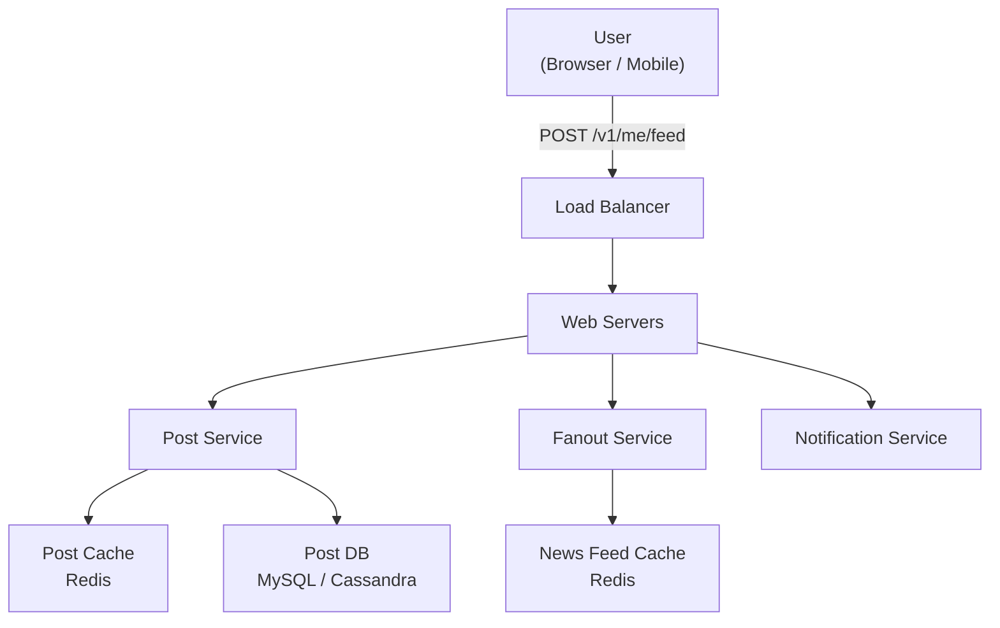
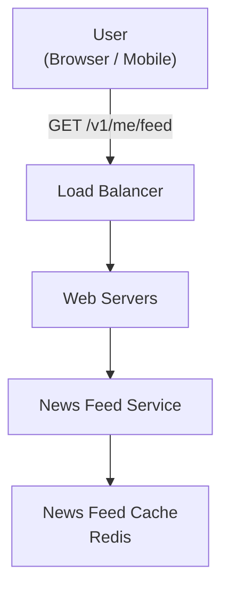
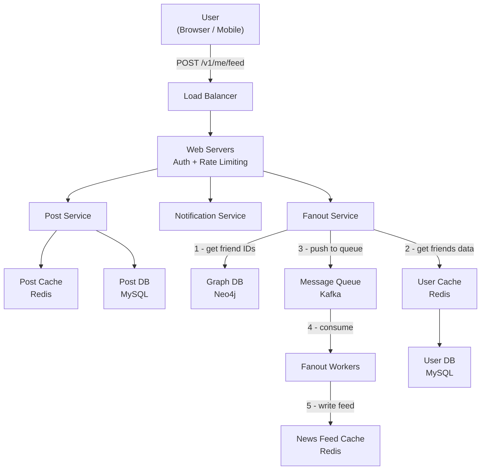
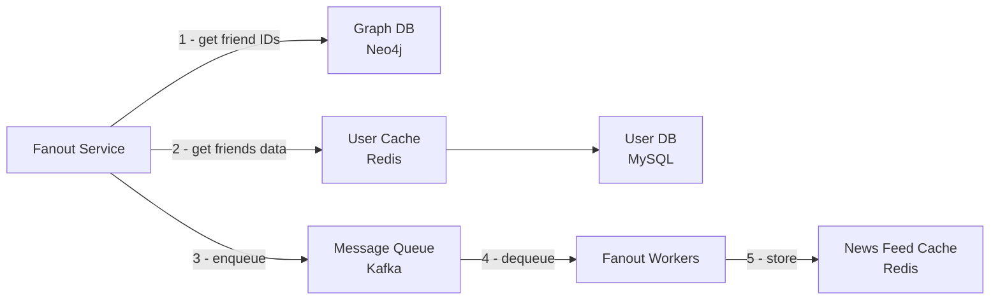
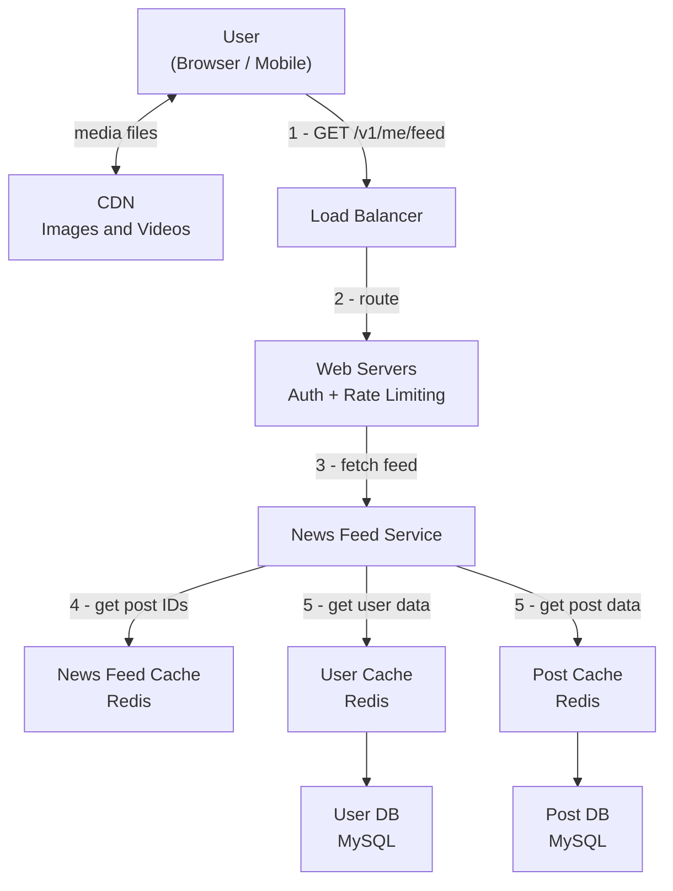
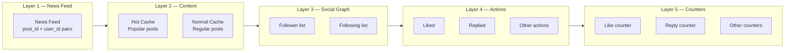
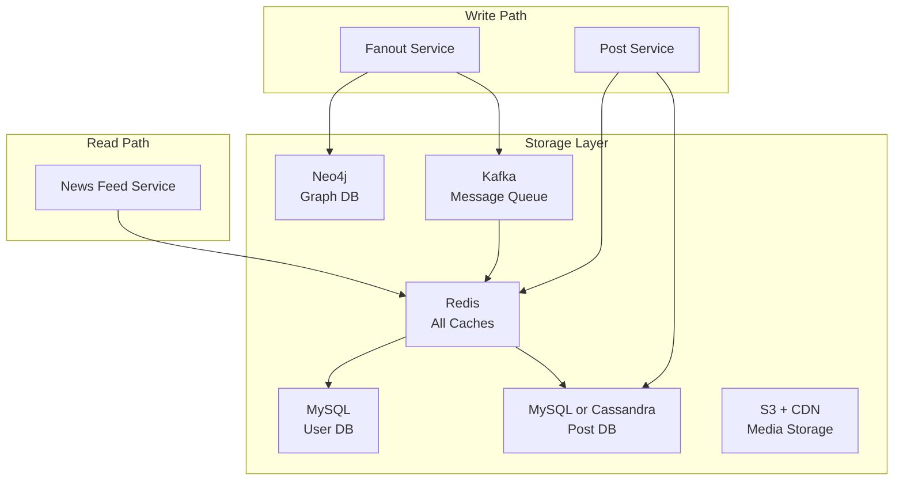
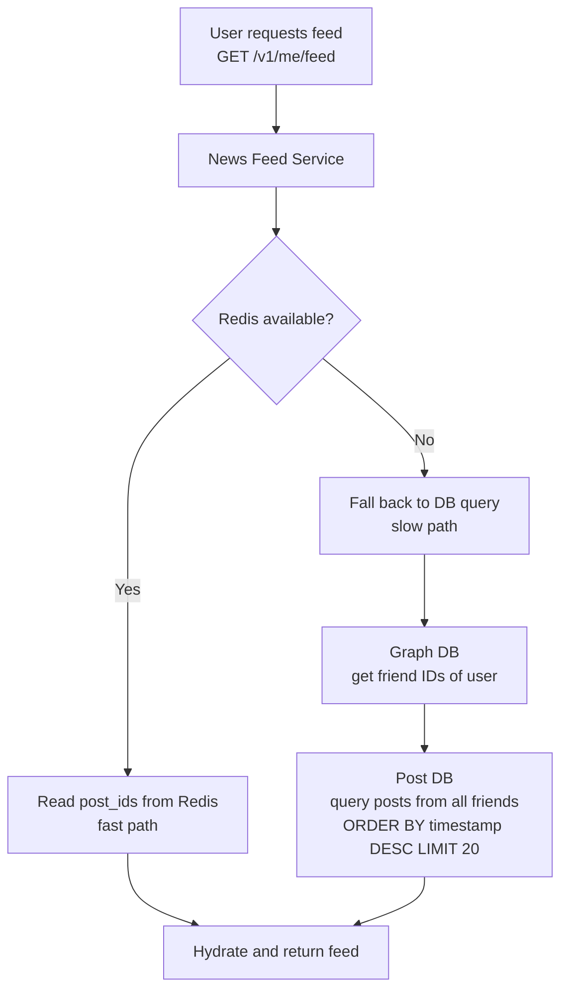
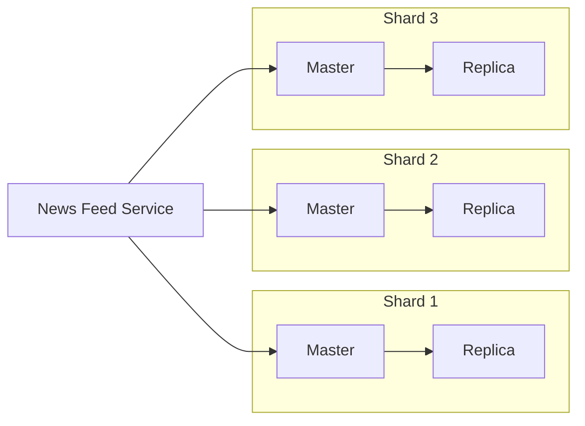

# System Design: News Feed System
> *Based on Chapter 11 — System Design Interview (Alex Xu)*

---

## Table of Contents
1. [Problem Statement](#problem-statement)
2. [Step 1 — Clarify Requirements](#step-1--clarify-requirements)
3. [Step 2 — High-Level Design](#step-2--high-level-design)
4. [Step 3 — Deep Dive](#step-3--deep-dive)
5. [Database Choices & Rationale](#database-choices--rationale)
6. [Step 4 — Wrap Up & Scalability](#step-4--wrap-up--scalability)
7. [Interview Q&A](#interview-qa)

---

## Problem Statement

Design a **news feed system** — a constantly updating list of stories in the middle of a user's home page. It includes status updates, photos, videos, links, and app activity from friends, pages, and groups the user follows.

**Similar questions:** Design Facebook News Feed, Instagram Feed, Twitter Timeline.

---

## Step 1 — Clarify Requirements

### Candidate–Interviewer Dialogue

| Question | Answer |
|---|---|
| Mobile app, web app, or both? | Both |
| What are the key features? | User can publish posts; see friends' posts on feed |
| Is the feed sorted reverse chronological or by score? | Reverse chronological |
| Max friends per user? | **5,000** |
| Traffic volume? | **10 million DAU** |
| Can posts contain media (images, videos)? | Yes — both images and videos |

### Two Core Flows
- **Feed Publishing** — when a user publishes a post, data is written to cache/DB and pushed to friends' feeds
- **Newsfeed Building** — feed is built by aggregating friends' posts in reverse chronological order

---

## Step 2 — High-Level Design

### APIs

#### Feed Publishing API
```
POST /v1/me/feed
Params:
  - content: text of the post
  - auth_token: authenticates the API request
```

#### Newsfeed Retrieval API
```
GET /v1/me/feed
Params:
  - auth_token: authenticates the API request
```

---

### Figure 11-2: Feed Publishing — High-Level



**Component Responsibilities:**
- **Load Balancer** — distributes incoming traffic to web servers
- **Web Servers** — redirect traffic to appropriate internal services
- **Post Service** — persists the post in database and cache
- **Fanout Service** — pushes new post to friends' news feed cache
- **Notification Service** — notifies friends that new content is available

---

### Figure 11-3: Newsfeed Building — High-Level



**Component Responsibilities:**
- **News Feed Service** — fetches news feed from the cache
- **News Feed Cache** — stores `<post_id, user_id>` mappings for fast retrieval

---

## Step 3 — Deep Dive

### Feed Publishing Deep Dive

#### Figure 11-4: Feed Publishing — Detailed



#### Fanout Service — Step-by-Step
1. **Get friend IDs** from the Graph DB
2. **Get friends' data** from User Cache (filtered by user settings — muted users excluded)
3. **Push** friends list + new post ID to the Message Queue
4. **Fanout Workers** consume the queue asynchronously
5. Workers **write `<post_id, user_id>`** entries to the News Feed Cache

---

### Fanout Models — Push vs Pull

#### Figure 11-5: Fanout Service Detail



#### Fanout on Write (Push Model)

| | |
|---|---|
| **How** | News feed pre-computed at write time; delivered to friends' cache immediately |
| **Pro** | Feed generation is real-time; fetching is fast |
| **Pro** | Feed retrieval fast — already pre-computed |
| **Con** | Hotkey problem — users with many friends cause massive fanout |
| **Con** | Wastes resources computing feeds for inactive users |

#### Fanout on Read (Pull Model)

| | |
|---|---|
| **How** | News feed generated on demand when user loads their home page |
| **Pro** | No wasted compute for inactive users |
| **Pro** | No hotkey problem — no data pushed to friends |
| **Con** | Fetching feed is slow — not pre-computed |

#### Hybrid Approach (Recommended)

> Use **push model for most users**. For **celebrities / users with massive follower counts**, let followers **pull** on demand. Use **consistent hashing** to distribute requests evenly and mitigate the hotkey problem.

---

### News Feed Cache Structure

#### Figure 11-6: News Feed Cache Table

The cache stores only IDs (not full objects) to keep memory usage small:

```
┌──────────┬──────────┐
│  post_id │  user_id │
├──────────┼──────────┤
│  post_id │  user_id │
│  post_id │  user_id │
│  post_id │  user_id │
│  post_id │  user_id │
│  post_id │  user_id │
│  post_id │  user_id │
│  post_id │  user_id │
└──────────┴──────────┘
```

**Why IDs only?**
- Storing entire user/post objects per entry would consume enormous memory
- A configurable size limit is set — most users don't scroll past recent posts, so cache miss rate is low

---

### Newsfeed Retrieval Deep Dive

#### Figure 11-7: Newsfeed Retrieval — Detailed



**Retrieval Steps:**
1. User sends `GET /v1/me/feed`
2. Load balancer redistributes to web servers
3. Web servers call the News Feed Service
4. News Feed Service gets list of **post IDs** from News Feed Cache
5. Service fetches full **user objects** and **post objects** from caches to **hydrate** the feed
6. Fully hydrated feed returned as **JSON** to the client
7. **Media files** (images, videos) loaded from **CDN** for fast retrieval

---

### Cache Architecture — 5 Layers

#### Figure 11-8: Cache Layers



| Layer | What it Stores |
|---|---|
| **News Feed** | `<post_id, user_id>` pairs forming each user's feed |
| **Content** | Every post's data; popular posts go to hot cache |
| **Social Graph** | User relationship data (follower / following lists) |
| **Action** | Whether a user liked, replied, or took other actions on a post |
| **Counters** | Like counts, reply counts, follower counts, etc. |

---

## Database Choices & Rationale

### System Database Map



---

### 1. User DB — MySQL (Relational)

**What it stores:** User profiles — name, email, auth tokens, account settings, privacy preferences.

**Why MySQL?**
- User data is **highly structured** with a well-defined, stable schema
- Requires **ACID transactions** — e.g., updating account + writing audit log atomically
- Rich **JOIN support** for analytics and admin queries
- Proven at scale (used by Facebook, Twitter, LinkedIn)

**Scaling:**
- **Read replicas** to handle high read traffic (profile lookups happen on every feed load)
- **Sharding by user_id** once single-node limits are hit

---

### 2. Post DB — MySQL (moderate) or Cassandra (large scale)

**What it stores:** Post content, metadata (timestamp, author_id, media URLs), visibility settings.

**Why MySQL at moderate scale?**
- Posts have a structured schema and benefit from ACID guarantees on writes
- Easy to query by `post_id` for hydration

**Why Cassandra at large scale?**
- Post writes are extremely high-volume — Cassandra is optimised for **high write throughput**
- Data is naturally **time-series** shaped (partition by user_id, cluster by timestamp) — fits Cassandra's model perfectly
- **Masterless** peer-to-peer replication — no single point of failure
- Trade-off: eventual consistency, which is acceptable since a post appearing milliseconds late is fine

---

### 3. Graph DB — Neo4j

**What it stores:** Social relationships — who follows whom, friendship edges.

**Why a Graph DB?**
- The social graph is fundamentally a **network of nodes (users) and edges (relationships)**
- Queries like *"get all friends of user X"* require traversing many hops
- In a relational DB this means **expensive recursive JOINs** on a `friends` table — O(n²) at scale
- Neo4j stores relationships as **first-class indexed citizens**, making traversal O(depth) not O(rows)
- Enables friend recommendations, mutual friend counts, and degree-of-separation queries efficiently

**Alternative:** Adjacency list stored in a Redis hash for simpler graphs at high throughput — trades traversal depth for raw speed.

---

### 4. Cache — Redis

**What it stores:** All 5 cache layers (News Feed, Content, Social Graph, Actions, Counters).

**Why Redis?**
- **In-memory** — sub-millisecond read/write latency, critical for feed retrieval speed
- **Sorted Sets (ZSet)** — perfect for storing a time-ordered list of post IDs per user

```
# Feed ordered by timestamp
ZADD  feed:{user_id}  {unix_timestamp}  {post_id}
ZRANGE feed:{user_id} 0 19              # get latest 20 posts

# Post and user data
HSET  post:{post_id}  content "..."  author_id "..."
HSET  user:{user_id}  name "..."  avatar_url "..."

# Counters
INCR  likes:{post_id}

# Social graph
SADD  followers:{user_id}  {follower_id}
```

- **Horizontal scaling** via Redis Cluster — consistent hashing across nodes
- **TTL support** — automatically evict stale feed entries
- **Atomic operations** — INCR for counters without race conditions

**Why Redis over Memcached?**
- Memcached is simple key-value only — no native ordering
- Redis sorted sets are purpose-built for ranked/time-ordered feeds
- Redis supports TTL per key, persistence, Pub/Sub, and scripting

---

### 5. Media Storage — S3 + CDN

**What it stores:** Images, videos, and other binary media.

**Why S3?**
- Media files are **large, unstructured blobs** — not suited for relational or document DBs
- S3 provides **virtually unlimited, durable storage** (11 nines durability)
- Files are **immutable after upload** — perfect fit for S3's key-value model

**Why CDN in front of S3?**
- Users are globally distributed — serving media from one S3 region adds latency for distant users
- CDN **caches media at edge nodes** closest to the user
- Reduces origin bandwidth costs significantly
- Post DB stores only the S3/CDN URL — the client fetches media directly, offloading app servers

---

### 6. Message Queue — Kafka

**What it stores:** Pending fanout tasks — `{ post_id, author_id, friend_ids[] }`.

**Why Kafka?**
- Fanout is the **most write-intensive operation** — updating N friends' caches per post
- Kafka **decouples the write path** — Post Service publishes one message, Fanout Workers consume at their own pace
- Handles **traffic spikes** without data loss — messages are durably persisted on disk
- **Replay capability** — if workers crash, they resume from last committed offset
- Scales to millions of messages/second via partitioning

---

### Database Summary Table

| Component | Technology | Type | Key Reason |
|---|---|---|---|
| User profiles | **MySQL** | Relational SQL | Structured schema, ACID, JOIN support |
| Posts (moderate scale) | **MySQL** | Relational SQL | Structured data, ACID writes |
| Posts (large scale) | **Cassandra** | Wide-column NoSQL | High write throughput, time-series fit, masterless |
| Social graph | **Neo4j** | Graph DB | Multi-hop traversal O(depth) vs O(n^2) JOINs |
| All caches | **Redis** | In-memory Key-Value | Sub-ms latency, sorted sets, TTL, atomic counters |
| Media files | **S3** | Object Storage | Unstructured blobs, durable, cheap at scale |
| Media delivery | **CDN** | Edge Cache | Low-latency global delivery, origin offload |
| Fanout task queue | **Kafka** | Message Queue | Async decoupling, durable, replayable on crash |

---

## Step 4 — Wrap Up & Scalability

### Scaling the Database
- **Vertical vs Horizontal scaling** — scale out horizontally as DAU grows
- **SQL vs NoSQL** — Cassandra for high write throughput on posts; MySQL for user data
- **Master-slave replication** — writes to master, reads from replicas
- **Read replicas** — offload read-heavy news feed retrieval
- **Consistency models** — eventual consistency acceptable for feeds
- **Database sharding** — shard by user_id to distribute load evenly

### Other Talking Points
- **Keep web tier stateless** — session state in Redis, not in-process
- **Cache aggressively** — all 5 layers of the cache architecture
- **Support multiple data centers** — geo-routing, active-active or active-passive failover
- **Loose coupling with message queues** — fanout workers decouple write path from feed update
- **Monitor key metrics** — QPS during peak hours, feed refresh latency, cache hit rate

---

## Interview Q&A

### Clarification Questions (You should ask these)

1. Is this for a mobile app, web app, or both?
2. What are the key features required? (publish posts, view friends' posts, likes, comments?)
3. Is the feed sorted reverse chronologically or ranked by relevance/score?
4. What is the maximum number of friends a user can have?
5. What is the expected traffic volume? (DAU, posts per second)
6. Can posts contain media (images, videos) or just text?

---

### Deep-Dive Questions

#### Architecture & Design

**Q: What are the two main flows in a news feed system?**
> **Feed Publishing** (write path) and **Newsfeed Retrieval** (read path). Publishing writes to DB/cache and fans out to friends. Retrieval reads from cache and hydrates the feed with full user/post data.

**Q: Why do we use a Message Queue in the fanout service?**
> To decouple the write path from the fanout operation. Post Service publishes one message and returns immediately — Fanout Workers consume asynchronously. This improves write latency and absorbs traffic spikes.

**Q: What is a Graph Database used for here, and why not a relational DB?**
> The Graph DB stores social relationships. Graph DBs like Neo4j are optimised for traversal — "get all friends of user X" is O(depth). The same query in a relational DB requires recursive JOINs on a `friends` table, which is O(n²) at scale.

**Q: Why do we store only IDs in the News Feed Cache, not full post objects?**
> Memory efficiency. Storing entire user and post objects for every entry would consume enormous memory. IDs are tiny; full objects are fetched on demand from their respective caches at read time.

**Q: How does media content get served efficiently?**
> Media is stored in S3 and served via a CDN. The news feed returns metadata and CDN URLs — the client fetches media directly from the nearest CDN edge node, reducing latency and origin server load.

---

#### Fanout Models

**Q: Explain Fanout on Write vs Fanout on Read. Which would you choose?**
> - **Push (write):** Pre-compute feed at write time. Fast reads, but hotkey problem for celebrities and wastes compute for inactive users.
> - **Pull (read):** Compute on demand. No wasted compute, no hotkey problem, but slow reads.
> - **Best answer:** Hybrid — push for regular users, pull for high-follower-count accounts. Consistent hashing distributes load evenly.

**Q: What is the hotkey problem and how do you solve it?**
> When a celebrity posts, fanout on write must update millions of cache entries simultaneously — spiking specific cache servers. Solutions: (1) Fanout on read for celebrity accounts, (2) Consistent hashing to spread cache keys, (3) Rate-limiting fanout workers.

---

#### Database Questions

**Q: Why use Cassandra for posts instead of MySQL at scale?**
> At 10M DAU, post writes can reach thousands per second. Cassandra handles **high write throughput** natively with linear horizontal scalability. Its wide-column model maps naturally to post data (partition by user_id, cluster by timestamp). MySQL single-master becomes a bottleneck; Cassandra handles distribution natively.

**Q: Why Redis over Memcached for the feed cache?**
> Redis supports **Sorted Sets (ZSets)** — purpose-built for time-ordered lists of post IDs per user. Memcached is simple key-value with no native ordering. Redis also supports atomic INCR for counters, TTL per key, persistence, and Pub/Sub.

**Q: How do you shard the User DB?**
> Shard by `user_id` using consistent hashing. This distributes users evenly across shards and minimises resharding overhead when adding nodes.

**Q: What happens if the News Feed Cache goes down?**
> Requests fall through to the News Feed Service which reads directly from Post DB — slower, but functional. Cache repopulates lazily on next user request or eagerly via a warm-up job.

---

#### Caching

**Q: Walk me through the 5 layers of the cache architecture.**
> 1. **News Feed** — `<post_id, user_id>` pairs for each user's feed
> 2. **Content** — post data; popular posts go to hot cache
> 3. **Social Graph** — follower/following relationships
> 4. **Action** — user interactions (liked, replied, etc.)
> 5. **Counters** — aggregate counts (likes, replies, followers)

**Q: What cache eviction policy would you use?**
> LRU — most users only care about recent posts. A configurable max size per user prevents unbounded memory growth.

**Q: How would you handle cache invalidation when a post is deleted?**
> Soft-delete in DB first. On cache hit, check deleted flag and filter it out. Async cleanup removes the entry from all affected news feed caches via a deletion event on the message queue.

---

#### Scalability

**Q: Estimate writes per second for the fanout service at 10M DAU.**
> 10M posts/day / 86,400 seconds = ~116 posts/sec. Each fans out to up to 5,000 friends = up to **580,000 cache writes/sec** at peak. This is why async Kafka workers and Redis Cluster are essential.

**Q: What consistency guarantees does this system provide?**
> Eventual consistency on the feed — there is a short window after posting where some friends' feeds have not updated yet. Acceptable for social feeds; strong consistency would require synchronous fanout which kills write latency.

**Q: How do you keep the web tier stateless?**
> No session state stored in-process on web servers. Auth validated via JWT (self-contained) or a shared auth service. Rate limit counters live in Redis, accessible by all instances.

---

---

## What Happens When Redis Goes Down

### Immediate Behavior — Fall Through to DB

The News Feed Service has no cache to read from, so it falls back to **querying the databases directly**:



Specifically the fallback does:
1. **Get friend IDs** from Graph DB (Neo4j) — same as the fanout service does
2. **Query Post DB** — `SELECT * FROM posts WHERE author_id IN (friend_ids) ORDER BY created_at DESC LIMIT 20`
3. Hydrate and return — slower, but correct

---

### The Cost of This Fallback

The system **stays functional** but degrades significantly under load. With 10M DAU, every feed request suddenly hitting Post DB would likely overwhelm it.

| | Normal (Redis up) | Redis down |
|---|---|---|
| Feed retrieval latency | ~10ms | ~500ms to 2s |
| DB load | Low — mostly cache hits | Massive spike — every request hits DB |
| Fanout writes | Write to Redis | Writes fail / queue up in Kafka |
| User experience | Fast | Noticeably slow |

---

### How You Mitigate This

#### 1. Redis Cluster with Replication
Don't run a single Redis node. Use **Redis Cluster** with master + replica shards. If one master dies, a replica is promoted automatically. Reduces full outage probability to near zero.



If `M2` dies → `R2` is promoted to master. No full outage, just a brief blip on that shard.

#### 2. Redis Persistence — AOF
Enable **AOF (Append-Only File)** persistence — Redis writes every command to disk. On restart, it replays the log and recovers the cache state. Warm restart instead of cold empty start.

#### 3. Cache Warm-up on Restart
When Redis comes back up, a **warm-up job** proactively rebuilds the most active users' feeds from Post DB before they request them — so the first request after recovery is still fast.

#### 4. Circuit Breaker on the DB
If Redis is down and DB fallback traffic spikes, a **circuit breaker** sheds excess load (returns stale feeds or partial results) rather than letting the DB get overwhelmed and causing a cascading failure.

---

### Interview Q — Redis Failure

**Q: What happens if Redis goes down?**
> The News Feed Service falls back to querying the Post DB and Graph DB directly — the feed is still generated correctly, just significantly slower (500ms vs 10ms). The bigger risk is DB overload from all 10M DAU suddenly hitting the DB simultaneously. In practice you prevent this with: (1) Redis Cluster replication so a single node failure never takes down the full cache, (2) AOF persistence for fast warm restarts, (3) a cache warm-up job, and (4) a circuit breaker to protect the DB under sudden load spikes.

**Q: Is the feed still accurate after Redis goes down?**
> Yes — Redis only holds a derived index of post IDs. The Post DB and Graph DB are the source of truth and are always up to date. The feed generated from DB fallback is just as correct as the cached version, just slower to produce.

**Q: What about fanout writes when Redis is down?**
> Fanout Workers write to Redis. If Redis is unavailable, those writes fail. However, the **Kafka messages are still durably stored** — once Redis recovers, the workers can replay or resume processing, and the feeds will eventually be consistent. No data is lost.

---

### Summary Cheat Sheet

```
Scale: 10M DAU, max 5,000 friends/user, supports images + videos

Write path:
  User → Load Balancer → Web Server (auth + rate limit)
       → Post Service  → Post Cache (Redis) + Post DB (MySQL/Cassandra)
       → Fanout Svc    → Graph DB (Neo4j) [get friends]
                       → User Cache (Redis) [filter muted]
                       → Kafka → Fanout Workers → News Feed Cache (Redis)

Read path:
  User → Load Balancer → Web Server → News Feed Service
       → News Feed Cache (Redis)    [get post IDs]
       → Post Cache + User Cache    [hydrate full objects]
       → Return JSON to client
  Media → S3 + CDN

Cache layers: News Feed | Content (hot/normal) | Social Graph | Actions | Counters

Fanout model: Hybrid — push for regular users, pull for celebrities

Database map:
  User profiles  → MySQL           (relational, ACID)
  Posts          → MySQL/Cassandra  (write-heavy, time-series)
  Social graph   → Neo4j            (graph traversal)
  All caches     → Redis            (in-memory, sorted sets)
  Media          → S3 + CDN         (object storage + edge delivery)
  Task queue     → Kafka            (async fanout, durable, replayable)
```

---

*Source: System Design Interview – An Insider's Guide, Alex Xu (Chapter 11)*
