# Design a Rate Limiter — Interview Guide

> *Source: System Design Interview, Chapter 4 (Alex Xu) · Pages 52–73*

---

## Table of Contents

1. [What is a Rate Limiter?](#1-what-is-a-rate-limiter)
2. [Step 1 — Requirements & Design Scope](#2-step-1--requirements--design-scope)
3. [Step 2 — High-Level Design](#3-step-2--high-level-design)
4. [Algorithms](#4-algorithms)
   - [Token Bucket](#41-token-bucket)
   - [Leaking Bucket](#42-leaking-bucket)
   - [Fixed Window Counter](#43-fixed-window-counter)
   - [Sliding Window Log](#44-sliding-window-log)
   - [Sliding Window Counter](#45-sliding-window-counter)
   - [Algorithm Comparison](#46-algorithm-comparison)
5. [High-Level Architecture](#5-high-level-architecture)
6. [Step 3 — Deep Dive](#6-step-3--deep-dive)
7. [Race Condition — Deep Dive](#7-race-condition--deep-dive)
8. [Redis as Single Point of Failure](#8-redis-as-single-point-of-failure)
9. [Performance & Monitoring](#9-performance--monitoring)
10. [Step 4 — Wrap Up](#10-step-4--wrap-up)
11. [Interview Answer Template](#11-interview-answer-template)
12. [Interviewer Question Bank](#12-interviewer-question-bank)

---

## 1. What is a Rate Limiter?

A rate limiter controls the rate of traffic sent by a client or service. In HTTP, it limits the number of requests over a time period. If the count exceeds the threshold, excess calls are **blocked with HTTP 429 Too Many Requests**.

**Why use one?**

| Reason | Explanation |
|---|---|
| **Prevent DoS attacks** | Blocks intentional/unintentional flood attacks from bots or malicious actors |
| **Reduce cost** | Fewer servers needed; critical when using paid third-party APIs |
| **Prevent misbehavior** | Filters excess requests caused by bots or abusive users |

**Real-world examples:**
- Twitter: max 2 posts/second per user
- Google Docs: max 300 write requests/user/60 seconds
- Amazon & Stripe: use token bucket to throttle API requests
- Shopify: uses leaking bucket

---

## 2. Step 1 — Requirements & Design Scope

> Always clarify before designing. A strong candidate asks these questions first.

| Candidate Question | Interviewer Answer |
|---|---|
| Client-side or server-side? | **Server-side** — we focus on server-side API rate limiter |
| Throttle by IP, user ID, or other? | Should be **flexible** enough to support different rules |
| Scale of the system? | Must handle a **large number of requests** |
| Distributed environment? | **Yes** |
| Separate service or in application code? | **Design decision** — up to you |
| Inform throttled users? | **Yes** |

### Non-Functional Requirements

- **Low latency** — must not slow down HTTP response time
- **Memory efficient** — use as little memory as possible
- **Distributed rate limiting** — shared across multiple servers/processes
- **Exception handling** — clear errors shown to users when throttled
- **High fault tolerance** — if rate limiter goes offline, the system is unaffected

---

## 3. Step 2 — High-Level Design

### Where to Put the Rate Limiter?

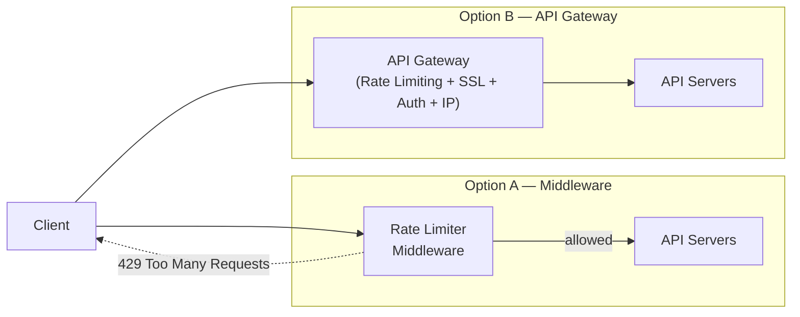

| | Client-side ❌ | Server-side ✅ |
|---|---|---|
| Reliability | Unreliable — can be forged | You own the enforcement |
| Control | None | Full |
| Recommended | No | Yes |

**Decision guidelines:**
- Already have an API gateway (auth, SSL, IP whitelisting)? → Add rate limiting there
- Need full algorithm control? → Embed on the server side
- Limited engineering resources? → Use a commercial API gateway

---

## 4. Algorithms

### 4.1 Token Bucket

A bucket with pre-defined capacity. Tokens are added at a fixed **refill rate**. Each request consumes 1 token. If tokens available → allow; else → drop.

**Parameters:** `bucket_size`, `refill_rate`

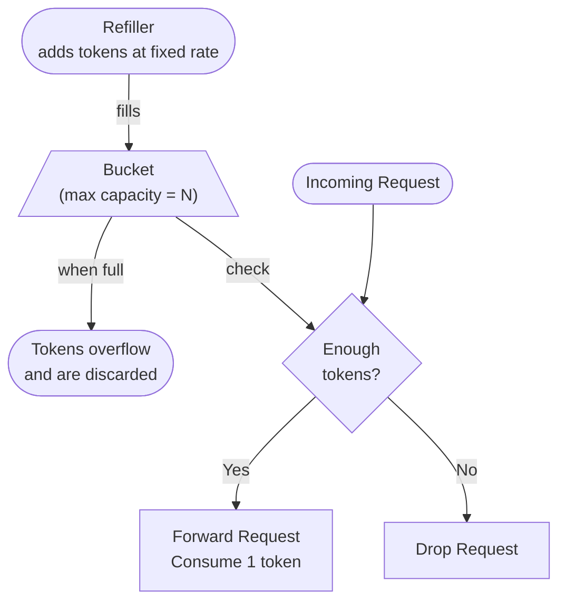

**How many buckets do we need?**
- 1 bucket per user per endpoint (e.g., 1 post/sec, 150 friends/day = 2 buckets per user)
- 1 bucket per IP address for IP-based throttling
- 1 global bucket if the system allows a maximum total req/sec

| ✅ Pros | ❌ Cons |
|---|---|
| Simple to implement | Two parameters — hard to tune |
| Memory efficient | |
| Allows short bursts while tokens remain | |

**Used by:** Amazon, Stripe

---

### 4.2 Leaking Bucket

Similar to token bucket but requests are **processed at a fixed output rate** via a FIFO queue.

**Parameters:** `bucket_size` (= queue size), `outflow_rate`

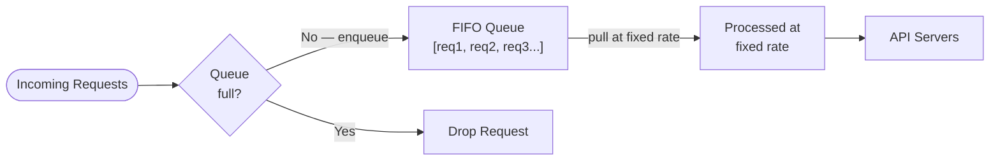

| ✅ Pros | ❌ Cons |
|---|---|
| Memory efficient (limited queue) | Burst fills queue with old requests; recent ones get dropped |
| Stable outflow — good for strict downstream SLAs | Two parameters hard to tune |

**Used by:** Shopify

---

### 4.3 Fixed Window Counter

Timeline divided into **fixed-size windows**. Counter per window. Once counter hits threshold → drop requests until next window.

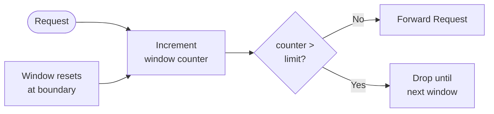

**⚠️ Edge Spike Problem:**

```
Window:  |-------- 1:00 --------|-------- 1:01 --------|
         .....5 requests here →  ← 5 requests here.....
                              ↑
                    2:00:30 to 2:01:30 = 10 requests
                    That's 2× the allowed quota!
```

In the one-minute rolling window straddling the boundary, **twice the allowed quota** can pass through.

| ✅ Pros | ❌ Cons |
|---|---|
| Memory efficient | Edge spike allows 2× quota in a rolling window |
| Easiest to implement | |
| Quota reset at window end fits some use cases | |

---

### 4.4 Sliding Window Log

Keeps a **log of request timestamps** (Redis sorted set). On each request: remove outdated timestamps → add current → check log size.

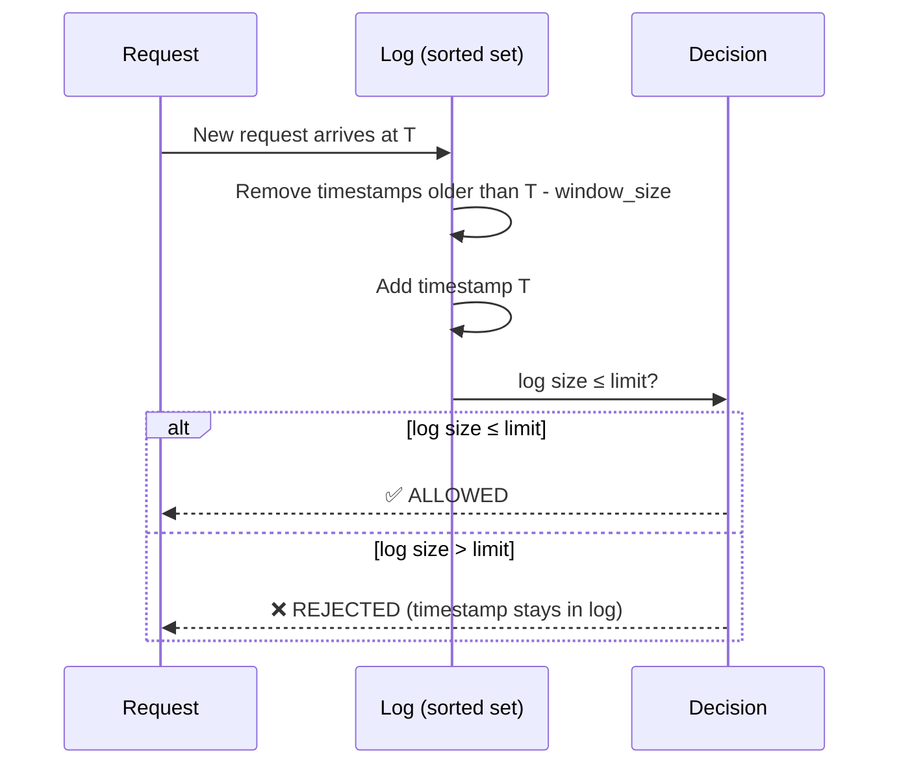

**Walkthrough example (limit = 2 req/min):**

| Time | Action | Log | Size | Decision |
|---|---|---|---|---|
| 1:00:01 | Add timestamp | `[1:00:01]` | 1 | ✅ Allowed |
| 1:00:30 | Add timestamp | `[1:00:01, 1:00:30]` | 2 | ✅ Allowed |
| 1:00:50 | Add timestamp | `[1:00:01, 1:00:30, 1:00:50]` | 3 | ❌ Rejected |
| 1:01:40 | Remove 1:00:01, 1:00:30 (outdated) → Add 1:01:40 | `[1:00:50, 1:01:40]` | 2 | ✅ Allowed |

| ✅ Pros | ❌ Cons |
|---|---|
| Very accurate — never exceeds limit in any rolling window | High memory — rejected timestamps still stored |

---

### 4.5 Sliding Window Counter

**Hybrid** of fixed window counter + sliding window log. Uses a weighted formula to estimate the rolling count.

```
rolling_count = requests_current_window
              + requests_previous_window × (1 − position_in_current_window)
```

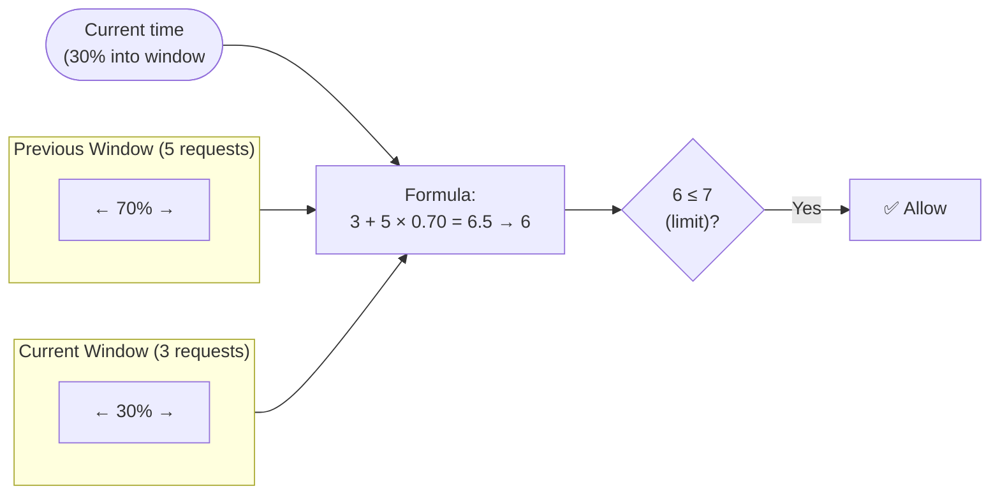

**Example (limit = 7/min):**
- Previous minute: 5 requests
- Current minute so far: 3 requests
- Request arrives at 30% of current minute
- Rolling count = `3 + 5 × 0.70 = 6.5 → rounds to 6`
- `6 < 7` → **allowed**

| ✅ Pros | ❌ Cons |
|---|---|
| Smooths out traffic spikes | Approximation — assumes even distribution in previous window |
| Memory efficient | Only works for non-strict lookback windows |

**Used by:** Cloudflare — only **0.003%** of requests wrongly handled across 400M requests

---

### 4.6 Algorithm Comparison

| Algorithm | Memory | Burst | Accuracy | Complexity | Used By |
|---|---|---|---|---|---|
| Token Bucket | Low | ✅ Yes | High | Simple | Amazon, Stripe |
| Leaking Bucket | Low | ❌ Fixed rate | High | Simple | Shopify |
| Fixed Window Counter | Low | ⚠️ Edge spike | Medium | Simplest | — |
| Sliding Window Log | High | ✅ Yes | Exact | Medium | — |
| Sliding Window Counter | Low | ✅ Smoothed | ~Approx | Medium | Cloudflare |

**Decision guide:**

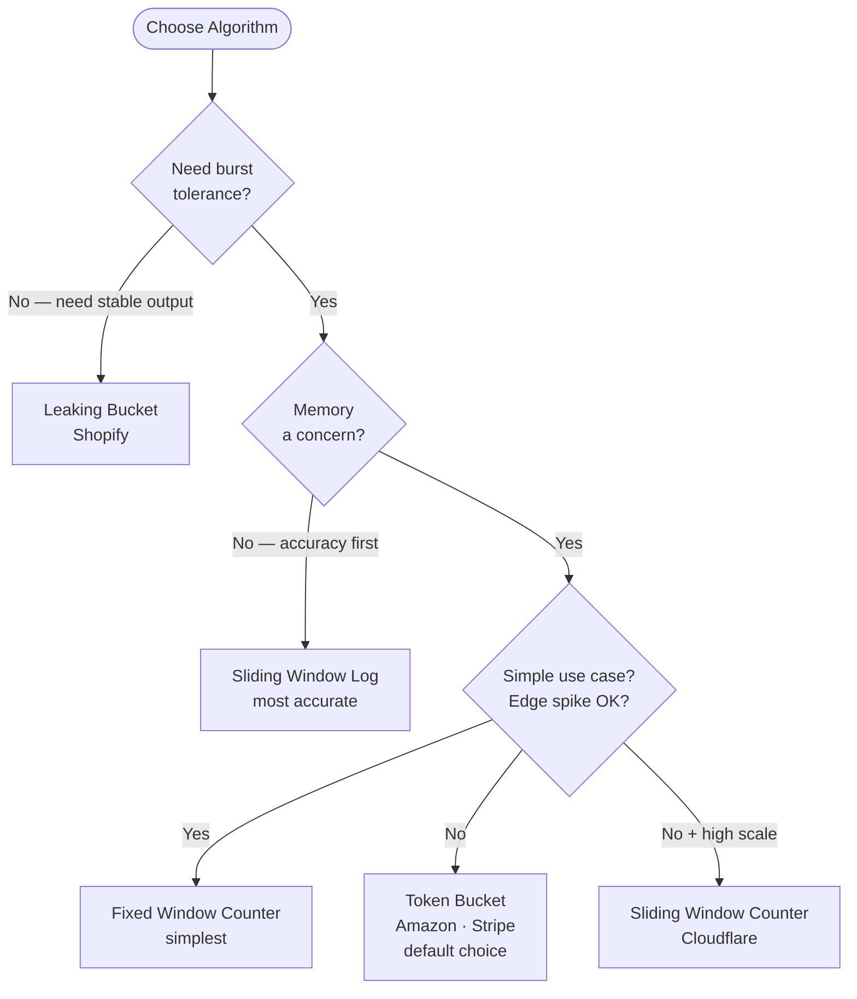

---

## 5. High-Level Architecture

The rate limiter uses **Redis** as the counter store — in-memory, fast, supports atomic `INCR` + `EXPIRE`.

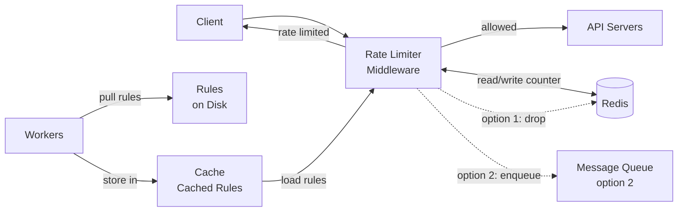

**Flow:**
1. Client sends request to rate limiter middleware
2. Middleware loads rules from **cache** (workers periodically pull from disk)
3. Middleware fetches counter from **Redis** and checks if limit is reached
4. If not rate limited → forward to API servers; increment counter in Redis
5. If rate limited → return **HTTP 429**; drop request or enqueue for later

**Why Redis?**
- `INCR key` — atomically increments counter, returns new value
- `EXPIRE key seconds` — auto-deletes key when window ends

---

## 6. Step 3 — Deep Dive

### Rate Limiting Rules

Rules stored in config files on disk, loaded into cache by background workers:

```yaml
# Max 5 marketing messages per day
domain: messaging
descriptors:
  - key: message_type
    value: marketing
    rate_limit:
      unit: day
      requests_per_unit: 5

# Max 5 login attempts per minute
domain: auth
descriptors:
  - key: auth_type
    value: login
    rate_limit:
      unit: minute
      requests_per_unit: 5
```

### HTTP Headers — Communicating to Clients

| Header | Meaning |
|---|---|
| `X-Ratelimit-Remaining` | Remaining allowed requests in the current window |
| `X-Ratelimit-Limit` | Maximum calls allowed per time window |
| `X-Ratelimit-Retry-After` | Seconds to wait before retrying |

When limit exceeded: return **HTTP 429** + `X-Ratelimit-Retry-After`.

### Detailed Design

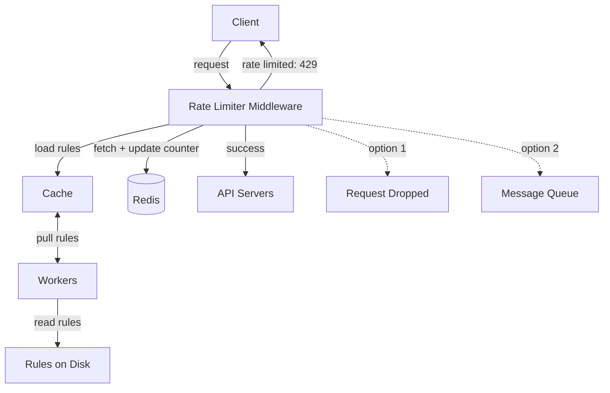

---

## 7. Race Condition — Deep Dive

### The Problem

The naive implementation uses three separate Redis commands: `GET` → check → `INCR`. There is a gap between them where another thread can execute.

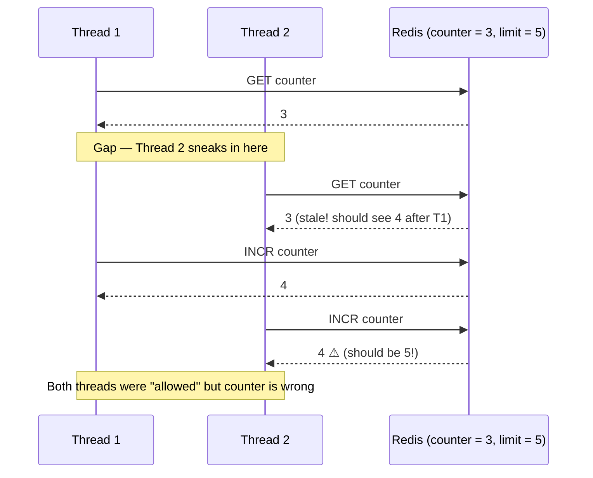

Both threads read `counter = 3`, both decide "I'm under the limit", both increment — counter ends at **4 instead of 5**. One extra request slips through.

### Why `INCR` Alone Doesn't Fully Fix It

`INCR` is atomic, but the surrounding logic (set expiry on first request, check result, decide) is still multi-step:

```
value = INCR counter       ← atomic ✓
if value == 1:
    EXPIRE counter, window ← gap here — crash before this = key never expires
if value > limit:
    reject
```

For the **sliding window log**, the problem is worse — `ZADD` + `ZREMRANGEBYSCORE` + `ZCARD` are three separate commands, all of which need to be atomic together.

### The Fix — Lua Script (Atomic)

Redis executes a Lua script as a **single atomic unit**. No other command from any client can execute between any two lines.

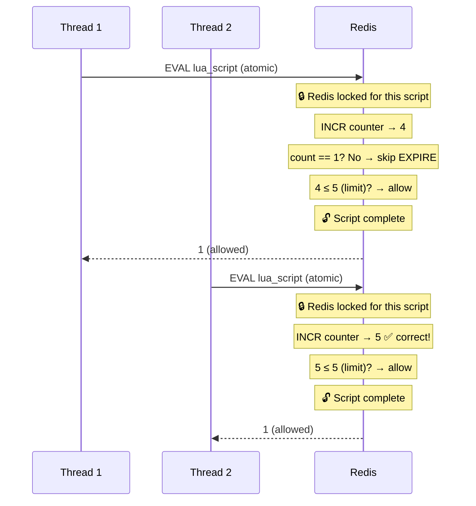

**Thread 2 now sees `counter = 4` — not the stale `3` it would have read without Lua.**

### The Actual Lua Script (Fixed Window Counter)

```lua
-- EVAL script 1 <key> <window_seconds> <limit>
local count = redis.call('INCR', KEYS[1])

-- On first request in window: set the TTL
if count == 1 then
    redis.call('EXPIRE', KEYS[1], tonumber(ARGV[1]))
end

-- Check against limit
if count > tonumber(ARGV[2]) then
    return 0  -- rejected — over limit
end

return 1  -- allowed
```

### Lua Script for Sliding Window Log (Sorted Set)

```lua
-- EVAL script 1 <key> <now_ms> <window_ms> <limit>
local now    = tonumber(ARGV[1])
local window = tonumber(ARGV[2])
local limit  = tonumber(ARGV[3])

-- Remove timestamps older than the window
redis.call('ZREMRANGEBYSCORE', KEYS[1], 0, now - window)

-- Add current request's timestamp (score = timestamp)
redis.call('ZADD', KEYS[1], now, now)

-- Set key expiry for cleanup
redis.call('EXPIRE', KEYS[1], math.ceil(window / 1000))

-- Count entries in the current window
local count = redis.call('ZCARD', KEYS[1])

if count > limit then
    return 0  -- rejected
end
return 1  -- allowed
```

> **Key insight:** Redis is single-threaded for command execution. A Lua script holds Redis's attention entirely — Thread 2 literally cannot read the counter until Thread 1's full script (increment + expire + check) has completed.

---

## 8. Redis as Single Point of Failure

The single Redis instance in the high-level architecture is a **SPOF**. Two standard solutions:

### Option 1 — Redis Sentinel (Active/Standby)

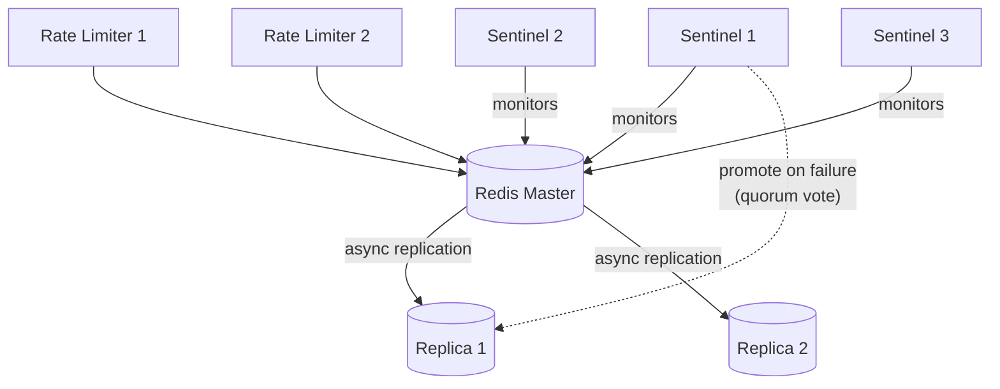

**Flow on master failure:**
1. Sentinels detect master is down
2. Sentinels hold a quorum vote
3. Winning sentinel promotes a replica to master
4. Rate limiters are notified of the new master address
5. Service resumes (~10–30 seconds downtime)

### Option 2 — Redis Cluster (Sharded + HA)

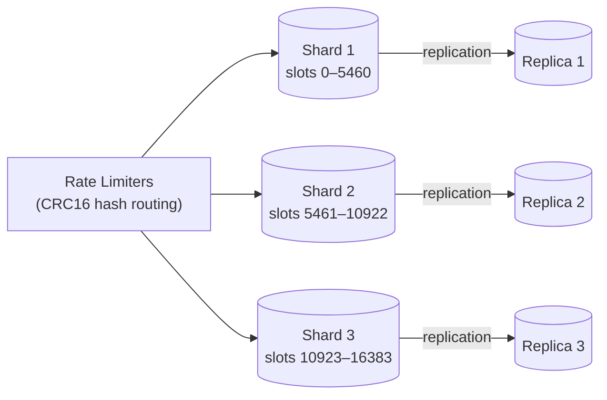

**How routing works:** `CRC16(user_id) % 16384` → determines which shard holds this user's counter. Each shard fails independently — no single point of failure.

### Comparison

| | Redis Sentinel | Redis Cluster |
|---|---|---|
| HA mechanism | Quorum vote, promotes replica | Per-shard replica promotion |
| Scaling | Vertical only | Horizontal — add shards |
| Failure scope | Whole instance | One shard at a time |
| Complexity | Lower | Higher |
| Use when | Moderate scale | Large scale, high throughput |
| Data loss on failover | Possible (async lag) | Possible (async lag) |

### Fail-Open vs Fail-Closed

During the brief failover window (10–30s), the rate limiter has no counter store. Choose:

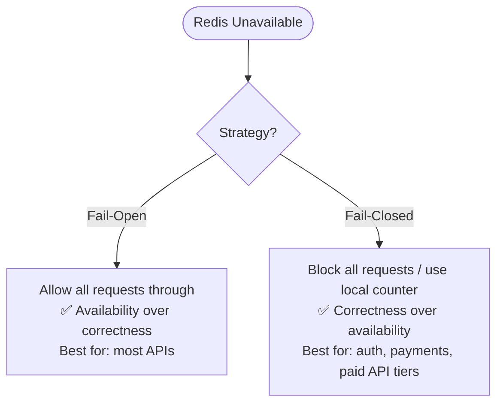

> **Recommendation:** Default to **fail-open**. A 20-second gap in enforcement is far less damaging than rejecting all legitimate traffic. Use fail-closed only for high-stakes endpoints.

---

## 9. Performance & Monitoring

### Performance Optimization

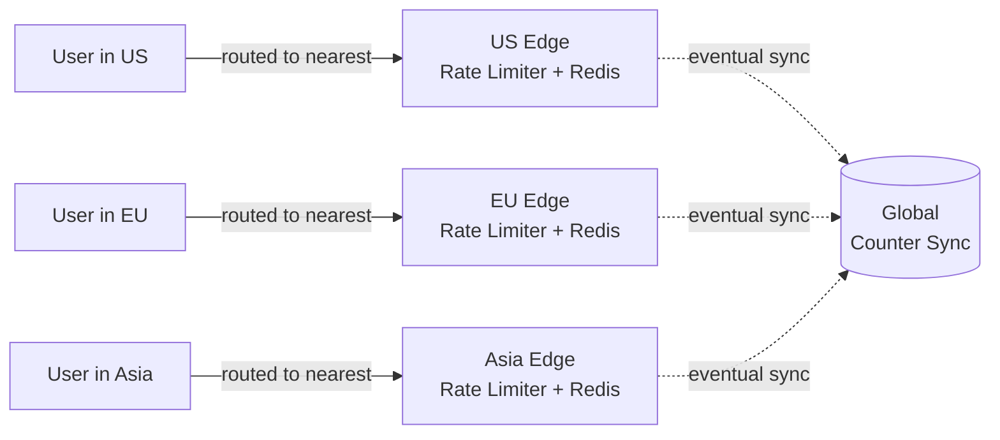

- Route traffic to nearest edge (Cloudflare: 194 edge locations globally)
- Sync counters across data centers with **eventual consistency**
- Accept small counter drift — a few extra requests passing through is acceptable

### Monitoring Metrics

| Category | What to Track |
|---|---|
| **Traffic** | Total req/sec, rate-limited req/sec, 429 rate by endpoint + user segment |
| **Latency** | P50/P99 latency added by rate limiter (target: < 1ms) |
| **Redis Health** | CPU, memory, command latency, replication lag |
| **Correctness** | False positive rate (valid users getting 429), counter drift between instances |

**Alert on:**
- 429 rate spikes suddenly → possible attack or misconfigured rule
- Redis replication lag growing → synchronization issue forming
- P99 latency climbing → rate limiter becoming a bottleneck

**Tuning signals:**
- Too many valid requests dropped → rules too strict, relax the threshold
- Rate limiter ineffective during flash sales → switch to **Token Bucket** (handles bursts)

---

## 10. Step 4 — Wrap Up

### Additional Topics to Mention

**Hard vs Soft Rate Limiting**

| | Hard | Soft |
|---|---|---|
| Definition | Requests *cannot* exceed the threshold | Requests *can* exceed threshold briefly |
| When to use | Financial, auth, paid API tiers | General APIs where brief spikes are acceptable |

**Rate Limiting at Different Network Layers**
- **Layer 7 (HTTP/Application):** Rich context — user ID, API key, endpoint, payload
- **Layer 3 (IP/Network):** Use `iptables` — simpler, kernel-level, but no application semantics
- Best practice: combine both (IP-layer as first line of defense, app-layer for nuanced policies)

**Client Best Practices**
- Use **client-side cache** to avoid redundant API calls
- Understand the limit — don't send too many requests in a short time frame
- Include **exception handling** to gracefully recover from 429 errors
- Add **back-off time** in retry logic

---

## 11. Interview Answer Template

> Model answer for *"Design a rate limiter"*

"I'd design a **server-side rate limiter** as middleware between clients and API servers. I'd use **Redis** for the counter store — it's in-memory, supports atomic `INCR`/`EXPIRE` commands, and handles time-based expiration natively.

For the algorithm, I'd default to **Token Bucket** — simple, memory-efficient, and allows bursts which suits most APIs. For stable processing use cases like calling a downstream service with strict SLAs, I'd use **Leaking Bucket**.

For the counter operations, I'd use **Lua scripts** to make the read-check-increment sequence atomic and avoid race conditions. Distributed synchronization is solved by a **centralized Redis** shared by all rate limiter instances.

Rate limiting rules live in config files on disk, loaded into a local cache by background workers. Clients are notified via **HTTP 429** with `X-Ratelimit-Remaining`, `X-Ratelimit-Limit`, and `X-Ratelimit-Retry-After` headers.

For high availability, I'd use **Redis Cluster** — data sharded across multiple masters each with a replica, so there's no single point of failure. For the brief failover window, I'd use a **fail-open** strategy — allow requests through rather than blocking everything."

---

## 12. Interviewer Question Bank

### ① Opening & Scoping

<details>
<summary><b>Q: "Design a rate limiter." — what to look for?</b></summary>

**Watch for:** Does the candidate pause and ask clarifying questions, or do they immediately start drawing token buckets?

**Strong answer:** Candidate asks — client or server side? What to throttle on? Distributed? Inform users when throttled? — before proposing any design.

</details>

<details>
<summary><b>Q: Why not client-side?</b></summary>

Client code can be modified or forged by malicious actors. You have no control over the client implementation. Server-side is the only reliable enforcement point.

</details>

<details>
<summary><b>Q: Separate service or embedded in application code?</b></summary>

Depends. If you already have an API gateway → add rate limiting there (avoid duplicating infrastructure). If you need full algorithm control → embed server-side. For a startup with limited resources → commercial API gateway is faster. For large scale → dedicated rate limiter service is more flexible and independently scalable.

</details>

<details>
<summary><b>Q: What happens when a user exceeds the limit?</b></summary>

Return **HTTP 429** with three headers: `X-Ratelimit-Remaining`, `X-Ratelimit-Limit`, `X-Ratelimit-Retry-After`. For non-critical requests (bulk jobs), enqueue them instead of dropping and process when capacity is available.

</details>

---

### ② Algorithm Depth

<details>
<summary><b>Q: What's the problem with fixed window counter?</b></summary>

**What to look for:** Candidate must describe the edge spike specifically — not just say "it's not accurate."

The **edge spike problem**: Because quota resets at the window boundary, a burst at the tail of window N and start of window N+1 can together pass **twice the allowed quota** in any rolling time period. Example: limit is 5/min, user sends 5 at 2:00:59 and 5 more at 2:01:01 — 10 requests in 2 seconds.

</details>

<details>
<summary><b>Q: How does sliding window counter calculate the rolling count?</b></summary>

**What to look for:** The weighted formula — many candidates know the name but can't state the math.

`rolling_count = requests_current + requests_previous × (1 - position_in_window)`

Example: limit 7/min, previous=5, current=3, position=30% → `3 + 5×0.70 = 6.5 → 6 < 7 → allowed`.

</details>

<details>
<summary><b>Q: When would you choose leaking bucket over token bucket?</b></summary>

When you need a **guaranteed stable outflow rate** — e.g., calling a third-party API that can't absorb bursts, or sending notifications where too many concurrent outbound calls would overwhelm an SMS/SMTP gateway. Token bucket is better when your servers can handle bursts and you want a better user experience during momentary spikes.

</details>

---

### ③ Architecture & Storage

<details>
<summary><b>Q: Where do you store counters? Why not a relational database?</b></summary>

**Redis** (in-memory cache). A relational database involves disk I/O on every read/write — too slow. Rate limiting happens on every incoming request, so counter lookup must be sub-millisecond. Redis `INCR` + `EXPIRE` are purpose-built for this pattern.

</details>

<details>
<summary><b>Q: What Redis commands make it work?</b></summary>

- `INCR key` — atomically increments counter and returns new value
- `EXPIRE key seconds` — auto-deletes key when window ends (self-resetting counter)
- For sliding window log: `ZADD`, `ZREMRANGEBYSCORE`, `ZCARD` on a sorted set with timestamps as scores

</details>

<details>
<summary><b>Q: Redis is a SPOF — how do you fix it?</b></summary>

**This is the key follow-up. Look for: Sentinel vs Cluster distinction + fail-open/closed.**

- **Redis Sentinel** — master + replicas + sentinel monitors. Auto-promotes replica on failure (~10–30s failover). Good for moderate scale.
- **Redis Cluster** — data sharded across multiple masters (16,384 hash slots), each with replicas. No single point of failure — shards fail independently. Good for large scale.
- **Fail-open during failover** — allow requests through rather than blocking everything. Short gap in enforcement is acceptable for most APIs.

</details>

<details>
<summary><b>Q: If Redis goes down for 20 seconds, what does your rate limiter do?</b></summary>

**Fail-open vs fail-closed decision.** Default to **fail-open** — allow all requests through. A 20-second window without enforcement is far less damaging than rejecting all legitimate traffic. For sensitive endpoints (login, payment) → fail-closed: return 503 or fall back to a local in-process counter as best-effort.

</details>

---

### ④ Distributed Challenges

<details>
<summary><b>Q: Two concurrent requests both read counter=3, both write back 4. What's wrong and how do you fix it?</b></summary>

**Race condition.** Both threads read before either writes — both see 3, both compute 4, counter should be 5. Fix: **Lua scripts** — Redis executes them atomically so no command can interleave between the read and write. The entire increment-check-expire runs as one indivisible unit.

</details>

<details>
<summary><b>Q: Three rate limiter servers, each with its own Redis. What breaks?</b></summary>

**Synchronization problem.** Each rate limiter only sees its own requests — the counter is split across three stores. A user's actual count could be 3× the enforced limit before any single server blocks them. Fix: **centralized Redis** shared by all rate limiter instances.

</details>

<details>
<summary><b>Q: Why not sticky sessions to fix the sync problem?</b></summary>

Sticky sessions break **scalability** (can't rebalance load freely) and **fault tolerance** (server goes down → users routed elsewhere with zero counter state). They also don't work for clients that change IPs (mobile, NAT). Centralized Redis is cleaner.

</details>

<details>
<summary><b>Q: What does eventual consistency mean here? Is it acceptable?</b></summary>

In multi-data-center setup, counter updates in one region may take milliseconds to propagate to others. During that window, each region sees a slightly stale count — a user could briefly exceed their global limit. For most rate limiting: acceptable (enforcement corrects itself within milliseconds). Not acceptable for financial transactions or strict prepaid quota enforcement — those need a single authoritative region.

</details>

---

### ⑤ Edge Cases & Follow-ups

<details>
<summary><b>Q: User sends 1,000 requests in 10ms — under the per-second limit but is it a problem?</b></summary>

Yes — sub-second burst. 1,000 concurrent requests in 10ms can cause latency spikes or timeouts downstream even if the per-second count is valid. Solutions: **Leaking Bucket** (smooths outflow), or a secondary sub-second limit (e.g., max 100 req/100ms), or Token Bucket with a smaller bucket size.

</details>

<details>
<summary><b>Q: Flash sale — 10× traffic in 5 seconds. Fixed window counter drops valid orders. What do you do?</b></summary>

Switch to **Token Bucket** — designed to absorb bursts using accumulated tokens from low-traffic periods. Also monitor in real time: if origin servers have headroom (low CPU/latency) but rate limiter is dropping requests, threshold is too low. Pre-warm for known flash sales by raising limits beforehand.

</details>

<details>
<summary><b>Q: How do you rate limit across multiple data centers globally?</b></summary>

Two options: **(1) Local + sync** — each DC maintains local Redis, periodically syncs with global aggregator. Fast but has a lag window. **(2) Centralized global counter** — all rate limiters worldwide write to one Redis Cluster in a home region. Accurate but adds cross-region latency (~50–200ms). For general APIs → local limiting with per-region threshold (total_limit / num_regions). For strict global quotas (paid tiers) → route counter ops to home region.

</details>

---

### ⑥ System Design Maturity *(senior signal)*

<details>
<summary><b>Q: How do you roll out a new rate limiting rule safely?</b></summary>

Use **shadow mode / dry-run**: evaluate the rule and log what would happen (allowed or blocked), but don't enforce it. Monitor shadow logs — check if legitimate traffic would have been blocked. Once calibrated, flip the flag to enforce. For gradual rollout, apply to a small percentage (canary) before full rollout. Config changes should be versioned so they can be rolled back instantly.

</details>

<details>
<summary><b>Q: How do you test at 100k req/sec?</b></summary>

Load testing with **Locust, k6, or Gatling** — simulate target req/sec with known user IDs and IPs, verify correct proportion of 429s. Test: single-user burst, distributed (many users near limit), clock boundary behavior. Chaos test: kill Redis master mid-load → verify fail-open and enforcement resumes after replica promotion.

</details>

<details>
<summary><b>Q: What metrics do you monitor on the rate limiter itself?</b></summary>

- **Traffic:** req/sec, rate-limited req/sec, 429% by endpoint and user segment
- **Latency:** P50/P99 added by middleware (target < 1ms)
- **Redis health:** CPU, memory, command latency, replication lag
- **Correctness:** False positive rate (valid users getting 429), counter drift between instances

Alert on: 429 spike (attack or bad rule), replication lag growing (sync issue), P99 latency climbing.

</details>

<details>
<summary><b>Q: IP-layer vs application-layer rate limiting — when to use which?</b></summary>

**Layer 7 (HTTP):** Rich context — user ID, API key, endpoint, payload. This is what we designed. **Layer 3 (IP):** `iptables` or firewall — simpler, kernel-level, no application semantics. Best practice: use **both** — IP-layer as first line of defense against obvious floods (blocked before reaching the app), app-layer for nuanced per-user/per-endpoint policies. IP-level alone is insufficient against distributed attacks from many IPs (botnets).

</details>

---

*Source: System Design Interview by Alex Xu · Chapter 4 · Pages 52–73*
